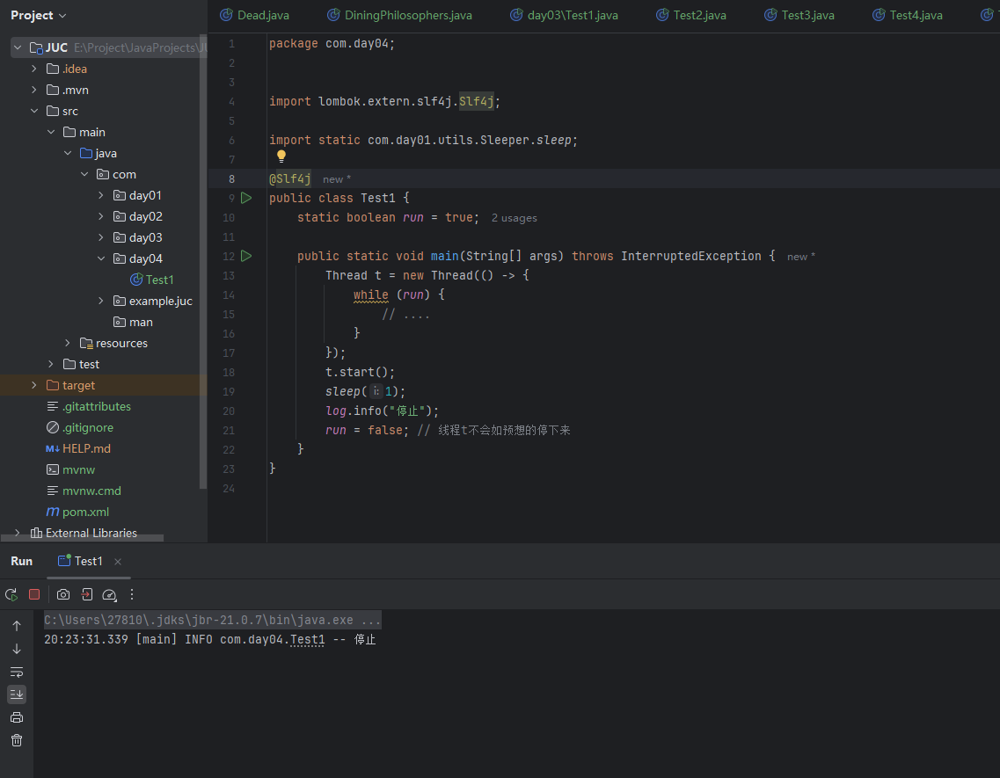
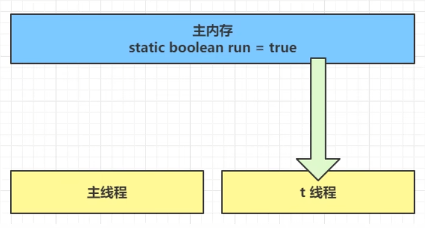
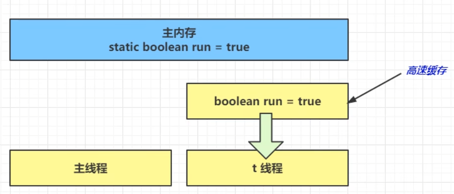
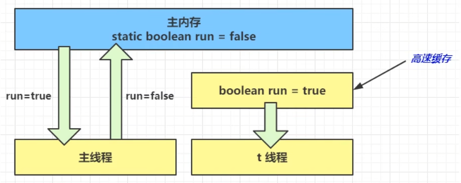
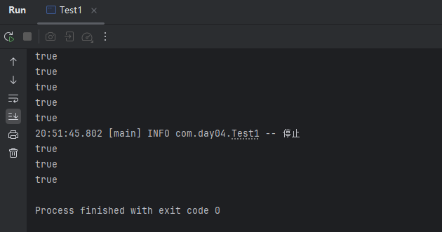
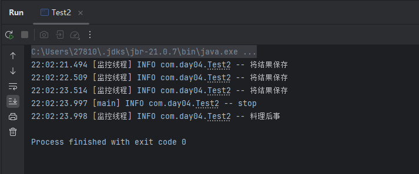
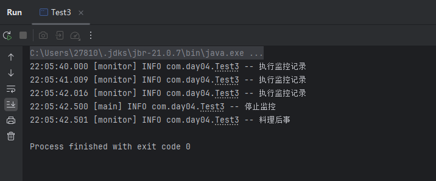
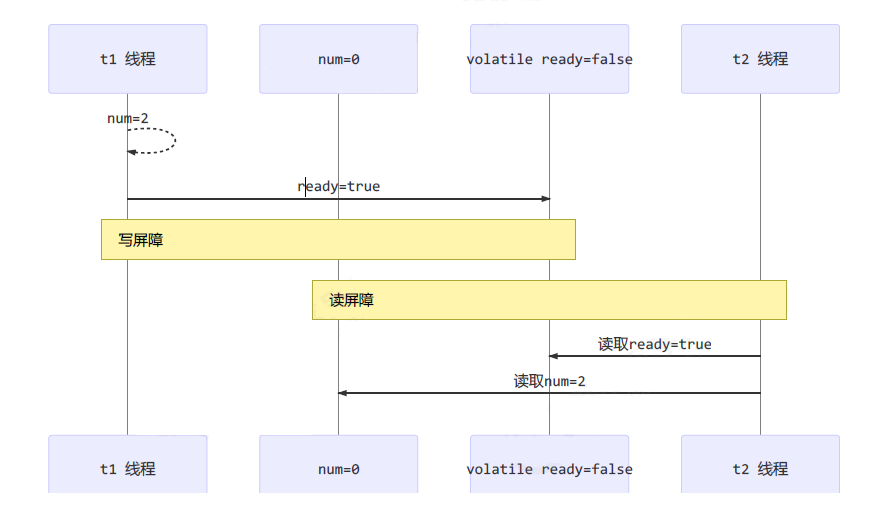
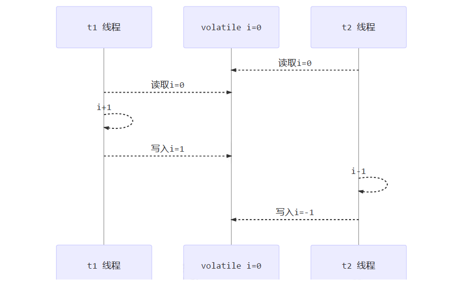
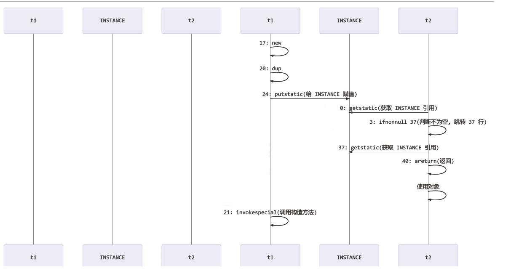

# JUC-07  Java内存模型

# 1、内存模型

JMM，即 Java Memory Model，它定义了主存、工作内存抽象概念，底层对应着CPU寄存器、缓存、硬件内存、CPU 指令优化等。

JMM 体现在以下几个方面：

- 原子性 - 保证指令不会受到线程上下文切换的影响。
- 可见性 - 保证指令不会受 cpu 缓存的影响。
- 有序性 - 保证指令不会受 cpu 指令并行优化的影响。

# 2、原子性

#### 2.1  定义及使用规则

- 定义：**原子性**是指不可分割，完整性。也就是说某个线程正在做某个具体业务时，中间不可以被分割，需要具体完成，要么同时成功，要么同时失败，保证指令不会受到线程上下文切换的影响。
- 定义原子操作的使用规则：

  1. 不允许 read 和 load、store 和 write 操作之一单独出现，必须顺序执行，但是不要求连续
  2. 不允许一个线程丢弃 assign 操作，必须同步回主存
  3. 不允许一个线程无原因地（没有发生过任何 assign 操作）把数据从工作内存同步会主内存中
  4. 一个新的变量只能在主内存中诞生，不允许在工作内存中直接使用一个未被初始化（assign 或者 load）的变量，即对一个变量实施 use 和 store 操作之前，必须先自行 assign 和 load 操作
  5. 一个变量在同一时刻只允许一条线程对其进行 lock 操作，但 lock 操作可以被同一线程重复执行多次，多次执行 lock 后，只有**执行相同次数的 unlock** 操作，变量才会被解锁，**lock 和 unlock 必须成对出现**
  6. 如果对一个变量执行 lock 操作，将会**清空工作内存中此变量的值**，在执行引擎使用这个变量之前需要重新从主存加载
  7. 如果一个变量事先没有被 lock 操作锁定，则不允许执行 unlock 操作，也不允许去 unlock 一个被其他线程锁定的变量
  8. 对一个变量执行 unlock 操作之前，必须**先把此变量同步到主内存**中（执行 store 和 write 操作）

# 3、可见性

#### 3.1  定义

- **可见性：** 是指当多个线程访问同一个变量时，一个线程修改了这个变量的值，其他线程能够立即看得到修改的值。
- 存在不可见问题的根本原因是由于**缓存**的存在，线程持有的是共享变量的副本，无法感知其他线程对于共享变量的更改，导致读取的值不是最新的。但是 final 修饰的变量是**不可变**的，就算有缓存，也不会存在不可见的问题。

#### 3.2  退不出的循环

- 先来看一个现象，main 线程对 run 变量的修改对于 t 线程不可见，导致了 t 线程无法停止：

  - 代码

    ```java
    @Slf4j
    public class Test1 {
        static boolean run = true;

        public static void main(String[] args) throws InterruptedException {
            Thread t = new Thread(() -> {
                while (run) {
                    // ....
                }
            });
            t.start();
            sleep(1);
            log.info("停止");
            run = false; // 线程t不会如预想的停下来
        }
    }
    ```
  - 结果

    

    - 可以看到，线程t并没有停止。
  - 分析

    - 初始状态， t 线程刚开始从主内存读取了 run 的值到工作内存。

      
    - 因为 t 线程要频繁从主内存中读取 run 的值，JIT 编译器会将 run 的值缓存至自己工作内存中的高速缓存中，减少对主存中 run 的访问，提高效率。

      
    - 1 秒之后，main 线程修改了 run 的值，并同步至主存，而 t 是从自己工作内存中的高速缓存中读取这个变量的值，结果永远是旧值。

      
  - 解决方案：使用 `volatile`​ （易变关键字）

    - ​`volatile`​ 可以用来修饰成员变量和静态成员变量，它可以避免线程从自己的工作缓存中查找变量的值，必须到主存中获取它的值，线程操作 volatile 变量都是直接操作主存。
    - 只需要在 `run`​ 前面加上关键字，即`static boolean volatile run = true;`​，便可以解决可见性的问题。
    - 使用 `synchronized`​ 关键字也可以，但是它需要创建 `monitor`​，属于重量级的操作，`volatile`​ 相对来说会更加轻量级一点。如果只是解决可见性的问题，推荐优先使用 `volatile`​。
  - 思考：当主线程设置 `run = false`​ 时，线程 `t`​ 还是陷入无限循环。但在循环中加入 `System.out.println()`​ 之后，线程 `t`​ 却能正确退出了，这是为什么？

    - 代码

      ```java
      while (run) {
          System.out.println(run);
          // ....
      }
      ```
    - 结果

      
    - 分析：

      - **Java内存模型中，线程可能缓存变量**

        - 在没有 `volatile`​ 或同步代码块的情况下：

          - 线程可能将 `run`​ 缓存到寄存器或 CPU 的工作内存中；
          - 不会每次都从主内存读取 `run`​ 的最新值；
          - 导致子线程“看不到”主线程对 `run`​ 的修改。
      - ​**​`System.out.println()`​** ​ **的副作用**

        - ​`System.out.println()`​ 是一个 **同步方法**，最终会调用底层的 I/O 操作；
        - 它内部使用了 **synchronized**，这会：

          - **刷新线程工作内存中的变量到主内存（写入）** ；
          - **从主内存读取最新值（读取）** ；
        - 因此，在调用 `println()`​ 时：

          - 会强制线程 `t`​ 的工作内存与主内存同步；
          - 所以 `t`​ 能及时“看到”主线程对 `run`​ 的更新，进而跳出循环。
        - 附上源码

          ```java
          public void println(boolean x) {
              if (getClass() == PrintStream.class) {
                  writeln(String.valueOf(x));
              } else {
                  synchronized (this) {
                      print(x);
                      newLine();
                  }
              }
          }

          private void newLine() {
              try {
                  if (lock != null) {
                      lock.lock();
                      try {
                          implNewLine();
                      } finally {
                          lock.unlock();
                      }
                  } else {
                      synchronized (this) {
                          implNewLine();
                      }
                  }
              }
              catch (InterruptedIOException x) {
                  Thread.currentThread().interrupt();
              }
              catch (IOException x) {
                  trouble = true;
              }
          }
          ```

#### 3.3  可见性vs原子性

- 上述例子体现的是可见性，它保证的是在多个线程之间，一个线程对 `volatile`​ 变量的修改对另一个线程可见， 但不能保证原子性。如果这个变量是**一个线程在写**，**多个线程在读**，那 `volatile`​ 就足够了，不会有并发写的问题。 `volatile`​ 适合一个线程写，多个线程读，不适合多个线程同时修改同一个变量的情况（需要加锁或用原子类）。
- 从字节码理解是这样的：

  ```java
  getstatic run // 线程 t 获取 run true 
  getstatic run // 线程 t 获取 run true 
  getstatic run // 线程 t 获取 run true 
  getstatic run // 线程 t 获取 run true 
  putstatic run // 线程 main 修改 run 为 false， 仅此一次
  getstatic run // 线程 t 获取 run false 
  ```

  - 之前的文章中，我们提到了线程安全，当时举了这样的例子：两个线程一个 i++ 一个 i-- ，只能保证看到最新值，不能解决指令交错。

    ```java
    // 假设i的初始值为0 
    getstatic i // 线程2-获取静态变量i的值 线程内i=0 

    getstatic i // 线程1-获取静态变量i的值 线程内i=0 
    iconst_1 // 线程1-准备常量1 
    iadd // 线程1-自增 线程内i=1 
    putstatic i // 线程1-将修改后的值存入静态变量i 静态变量i=1 

    iconst_1 // 线程2-准备常量1 
    isub // 线程2-自减 线程内i=-1 
    putstatic i // 线程2-将修改后的值存入静态变量i 静态变量i=-1

    ```
- 因此需要注意的是：`synchronized`​ 语句块既可以保证代码块的**原子性**，也同时保证代码块内变量的**可见性**。但缺点是 `synchronized`​ 是属于重量级操作，性能相对更低。

#### 3.4  设计模式

1. 两阶段终止

    - 代码

      ```java
      @Slf4j
      public class Test2 {

          static class TPTVolatile {
              private Thread thread;
              private volatile boolean stop = false;

              public void start() {
                  thread = new Thread(() -> {
                      while (true) {
                          Thread current = Thread.currentThread();
                          if (stop) {
                              log.info("料理后事");
                              break;
                          }
                          try {
                              Thread.sleep(1000);
                              log.info("将结果保存");
                          } catch (InterruptedException e) {
                              // InterruptedException 可能由 stop() 调用时的 thread.interrupt() 触发
                          }
                          // 执行监控操作
                      }
                  }, "监控线程");
                  thread.start();
              }

              public void stop() {
                  stop = true;
                  thread.interrupt(); // 如果线程正在 sleep，可以打断它
              }
          }

          public static void main(String[] args) throws InterruptedException {
              TPTVolatile t = new TPTVolatile();
              t.start();

              Thread.sleep(3500);
              log.info("stop");
              t.stop();
          }
      }
      ```
    - 结果

      
2. 犹豫模式

    - **Balking （犹豫）模式**用在一个线程发现另一个线程或本线程已经做了某一件相同的事，那么本线程就无需再做了，直接结束返回。
    - 代码

      ```java
      @Slf4j
      public class Test3 {

          static class TwoPhaseTermination {
              // 监控线程
              private Thread monitorThread;
              // 停止标记
              private volatile boolean stop = false;
              // 判断是否执行过 start 方法
              private boolean starting = false;

              // 启动监控线程
              public void start() {
                  synchronized (this) {
                      if (starting) {
                          return;
                      }
                      starting = true;
                      monitorThread = new Thread(() -> {
                          while (true) {
                              if (stop) {
                                  log.info("料理后事");
                                  break;
                              }
                              try {
                                  Thread.sleep(1000);
                                  log.info("执行监控记录");
                              } catch (InterruptedException e) {
                                  // 可选处理：log.debug("被中断了");
                              }
                          }
                      }, "monitor");
                      monitorThread.start();
                  }
              }

              // 停止监控线程
              public void stop() {
                  stop = true;
                  monitorThread.interrupt();
              }
          }

          public static void main(String[] args) throws InterruptedException {
              TwoPhaseTermination tpt = new TwoPhaseTermination();
              tpt.start(); // 只会启动一次线程
              tpt.start(); // 后续调用无效
              tpt.start(); // 后续调用无效

              Thread.sleep(3500);
              log.info("停止监控");
              tpt.stop();
          }
      }

      ```
    - 结果

      

# 4、有序性

> JVM 会在不影响正确性的前提下，可以调整语句的执行顺序，思考下面一段代码：
>
> ```java
> static int i;
> static int j;
>
> // 在某个线程内执行如下赋值操作
> i = ...; 
> j = ...; 
> ```
>
> 上述代码真正执行时，既可以是先给`i`​赋值，再给`j`​赋值；也可以是先给`j`​赋值，再给`i`​赋值。
>
> 这种特性称之为『指令重排』，多线程下『指令重排』会影响正确性。为什么要有重排指令这项优化呢？
>
> 且看下文。

#### 4.1  定义

- **有序性：** 在本线程内观察，所有操作都是有序的；在一个线程观察另一个线程，所有操作都是无序的，无序是因为发生了指令重排序。

#### 4.2  指令重排序

##### 4.2.1  指令重排的类型

CPU 的基本工作是执行存储的指令序列，即程序。程序的执行过程实际上是不断地取出指令、分析指令、执行指令的过程。为了提高程序执行效率，现代编译器和处理器通常会对指令进行重排，常见的重排类型包括：

1. **编译器级重排**：对源代码生成的中间代码进行优化，调整语句顺序。
2. **指令级并行重排**：如流水线执行，多条指令并发处理。
3. **内存系统级重排**：如缓存一致性协议、写缓冲等导致的重排。

指令执行过程可以理解为如下阶段链条：

```
源代码 -> 编译器优化重排 -> 指令并行调度 -> 内存系统重排 -> 最终执行
```

##### 4.2.2  CPU 流水线与指令执行

- 现代 CPU 通常支持多级流水线机制。例如，典型的五级流水线包括：

  1. 取指令（IF）
  2. 指令译码（ID）
  3. 执行指令（EX）
  4. 访存操作（MEM）
  5. 写回结果（WB）
- 在不改变程序结果的前提下，这些指令的各个阶段可以通过重排序和组合来实现指令级并行。
- CPU 可以在一个时钟周期内，同时运行五条指令的不同阶段（相当于一条执行时间最长的复杂指令）。虽然流水线技术不能缩短**单条指令的执行时间**，但通过并行化多个阶段的执行，可以显著提升**指令吞吐率**。

##### 4.2.3  指令重排与数据依赖性

处理器在进行重排序时，必须考虑 **指令之间的数据依赖性**。

- **单线程环境**下：虽然可能发生指令重排，但依赖关系确保了执行结果与代码语义一致。
- **多线程环境**中：线程之间交替执行，且存在**缓存与重排**，可能导致一个线程观察到另一个线程变量的“旧值”或“中间状态”，引发可见性问题或竞态条件。

##### 4.2.4  补充知识

- 指令周期是取出一条指令并执行这条指令的时间，一般由若干个机器周期组成。
- 机器周期也称为 CPU 周期，一条指令的执行过程划分为若干个阶段（如取指、译码、执行等），每一阶段完成一个基本操作，完成一个基本操作所需要的时间称为机器周期。
- 振荡周期指周期性信号作周期性重复变化的时间间隔。

#### 4.3  案例分析

- 示例代码

  ```java
  @JCStressTest
  @Outcome(id = {"1", "4"}, expect = Expect.ACCEPTABLE, desc = "ok")
  @Outcome(id = "0", expect = Expect.ACCEPTABLE_INTERESTING, desc = "!!!!")
  @State
  public class ConcurrencyTest {
      int num = 0;
      boolean ready = false;
      @Actor
      public void actor1(I_Result r) {
          if(ready) {
              r.r1 = num + num;
          } else {
              r.r1 = 1;
          }
      }
      @Actor
      public void actor2(I_Result r) {
          num = 2;
          ready = true;
      }
  }

  ```
- 思考：有一个属性 r1 用来保存结果，问，可能的结果有几种？

  - 情况1：线程1 先执行，这时 ready = false，所以进入 else 分支结果为 1
  - 情况2：线程2 先执行 num = 2，但没来得及执行 ready = true，线程1 执行，还是进入 else 分支，结果为1
  - 情况3：线程2 执行到 ready = true，线程1 执行，这回进入 if 分支，结果为 4（因为 num 已经执行过了）
  - **但是，结果还有可能是 0！！！**
- 运行结果

  ```java
  *** INTERESTING tests
  Some interesting behaviors observed. This is for the plain curiosity.

  2 matching test results.
  [OK] test.ConcurrencyTest
  (JVM args: [-XX:-TieredCompilation])
  Observed state Occurrences Expectation Interpretation
  0 		1,729 			ACCEPTABLE_INTERESTING !!!!
  1 		42,617,915 		ACCEPTABLE ok
  4 		5,146,627 		ACCEPTABLE ok
  [OK] test.ConcurrencyTest
  (JVM args: [])
  Observed state Occurrences Expectation Interpretation
  0 		1,652 			ACCEPTABLE_INTERESTING !!!!
  1 		46,460,657 		ACCEPTABLE ok
  4 		4,571,072 		ACCEPTABLE ok
  ```

  - 可以看到，出现结果为 `0`​ 的情况有 一千多次。
  - ​`0`​ 说明发生了 **指令重排**（即 `ready=true`​ 被观察到了，但 `num=2`​ 还没可见）。
- 解决方案

  - ​`volatile`​ 修饰的变量，可以禁用指令重排：`volatile boolean ready = false;`​。

#### 4.4  volatile原理

##### 4.4.1  同步机制

- ​`volatile`​ 是 Java 虚拟机提供的**轻量级**的同步机制

  - 保证可见性；
  - 不保证原子性；
  - 保证有序性（禁止指令重排）。
- 性能

  - volatile 修饰的变量进行读操作与普通变量几乎没什么差别，但是写操作相对慢一些，因为需要在本地代码中插入很多内存屏障来保证指令不会发生乱序执行，但是开销比锁要小。
- synchronized 无法禁止指令重排和处理器优化，为什么可以保证有序性可见性？

  - 加了锁之后，只能有一个线程获得到了锁，获得不到锁的线程就要阻塞，所以同一时间只有一个线程执行，相当于单线程，由于数据依赖性的存在，单线程的指令重排是没有问题的。
  - 线程加锁前，将**清空工作内存**中共享变量的值，使用共享变量时需要从主内存中重新读取最新的值；线程解锁前，必须把共享变量的最新值**刷新到主内存**中。

##### 4.4.2  底层原理

- 使用 `volatile`​ 修饰的共享变量，底层通过汇编 `lock`​ 前缀指令进行缓存锁定，在线程修改完共享变量后写回主存，其他的 CPU 核心上运行的线程通过 CPU 总线嗅探机制会修改其共享变量为失效状态，读取时会重新从主内存中读取最新的数据。
- ​`lock`​ 前缀指令就相当于内存屏障

  - 对 `volatile`​ 变量的写指令后会加入写屏障。
  - 对 `volatile`​ 变量的读指令前会加入读屏障。
- 内存屏障有三个作用

  - 确保对内存的 读-改-写 操作原子执行。
  - 阻止屏障两侧的指令重排序。
  - 强制把缓存中的脏数据写回主内存，让缓存行中相应的数据失效。
- **如何保证可见性？**

  - 写屏障（sfence，Store Barrier）保证在该屏障之前的，对共享变量的改动，都同步到主存当中。

    ```java
    public void actor2(I_Result r) {
        num = 2;
        ready = true; // ready 是 volatile 赋值带写屏障
        // 写屏障
    }
    ```
  - 读屏障（lfence）保证在该屏障之后，对共享变量的读取，加载的是主存中最新数据。

    ```java
    public void actor1(I_Result r) {
        // 读屏障
        // ready 是 volatile 读取值带读屏障
        if(ready) {
            r.r1 = num + num;
        } else {
            r.r1 = 1;
        }
    }
    ```
  - 
- **如何保证有序性？**

  - 写屏障会确保指令重排序时，不会将写屏障之前的代码排在写屏障之后。
  - 读屏障会确保指令重排序时，不会将读屏障之后的代码排在读屏障之前。
  - 为什么不能解决指令交错？

    - 写屏障仅仅是保证之后的读能够读到最新的结果，但不能保证其他线程的读跑到写屏障之前。
    - 有序性的保证也只是保证了本线程内相关代码不被重排序。
    - 因此，`volatile`​底层的读写屏障只是 保证了可见性 和 有序性，还是不能解决指令交错。而`synchronized`​都可以做到**有序、可见、原子**。
    - 

#### 4.5  双端检锁

##### 4.5.1  检锁机制

- 双端检锁（Double-Checked Locking，DCL）机制不一定是线程安全的，原因是有指令重排的存在，加入 `volatile`​ 可以禁止指令重排。

  ```java
  public final class Singleton {
      private Singleton() { }
      private static Singleton INSTANCE = null;
      
      public static Singleton getInstance() {
          if(INSTANCE == null) { // t2，这里的判断不是线程安全的
              // 首次访问会同步，而之后的使用没有 synchronized
              synchronized(Singleton.class) {
                  // 这里是线程安全的判断，防止其他线程在当前线程等待锁的期间完成了初始化
                  if (INSTANCE == null) { 
                      INSTANCE = new Singleton();
                  }
              }
          }
          return INSTANCE;
      }
  }
  ```
- 实现特点：

  - 懒惰初始化。
  - 首次使用 ` getInstance()`​ 才使用 `synchronized`​ 加锁，后续使用时无需加锁。
  - 第一个 if 使用了 INSTANCE 变量，是在同步块之外，但在多线程环境下会产生问题。
- 不锁 `INSTANCE`​ 的原因

  - ​`INSTANCE`​ 要重新赋值。
  - ​`INSTANCE`​ 是 null，线程加锁之前需要获取对象的引用，设置对象头，null 没有引用。
- DCL问题

  - 但在多线程环境下，上面的代码是有问题的，`getInstance()`​ 方法对应的字节码为：

    ```java
    0: getstatic #2 		// Field INSTANCE:Lcn/itcast/n5/Singleton;
    3: ifnonnull 37
    6: ldc #3 				// class cn/itcast/n5/Singleton
    8: dup
    9: astore_0
    10: monitorenter
    11: getstatic #2 		// Field INSTANCE:Lcn/itcast/n5/Singleton;
    14: ifnonnull 27
    17: new #3 				// class cn/itcast/n5/Singleton
    20: dup
    21: invokespecial #4 	// Method "<init>":()V
    24: putstatic #2 		// Field INSTANCE:Lcn/itcast/n5/Singleton;
    27: aload_0
    28: monitorexit
    29: goto 37
    32: astore_1
    33: aload_0
    34: monitorexit
    35: aload_1
    36: athrow
    37: getstatic #2 		// Field INSTANCE:Lcn/itcast/n5/Singleton;
    40: areturn
    ```

    - 其中：

      - 17 表示创建对象，将对象引用入栈 // new Singleton
      - 20 表示复制一份对象引用 // 引用地址
      - 21 表示利用一个对象引用，调用构造方法
      - 24 表示利用一个对象引用，赋值给 static INSTANCE
    - **步骤 21 和 24 之间不存在数据依赖关系**，而且无论重排前后，程序的执行结果在单线程中并没有改变，因此这种重排优化是允许的。

      - 关键在于 0:getstatic 这行代码在 monitor 控制之外，可以越过 monitor 读取 `INSTANCE`​ 变量的值。
      - 当其他线程访问 `INSTANCE`​ 不为 null 时，由于 INSTANCE 实例未必已初始化，那么 t2 拿到的是将是一个未初始化完毕的单例返回，这就造成了线程安全的问题。
      - 
  - 解决方法

    - 指令重排只会保证串行语义的执行一致性（单线程），但并不会关系多线程间的语义一致性。引入 `volatile`​，来保证出现指令重排的问题，从而保证单例模式的线程安全性。

      - ​`private static volatile SingletonDemo INSTANCE = null;`​
    - ​`synchronized`​ 仍然是可以被重排序的，并不能组织重排序，`volatile`​才能组织重排序，但是如果共享变量完全被 `synchronized`​ 所保护，那么共享变量在使用的过程中是不会有**原子、可见、有序**问题的，就算中间发生了重排序，但是只要完全交给 `synchronized`​ 管理，是不会有有序性问题的。

#### 4.6  happens-before

- happens-before 规定了某一个线程对共享变量的写操作对其他线程的读操作可见，它是可见性与有序性的一套规则总结，除了以下 happens-before 规则，JMM 并不能保证一个线程对共享变量的写，对于其它线程对该共享变量的读可见。

  - 线程解锁 m 之前对变量的写，对于接下来对 m 加锁的其它线程对该变量的读可见

    ```java
    static int x;
    static Object m = new Object();
    		new Thread(()->{
    synchronized(m) {
    x = 10;
            }},"t1").start();
    		new Thread(()->{
    synchronized(m) {
            System.out.println(x);
    		}},"t2").start();
    ```
  - 线程对 volatile 变量的写，对接下来其它线程对该变量的读可见

    ```java
    volatile static int x;

    new Thread(()->{
    x = 10;
            },"t1").start();

    new Thread(()->{
            System.out.println(x);
    },"t2").start();
    ```
  - 线程 start 前对变量的写，对该线程开始后对该变量的读可见

    ```java
    static int x;

    x = 10;

    new Thread(()->{
        System.out.println(x);
    },"t2").start();
    ```
  - 线程结束前对变量的写，对其它线程得知它结束后的读可见（比如其它线程调用 t1.isAlive() 或 t1.join()等待它结束）

    ```java
    static int x;

    Thread t1 = new Thread(()->{
        x = 10;
    },"t1");

    t1.start();
    t1.join();
    System.out.println(x);
    ```
  - 线程 t1 打断 t2（interrupt）前对变量的写，对于其他线程得知 t2 被打断后对变量的读可见（通过t2.interrupted 或 t2.isInterrupted）

    ```java
    Thread t2 = new Thread(()->{
        while(true) {
            if(Thread.currentThread().isInterrupted()) {
                System.out.println(x);
                break;
            }
        }
    },"t2");

    t2.start();
    new Thread(()->{
        try {
            Thread.sleep(10000);
        } catch (InterruptedException e) {
            e.printStackTrace();
        }  
        x = 10;
        t2.interrupt();
        },"t1").start();
    ```
  - 具有传递性，如果 x hb-> y 并且 y hb-> z 那么有 x hb-> z ，配合 volatile 的防指令重排，有下面的例子

    ```java
    volatile static int x;
    static int y;
    new Thread(()->{
    y = 10;
    x = 20;
            },"t1").start();
    new Thread(()->{
            // x=20 对 t2 可见, 同时 y=10 也对 t2 可见
            System.out.println(x); 
    },"t2").start();
    ```
