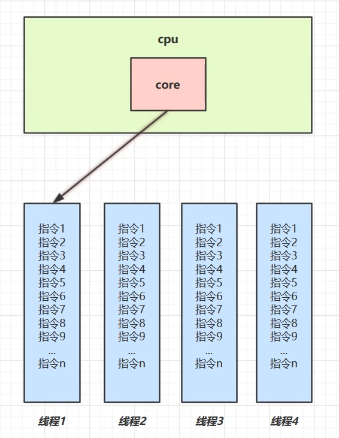
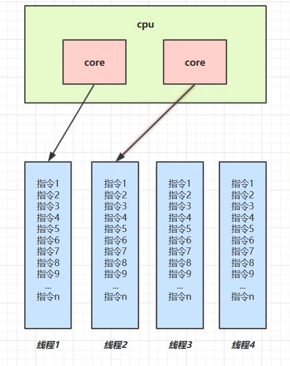
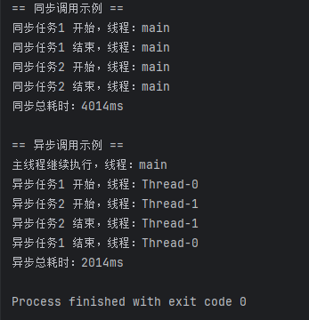
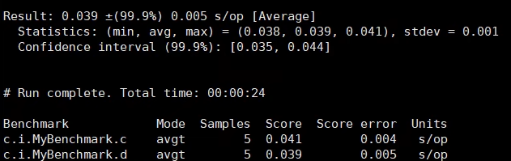

# JUC-01  进程与线程

# 1、什么是进程

- **进程**是进程实体的运行过程，是系统进行**资源分配的基本单位。**
- 当一个程序被运行，将代码从磁盘加载至内存，这时就开启了一个进程。
- 进程就可以视为程序的一个实例。大部分程序可以同时运行多个实例进程（例如记事本、画图、浏览器等），也有的程序只能启动一个实例进程（例如网易云音乐、360安全卫士等）。
- 进程的特征：动态性、并发性、独立性、异步性。

  - 动态性：

    - 进程是程序的执行过程，不是静态的程序代码。
    - 它具有生命周期：​**创建 → 就绪 → 运行 → 阻塞 → 终止**​。
    - 是系统资源分配和调度的基本单位，**随时可能发生状态变化**。
  - 并发性

    - 系统中的多个进程可以**在宏观上同时存在**，并且**在同一时间段内并发执行**。
    - 多进程在单核 CPU 上通过时间片轮转模拟并发，在多核 CPU 上则可以真正并行。
  - 独立性

    - 每个进程有自己独立的地址空间、数据和代码段，互不干扰。
    - 一个进程的运行不会直接影响其他进程的运行结果。
  - 异步性

    - 每个进程由**程序段（代码）+ 数据段 + PCB（进程控制块）** 组成，有完整的执行控制信息。
    - 由于进程之间的**竞争资源与通信需求**，执行过程具有**异步性和制约性**，执行的速度和顺序不完全确定，常需同步和互斥机制保障正确性。

# 2、什么是线程

- 线程是CPU调度的基本单位，一个进程之内可以包含多个线程。
- 一个线程就是一个指令流，将指令流中的一条条指令以一定的顺序交给 CPU 执行。
- Java 中，线程作为最小调度单位，进程作为资源分配的最小单位。 在 windows 中，进程是不活动的，只是作为线程的容器。

# 3、进程与线程的对比

- 进程基本上相互独立的，而线程存在于进程内，是进程的一个子集。
- 进程拥有共享的资源，如内存空间等，供其**内部的线程共享。**
- 进程间通信较为复杂。

  - 同一台计算机的进程通信称为 IPC（Inter-process communication）

    - 信号量：信号量是一个计数器，用于多进程对共享数据的访问，解决同步相关的问题并避免竞争条件。
    - 共享存储：多个进程可以访问同一块内存空间，需要使用信号量用来同步对共享存储的访问。
    - 管道通信：管道是用于连接一个读进程和一个写进程以实现它们之间通信的一个共享文件 pipe 文件，该文件同一时间只允许一个进程访问，所以只支持**半双工通信。**

      - 匿名管道（Pipes）：用于具有亲缘关系的父子进程间或者兄弟进程之间的通信。
      - 命名管道（Names Pipes）：以磁盘文件的方式存在，可以实现本机任意两个进程通信，遵循 FIFO。
    - 消息队列：内核中存储消息的链表，由消息队列标识符标识，能在不同进程之间提供**全双工通信**，对比管道：

      - 匿名管道存在于内存中的文件；命名管道存在于实际的磁盘介质或者文件系统；消息队列存放在内核中，只有在内核重启（操作系统重启）或者显示地删除一个消息队列时，该消息队列才被真正删除。
      - 读进程可以根据消息类型有选择地接收消息，而不像 FIFO 那样只能默认地接收。
  - 不同计算机之间的**进程通信**，需要通过网络，并遵守共同的协议，例如 HTTP

    - 套接字：与其他通信机制不同的是，可用于不同机器间的互相通信。
- 线程通信相对简单，因为线程之间共享进程内的内存，一个例子是多个线程可以访问同一个共享变量。

  - **Java 中的通信机制**：volatile、等待/通知机制、join 方式、InheritableThreadLocal、MappedByteBuffer。
- 线程更轻量，线程上下文切换成本一般上要比进程上下文切换低。

# 4、并行与并发

- **并发（concurrent）** ：同一时间应对多件事情的能力。
- **并行（parallel）** ：同一时间动手做多件事情的能力。

  - 并发就像是你只有一个工人（单核 CPU），但他要干好多活，他就会先干一会儿这个活，然后放下，再去干一会儿那个活，不停地在不同的活之间换来换去，看起来好像他同时在干好几样活似的。
  - 并行就好比你有好几个工人（多个处理器），他们可以同时干活，而且是在同一时刻一起干活。比如说你要盖几栋房子，有四个工人（四核 CPU），他们可以同时盖四栋房子，每个人负责一栋，互不干扰，一起推进工作。

**单核 cpu 下**，线程是**串行执行（交替运行多个线程的串行执行**，是实现并发的手段 **）** 的。操作系统中有一个组件叫做任务调度器，将 cpu 的时间片（windows 下时间片最小约为 15 毫秒）分给不同的线程使用，只是由于 cpu 在线程间（时间片很短）的切换非常快，人类感觉是同时运行的。总结为一句话就是：**微观串行，宏观并行**。



**多核 cpu下**，每个核（core） 都可以调度运行线程，这时候线程可以是并行的。



# 5、应用

#### 5.1  什么是同步，什么是异步

同步：需要等待结果返回，才能继续运行就是同步。

异步：不需要等待结果返回，就能继续运行就是异步。

#### 5.2  简单示例

定义一个“任务”类，模拟执行一个耗时操作（例如睡眠2秒），并在主线程中调用它。

示例代码：

```java
package com.day01;

public class SyncAsyncDemo {

    // 模拟一个耗时任务
    public static void doTask(String taskName) {
        System.out.println(taskName + " 开始，线程：" + Thread.currentThread().getName());
        try {
            Thread.sleep(2000); // 模拟耗时2秒
        } catch (InterruptedException e) {
            e.printStackTrace();
        }
        System.out.println(taskName + " 结束，线程：" + Thread.currentThread().getName());
    }

    public static void main(String[] args) {
        System.out.println("== 同步调用示例 ==");
        long syncStart = System.currentTimeMillis();

        doTask("同步任务1");
        doTask("同步任务2");

        long syncEnd = System.currentTimeMillis();
        System.out.println("同步总耗时：" + (syncEnd - syncStart) + "ms");

        System.out.println("\n== 异步调用示例 ==");
        long asyncStart = System.currentTimeMillis();

        Thread thread1 = new Thread(() -> doTask("异步任务1"));
        Thread thread2 = new Thread(() -> doTask("异步任务2"));

        thread1.start();
        thread2.start();

        // 主线程继续执行，不等待任务完成
        System.out.println("主线程继续执行，线程：" + Thread.currentThread().getName());

        try {
            // 如果想等异步任务结束再结束主线程，可以加 join（可选）
            thread1.join();
            thread2.join();
        } catch (InterruptedException e) {
            e.printStackTrace();
        }

        long asyncEnd = System.currentTimeMillis();
        System.out.println("异步总耗时：" + (asyncEnd - asyncStart) + "ms");
    }
}
```

运行结果：



通过结果不难看出，在同步调用时，主线程调用方法后**必须等任务完成**，才继续执行下一行代码，因此需要多花费约2秒（2000ms）的时间。

#### 5.3  多线程一定比单线程快吗

示例代码：

```java
import org.openjdk.jmh.annotations.*;

import java.util.Arrays;
import java.util.concurrent.FutureTask;

@Fork(1)
@BenchmarkMode(Mode.AverageTime)
@Warmup(iterations=3)
@Measurement(iterations=5)
public class MyBenchmark {
    static int[] ARRAY = new int[1000_000_00];
    static {
        Arrays.fill(ARRAY, 1);
    }
    @Benchmark
    public int c() throws Exception {
        int[] array = ARRAY;
        FutureTask<Integer> t1 = new FutureTask<>(()->{
            int sum = 0;
            for(int i = 0; i < 250_000_00;i++) {
                sum += array[0+i];
            }
            return sum;
        });
        FutureTask<Integer> t2 = new FutureTask<>(()->{
            int sum = 0;
            for(int i = 0; i < 250_000_00;i++) {
                sum += array[250_000_00+i];
            }
            return sum;
        });
        FutureTask<Integer> t3 = new FutureTask<>(()->{
            int sum = 0;
            for(int i = 0; i < 250_000_00;i++) {
                sum += array[500_000_00+i];
            }
            return sum;
        });
        FutureTask<Integer> t4 = new FutureTask<>(()->{
            int sum = 0;
            for(int i = 0; i < 250_000_00;i++) {
                sum += array[750_000_00+i];
            }
            return sum;
        });
        new Thread(t1).start();
        new Thread(t2).start();
        new Thread(t3).start();
        new Thread(t4).start();
        return t1.get() + t2.get() + t3.get()+ t4.get();
    }
    @Benchmark
    public int d() throws Exception {
        int[] array = ARRAY;
        FutureTask<Integer> t1 = new FutureTask<>(()->{
            int sum = 0;
            for(int i = 0; i < 1000_000_00;i++) {
                sum += array[0+i];
            }
            return sum;
        });
        new Thread(t1).start();
        return t1.get();
    }
}
```

在linux系统下的运行结果：



这段代码表示的是**多线程并行求和**与**单线程串行求和**的运行速度，使用 JMH 框架来精准衡量每种方式的平均执行时间，MyBenchmark.c表示多线程任务，MyBenchmark.d表示单线程任务。可以看到，多线程的运行时间反而比单线程的运行时间长。在 **小任务量或单核 CPU 上**，多线程的上下文切换开销大，可能比单线程还慢。

#### 5.4  结论

- **单核 cpu 下，多线程不能实际提高程序运行效率**，只是为了能够在不同的任务之间切换，不同线程轮流使用cpu ，不至于一个线程总占用 cpu，别的线程没法干活。
- **多核 cpu** 可以并行跑多个线程，但**能否提高程序运行效率还是要分情况**的：

  - 有些任务，经过精心设计，将任务拆分，并行执行，当然可以提高程序的运行效率。
  - 并不是所有任务都需要拆分，比如任务二需要任务一的结果，任务的目的如果不同，谈拆分和效率没啥意思。
- IO 操作不占用 cpu，只是我们一般拷贝文件使用的是**阻塞 IO**，这时线程虽然不用 cpu，但需要一直等待 IO 结束，没能充分利用线程。所以才有后面的**非阻塞 IO**和**异步 IO**优化。

‍
