# JUC-02  线程创建、运行原理及常用方法

# 1、创建线程

#### 1.1  直接使用Thread创建

示例代码：

```java
import lombok.extern.slf4j.Slf4j;

@Slf4j(topic = "c.Test01")
public class Test01 {
    public static void main(String[] args) {
        Thread t = new Thread() {
            @Override
            public void run() {
                log.info("running");
            }
        };
        t.setName("taotao");
        t.start();

        log.info("running");
    }
}
```

运行结果：

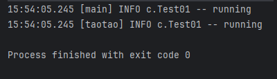

#### 1.2  使用Runnable，配合Thread创建

示例代码：

```java
import lombok.extern.slf4j.Slf4j;

@Slf4j(topic = "c.Test02")
public class Test02 {
    public static void main(String[] args) {
        Runnable r1 = new Runnable() {
            public void run() {
                log.info("Hello World~");
            }
        };

        // Java8以后，也可以用使用lambda表达式
        Runnable r2 = () -> { log.info("Hello~"); };

        Thread t1 = new Thread(r1, "tao");
        Thread t2 = new Thread(r2, "wang");
        t1.start();
        t2.start();

        log.info("Man!");
    }
}
```

运行结果：

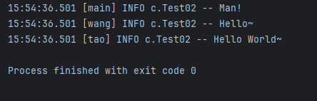

##### 小结：

- Thread把线程和任务合并在了一起，Runnable把线程和任务分开了。
- 用 Runnable 更容易与线程池等高级 API 配合。
- 用 Runnable 让任务类脱离了 Thread 继承体系，更灵活。

#### 1.3  使用FutureTask配合Thread

示例代码：

```java
import lombok.extern.slf4j.Slf4j;

import java.util.concurrent.Callable;
import java.util.concurrent.ExecutionException;
import java.util.concurrent.FutureTask;

@Slf4j(topic = "c.Test03")
public class Test03 {
    public static void main(String[] args) throws ExecutionException, InterruptedException {
        FutureTask<Integer> futureTask = new FutureTask<>(new Callable<Integer>() {

            @Override
            public Integer call() throws Exception {
                log.info("running");
                Thread.sleep(1000);
                return 100;
            }
        });

        Thread thread = new Thread(futureTask, "tao");
        thread.start();

        log.info("{}:", futureTask.get());
    }
}
```

运行结果：

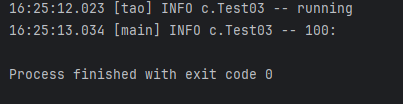

# 2、多线程运行以及查看进程线程的方法

#### 2.1  多线程运行

如果多线程同时运行，运行结果是怎样的呢？

示例代码：

```java
import lombok.extern.slf4j.Slf4j;

@Slf4j(topic = "c.TestMultiThread")
public class Test04 {
    public static void main(String[] args) {
        new Thread(() -> {
            while(true) {
                log.info("running");
            }
        },"t1").start();
        new Thread(() -> {
            while(true) {
                log.info("running");
            }
        },"t2").start();
    }

}
```

运行结果：

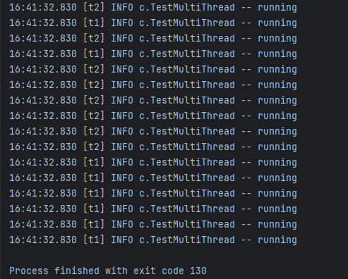

可以看到，输出结果是交替执行，谁先谁后并不由我们来控制，是由底层的**任务调度器**来决定的。

#### 2.2  查看进程线程的方法

1. Windows

    - 任务管理器：可以查看进程和线程数，也可以用来杀死进程

      在任务管理器中，可以查看到进程可执行文件的名称，PID、运行状态等信息。其中，PID是某个进程的ID，我们可以根据PID找到对应的进程，并进行相应的处理。

      
    - cmd窗口：

      - ​`tasklist`​ 查看进程；`taskkill`​ 杀死进程
      - 使用`tasklist`​查看进程

        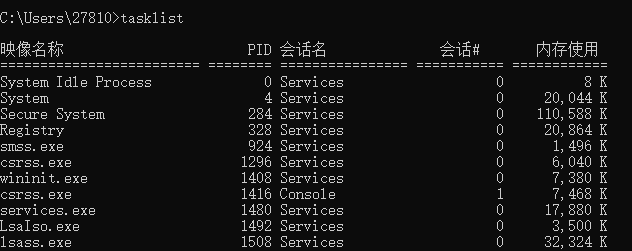
      - 使用`taskkill`​杀死我们正在运行的java进程

        - 使用 `tasklist | findstr java `​查看**当前所有正在运行的java进程**。通过下面这张图不难看出，有多个正在运行的java进程，那么如何定位到我们当前正在IDEA中**正在运行的Test04**呢？

          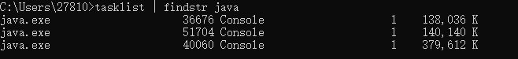
        - 使用 `jps`​ 列出当前 **Java 虚拟机（JVM）进程列表。** 可以发现，Test04的PID是40060。

          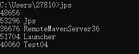
        - 使用`taskkill /F /PID 进程编号`​ kill掉Test04的进程。

          

          再次进入IDEA，发现程序已经终止。

          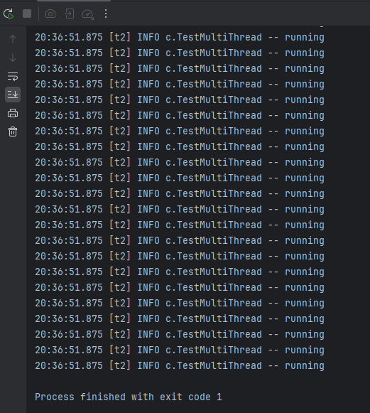

          再次 `jps`​ 执行，发现Test04的进程已经消失了。

          
2. Linux

    - ​**​`ps -fe`​**​ **：** 查看所有进程。
    - ​**​`ps -fe | grep java`​**​ **：** 查看所有java进程。
    - ​**​`ps -fT -p <PID>`​** ​ **：** 查看某个进程（PID）的所有线程。
    - ​**​`kill`​**​ **：** 杀死进程。
    - ​**​`top`​**​ **：** 按大写 H 切换是否显示线程。
    - ​**​`top -H -p <PID>`​** ​ **：** 查看某个进程（PID）的所有线程。
3. Java

    - ​**​`jps`​**​：命令查看所有 Java 进程。
    - ​**​`jstack <PID>`​** ​：查看某个 Java 进程（PID）的所有线程状态。
    - ​**​`jconsole`​**​：查看某个 Java 进程中线程的运行情况（图形界面）。使用win+R，输入`jconsole`​，即可打开。

      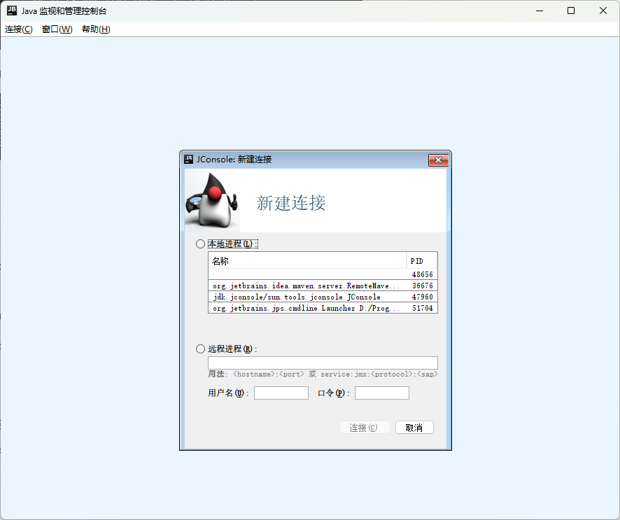

# 3、线程运行原理

#### 3.1  栈与栈帧

1. Java Virtual Machine Stacks （Java 虚拟机栈）

    **JVM**由**堆、栈、方法区**组成，其中**栈内存**是给谁用的呢？其实就是线程，每个**线程**启动后，虚拟机就会为其分配一块栈内存。

    - 每个栈由多个栈帧（Frame）组成，对应着每次方法调用时所占用的内存。
    - 每个线程只能有一个活动栈帧，对应着当前正在执行的那个方法。
2. 示例

    示例代码：

    ```java
    public class TestFrames {
        public static void main(String[] args) {
            method1(10);
        }

        private static void method1(int x) {
            int y = x + 1;
            Object m = method2();
            System.out.println(m);
        }

        private static Object method2() {
            Object n = new Object();
            return n;
        }
    }
    ```

    下面以Debug模型运行上面这段代码来介绍栈帧：

    - 对` method1(10);`​ 这一行代码打上断点，运行TestFrames。可以发现，在调用`main()`​后，Frames（栈帧）中有了main，并且Variables中也有了该方法参数。

      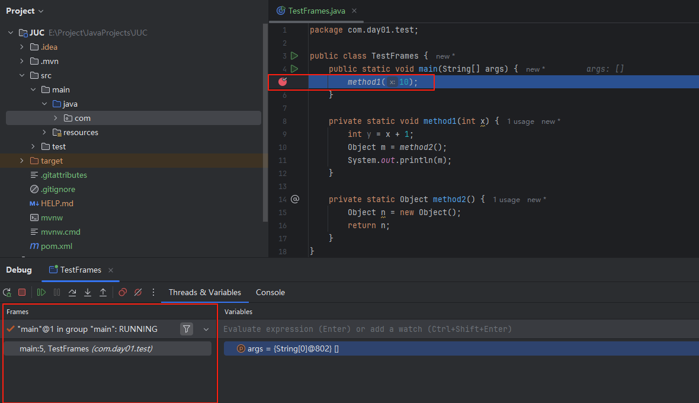
    - 继续向下执行，发现在调用`method1()`​后，`method1()`​也进入了Frames中，并且也带有该方法的参数。

      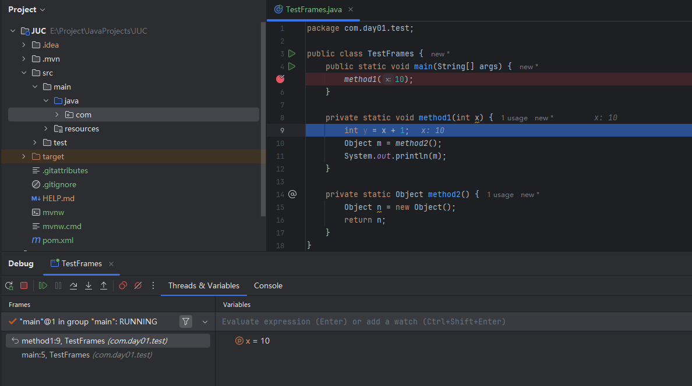
    - 继续向下执行，发现在调用`method2()`​后，`method2()`​也进入了Frames中。

      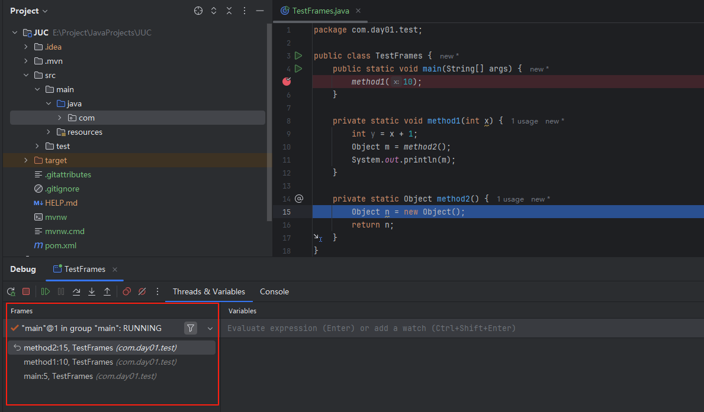
    - 继续执行，当`method2()`​返回n之后，`method2()`​的栈帧消失，内存也被释放掉了。

      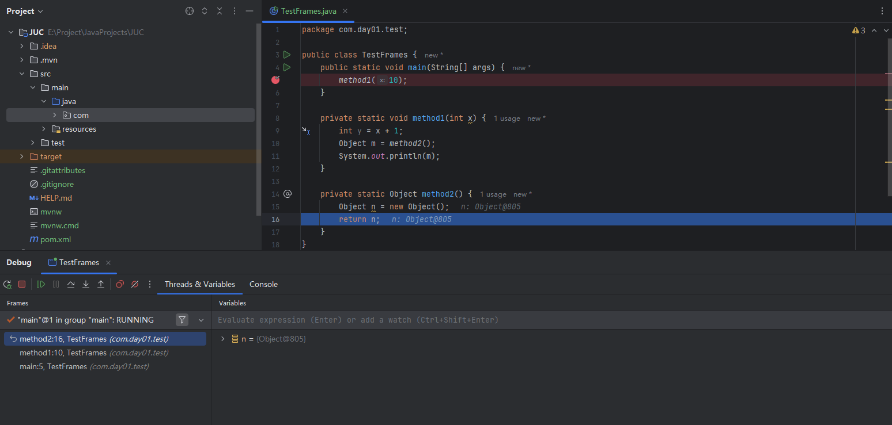

      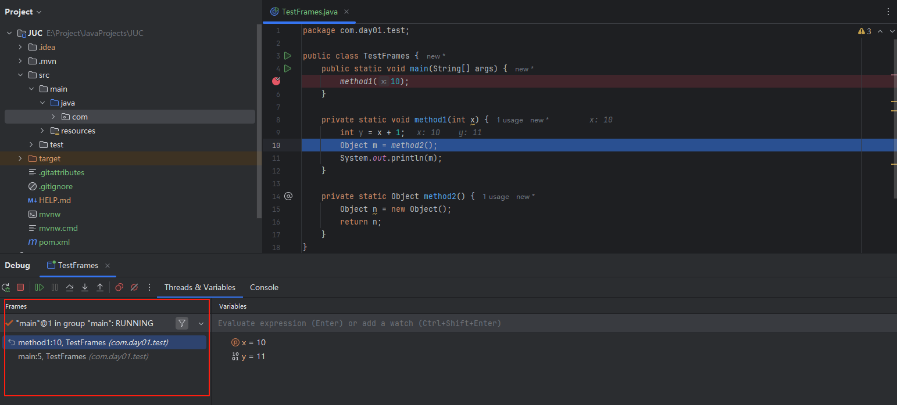
    - 按照栈后进先出的顺序，最终所有的栈内存都被释放掉了。
3. 图解线程流程

    - 当我们运行TestFrames时，都会发生什么呢？首先，**执行一个类加载，将TestFrames类的字节码加载到Java虚拟机中**，**Java虚拟机将字节码加载到内存中的方法区**。随后，Java 虚拟机会启动主线程，负责从 main 方法开始执行程序逻辑。

      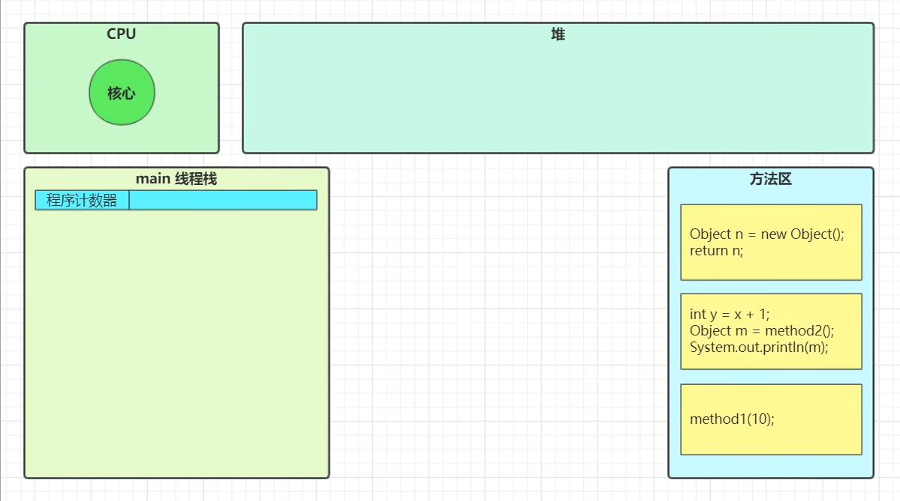
    - 当cpu的时间片分配给主线程了，Java虚拟机会给主线程分配一块栈内存，此时线程就交给任务调度器调度执行。

      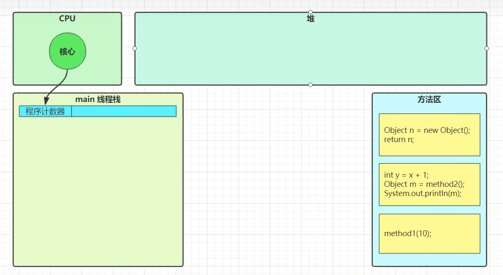
    - 在方法调用时，Java 虚拟机为每个方法创建一个新的**栈帧（Stack Frame）** ，该栈帧中包含**局部变量表、方法返回地址、锁记录、操作数栈**等信息。

      局部变量表用于存储方法参数及局部变量，并在方法执行期间被频繁访问。局部变量表其实在创建栈帧时其实就已经分配好了，不是运行到某行代码时才分配内存。

      程序计数器（PC寄存器）是每个线程私有的，它记录当前线程正在执行的字节码指令地址。随着代码的逐行执行，程序计数器会不断更新，确保线程能够顺序执行字节码指令。例如当程序计数器中的代码执行到`method1(10);`​时，method1栈帧中的x被更新为10，当执行到`int y = x + 1;`​时，method1栈帧中的y被更新为11。

      main 方法作为程序的入口，其执行逻辑由主线程调度执行，CPU 会根据程序计数器的值逐步解释执行其中的每条指令。

      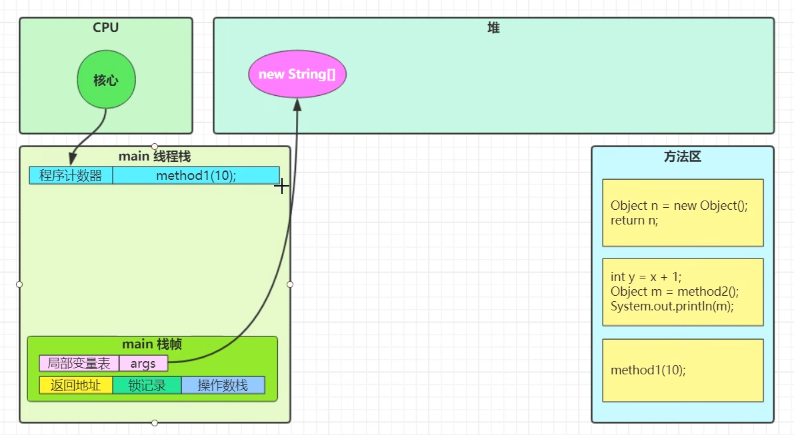

      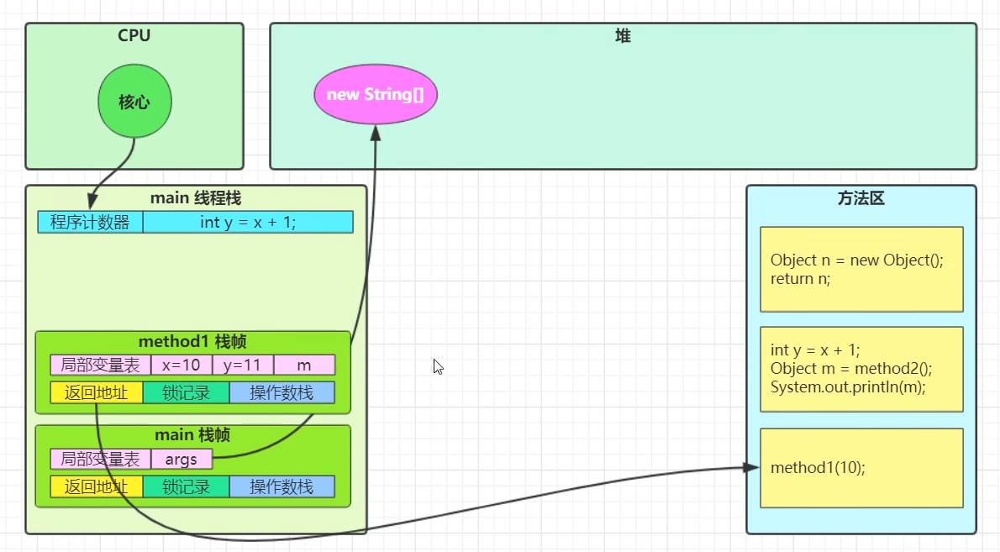
    - 在方法执行过程中，如果涉及对象的创建（例如 new 操作），相关**对象会被分配在堆内存**中，并通过引用在局部变量表中保存。

      方法执行完成后，虚拟机会通过 return 指令将控制权交还给调用方，并使用返回地址确保程序能正确继续执行。

      每当方法调用结束，对应的栈帧也会被销毁，从而释放所占用的栈内存。

      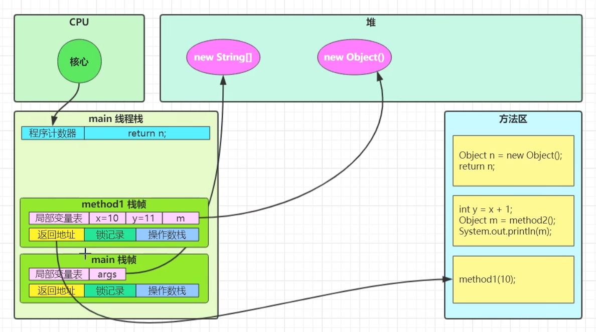
    - 整个执行过程体现了 Java 程序在运行时的内存管理机制与方法调用链条。随着每个方法作用域的结束，局部变量也随之失效，其占用的内存会被及时释放，从而避免内存泄漏。最终，当主方法执行完毕且无其他线程运行时，Java 虚拟机会回收所有资源，标志着程序的完整生命周期结束。
4. 多线程运行原理

    - 示例代码：

      ```java
      public class TestMutilFrames {
          public static void main(String[] args) {
              Thread t1 = new Thread(){
                  @Override
                  public void run() {
                      // 断点模式 要选择 thread 不要选择 all
                      method1(20);
                  }
              };
              t1.setName("t1");
              t1.start();
              method1(10);
          }

          private static void method1(int x) {
              int y = x + 1;
              Object m = method2();
              System.out.println(m);
          }

          private static Object method2() {
              Object n = new Object();
              return n;
          }

      }
      ```
    - 给t1线程和主线程的method1()方法打上注解。注意断点模型要选择Thread（鼠标右键选择）。

      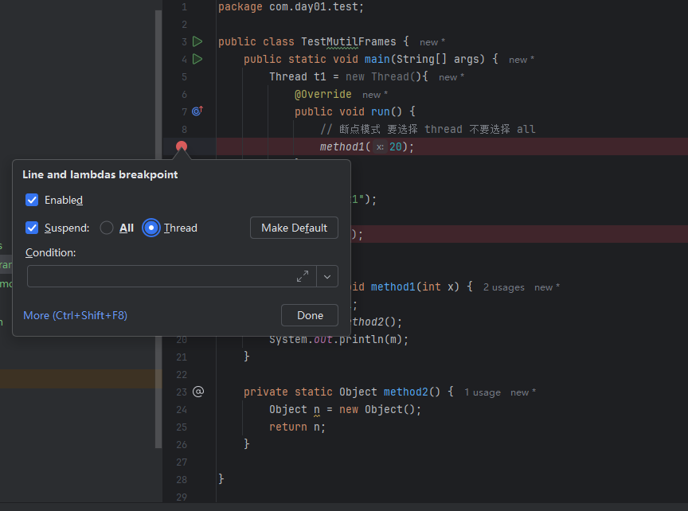
    - 运行主线程，发现t1线程的栈帧内存并没有变化。

      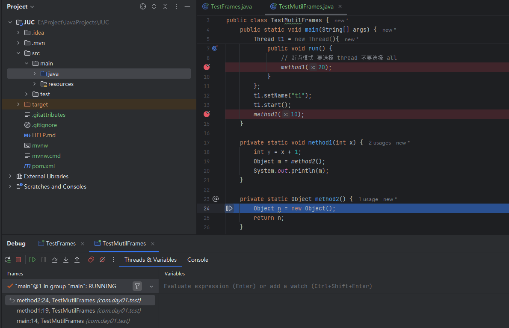

      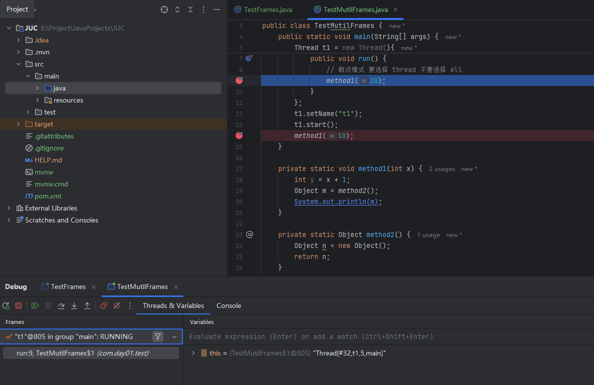
    - 由此可见，多线程运行时，每个栈帧的内存是相互独立的。多线程运行本质上和单线程是一样的，不同点在于，每个线程都有一个自己私有的栈，每个栈里面还是个单线程一样，但是在线程切换时，会保存当前的操作。

#### 3.2  线程上下文切换（Thread Context Switch）

- 导致 cpu 不再执行当前的线程，转而执行另一个线程的代码的原因可能有：

  - 线程的 cpu 时间片用完
  - 垃圾回收
  - 有更高优先级的线程需要运行
  - 线程自己调用了 sleep、yield、wait、join、park、synchronized、lock 等方法
- 当上下文切换（Context Switch）发生时，需要由操作系统保存当前线程的状态，并恢复另一个线程的状态，Java 中对应的概念就是程序计数器（Program Counter Register），它的作用是记住下一条 jvm 指令的执行地址，是线程私有的。

  - 状态包括程序计数器、虚拟机栈中每个栈帧的信息，如局部变量、操作数栈、返回地址等。
  -  频繁发生会影响性能。

# 4、线程常用方法

#### 4.1  常用方法总览

|方法名|static|功能说明|注意|
| ------------------| --------| --------------------------------------------------------------| ---------------------------------------------------------------------------------------------------------------------------------------------------------------|
|start()||启动一个线程，在线程对象中调用run方法中的代码|start 方法只是让线程进入就绪，里面代码不一定立刻运行（由CPU 调度时机决定），每个线程只能调用一次 start 方法；如果多次调用会抛出 IllegalThreadStateException|
|run()||新线程启动后会调用此方法|如果在构造 Thread 对象时传递了 Runnable 参数，则线程启动后会调用 Runnable 中的 run 方法，否则默认不执行任何操作。但可以创建 Thread 的子类对象，来覆盖默认行为|
|join()||等待线程执行结束||
|join(long n)||等待线程运行结束，最多等待 n 毫秒||
|getId()||获取线程长整型的 id|id 唯一|
|getName()||获取线程名||
|setName(String)||修改线程名||
|getPriority()||获取线程优先级||
|setPriority(int)||修改线程优先级|Java中规定线程优先级范围为 1-10 的整数，较大的优先级意味着该线程有更高机率被被 CPU 调度执行|
|getState()||获取线程状态|Java 线程状态用 6 个 enum 表示，分别为：NEW、RUNNABLE、BLOCKED、WAITING、TIMED_WAITING、TERMINATED|
|isInterrupted()||判断是否被中断|不会清除==打断标记==|
|isAlive()||判断线程是否存活（还没有运行完毕）||
|interrupt()||打断线程|如果线程正处在 sleep、wait、join 等状态，打断线程会抛出 InterruptedException，并清除==打断标记==；如果线程正运行，则仅设置==打断标记==，不抛异常；park 的线程被打断，也会设置==打断标记==|
|interrupted()|static|判断是否被中断|会清除==打断标记==|
|currentThread()|static|获取当前正在执行的线程对象||
|sleep(long n)|static|让当前执行的线程休眠 n 毫秒，休眠让出 cpu 的时间片给其它线程||
|yield()|static|提示线程调度器让出当前线程对 CPU 的使用|主要是为了测试和调试|

#### 4.2  start()与run()方法

- 示例代码

  ```java
  // Test1
  import lombok.extern.slf4j.Slf4j;

  @Slf4j(topic = "c.Test")
  public class Test1 {
      public static void main(String[] args) {
          Thread t1 = new Thread("t1") {
              @Override
              public void run() {
                  log.info(Thread.currentThread().getName());
              }
          };
          t1.run();
      }

  }

  // Test2 -- 查看线程状态
  import lombok.extern.slf4j.Slf4j;

  @Slf4j(topic = "c.Test2")
  public class Test2 {

      public static void main(String[] args) {
          Thread t1 = new Thread("t1") {
              @Override
              public void run() {
                  log.debug("running...");
              }
          };

          System.out.println(t1.getState());
          t1.start();
          System.out.println(t1.getState());
      }
  }
  ```
- Test1运行结果

  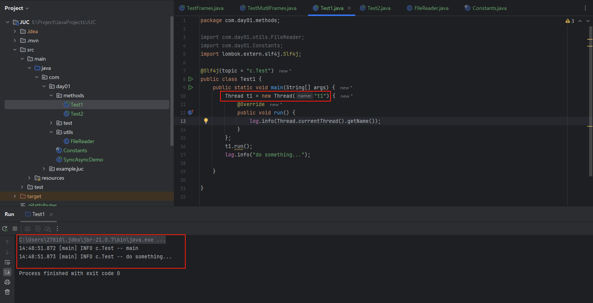

  可以发现，程序仍在 main 线程中运行。

  下面，将第16行的`t1.run()`​替换为`t1.start()`​。

  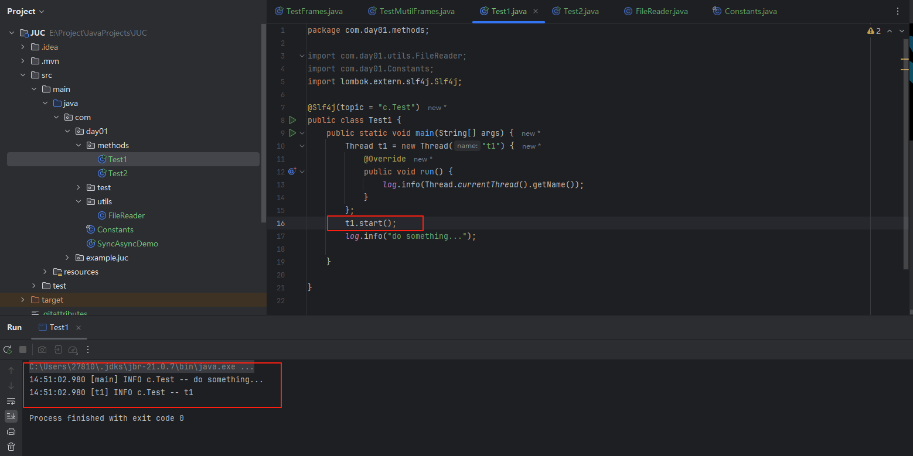

  此时，由t1线程执行了`run()`​方法里的代码，主线程执行了do something...。
- Test2运行结果

  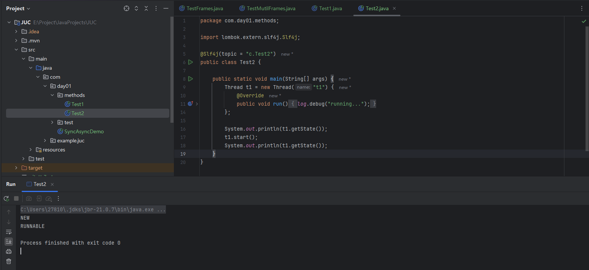

  可以发现，在执行 `start()`​ 方法之前，线程的状态是 `NEW`​ ，在执行了 `start()`​ 之后，线程的状态为 `RUNNABLE`​ 。

#### 4.3  sleep()与yield()方法

- sleep()

  - 调用 `sleep()`​ 会让当前线程从 `Running`​ 进入 `Timed Waiting`​ 状态（阻塞）。
  - 其他线程可以使用 `interrupt()`​ 方法打断正在睡眠的线程，这时 `sleep()`​ 方法会抛出 <span data-type="text" style="background-color: var(--b3-card-error-background); color: var(--b3-card-error-color);">InterruptedException</span>。
  - 睡眠结束后的线程未必会立刻得到执行。
  - TimeUnit中也有`sleep()`​方法，可读性会高一些。
  - 示例代码

    ```java
    // Test3
    public class Test3 {
        public static void main(String[] args) {
            Thread t1 = new Thread("t1") {
                @Override
                public void run() {
                    try {
                        Thread.sleep(2000);
                    } catch (InterruptedException e) {
                        e.printStackTrace();
                    }
                }
            };

            t1.start();

            System.out.println("t1 state: "+ t1.getState());

            try {
                Thread.sleep(500);
            } catch (InterruptedException e) {
                e.printStackTrace();
            }
            System.out.println("t1 state: "+ t1.getState());

        }
    }

    // T
    ```
  - Test3运行结果

    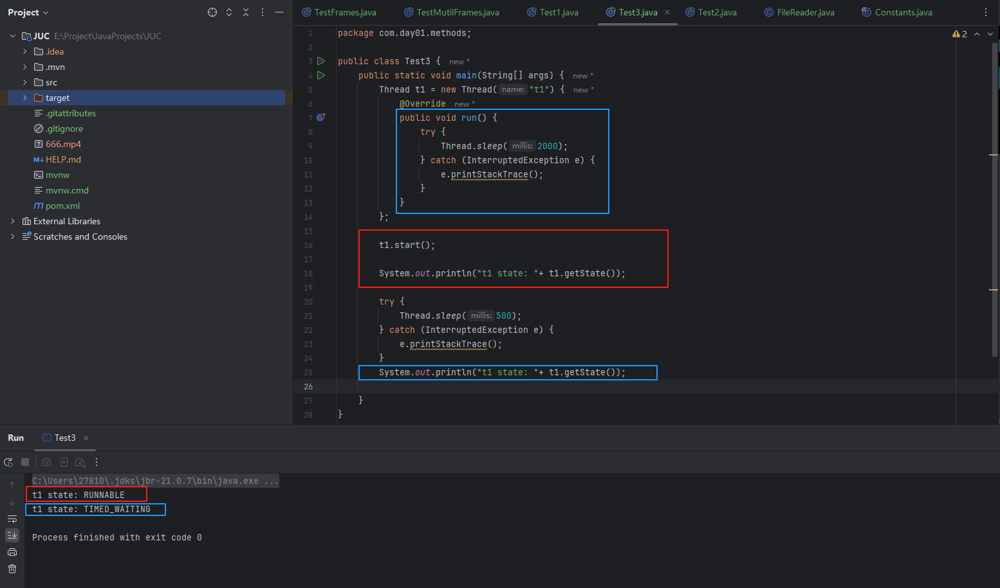

    这里给主线程增加了0.5s的睡眠时间，是防止在t1线程执行到`Thread.sleep(2000)`​之前就已经输出了t1的state。
  - Test4运行结果

    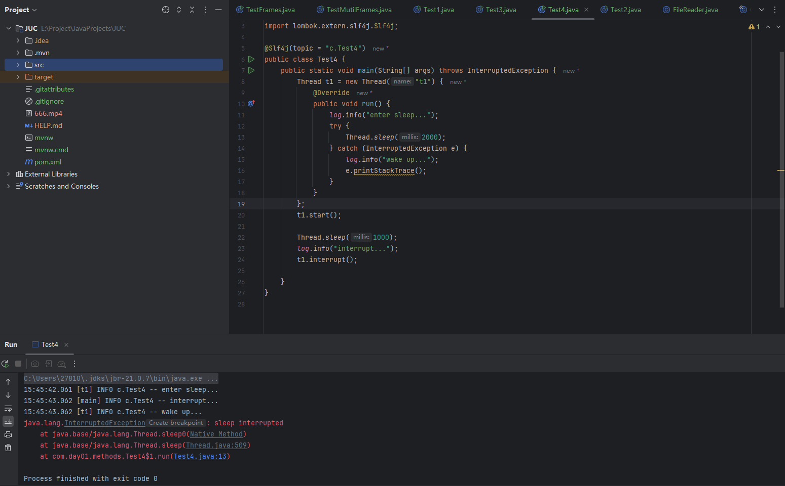
- yield()

  - 调用 yield 会让当前线程从 Running 进入 Runnable 就绪状态，然后调度执行其它线程。

    - **Timed Waiting 阻塞状态 与 Runnable 就绪状态的区别**：**就绪状态**随时有可能被 CPU 调度执行，而**阻塞状态**必须要等到计时结束后才有可能被 CPU 调度执行。
  - 具体的实现依赖于操作系统的任务调度器。
- 线程优先级

  - 线程优先级会提示（hint）调度器优先调度该线程，但它仅仅是一个提示，调度器在调度时可以忽略它。
  - 如果 cpu 比较忙，那么优先级高的线程会获得更多的时间片，但 cpu 闲时，优先级几乎没作用。

#### 4.4  join()方法

- 示例代码

  ```java
  public class Test5 {
      static int r = 0;
      public static void main(String[] args) throws InterruptedException {
          test1();
      }
      private static void test1() throws InterruptedException {
          Thread t1 = new Thread(() -> {
              try {
                  Thread.sleep(1000);
              } catch (InterruptedException e) {
                  e.printStackTrace();
              }
              r = 10;
          });
          t1.start();
          t1.join();//不等待线程执行结束，输出的10
          System.out.println(r);
      }
  }
  ```
- 运行结果

  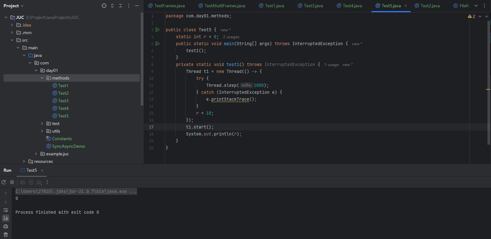

  - 由于主线程调用 `t1.start()`​ 后不会等待子线程 `t1`​ 执行完。 `t1`​ 虽然开始执行，但前面有 `Thread.sleep(1000)`​，所以它 **1 秒后才会执行** **​`r = 10`​**​；而**主线程会立即输出r**，此时子线程根本还没来得及执行，所以 `r`​ 仍然是初始化值 `0`​。

  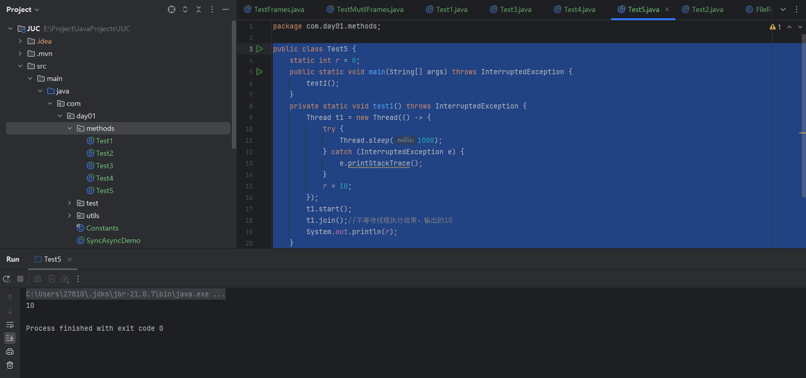

  - 此处 `t1.join()`​ 的作用是：让**主线程阻塞，直到** **​`t1`​**​ **执行完毕**。

    - 所以当主线程执行到 `join()`​ 时，会卡在这里，等待子线程`t1`​执行完 `r = 10;`​。
    - 等 `t1`​ 执行完毕后，主线程继续往下执行 `System.out.println(r);`​，此时 `r = 10`​，所以输出 `10`​。
- 其他示例

  - 等待多个结果

    - 核心代码

      ```java
      Thread t1 = new Thread(() -> {
       	sleep(1);
       	r1 = 10;
      });
      Thread t2 = new Thread(() -> {
       	sleep(2);
       	r2 = 20;
      });
      long start = System.currentTimeMillis();
      t1.start();
      t2.start();

      t1.join();
      t2.join();

      long end = System.currentTimeMillis();
      log.info("r1: {} r2: {} cost: {}", r1, r2, end - start);
      ```
    - 结果

      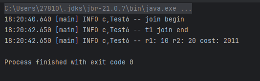

      虽然主线程是**顺序等待**两个线程，但由于 `t1`​ 和 `t2`​ 是 **同时启动的**，因此它们是**并发执行的**，所以总耗时不是 `1s + 2s = 3s`​，而是约等于两个线程中**耗时最长的那个**，也就是 `t2`​ 的 **2 秒。**
  - 有时效的join

    - 代码

      ```java
      //  线程执行时间 1 秒，join 等待 1.5 秒
      Thread t1 = new Thread(() -> {
          sleep(1);     // 睡眠 1 秒
          r1 = 10;
      });
      long start = System.currentTimeMillis();
      t1.start();
      t1.join(1500);    // 最多等待 1.5 秒
      long end = System.currentTimeMillis();
      log.debug("r1: {} r2: {} cost: {}", r1, r2, end - start);


      // 线程执行时间 2 秒，join 等待 1.5 秒
      Thread t1 = new Thread(() -> {
          sleep(2);     // 睡眠 2 秒
          r1 = 10;
      });
      long start = System.currentTimeMillis();
      t1.start();
      t1.join(1500);    // 最多等待 1.5 秒
      long end = System.currentTimeMillis();
      log.debug("r1: {} r2: {} cost: {}", r1, r2, end - start);
      ```
    - 结果

      - 线程执行时间 1 秒，join 等待 1.5 秒。

        实际耗时1秒。

        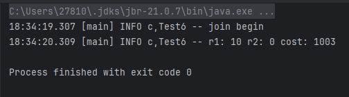
      - 线程执行时间 2 秒，join 等待 1.5 秒。

        实际耗时1.5秒。

        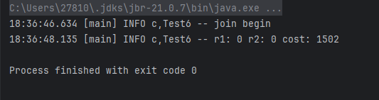
      - 带超时的 `join(millis)`​ 是“最多等待”，不是“至少等待”。如果线程在规定时间内执行完，主线程就会提前继续；否则时间一到，主线程就会放弃等待，无论线程是否完成。
- join的源码分析

  - 代码

    ```java
    public final void join() throws InterruptedException {
        join(0);
    }

    public final synchronized void join(long millis) throws InterruptedException {
        long base = System.currentTimeMillis();
        long now = 0;

        if (millis < 0) {
            throw new IllegalArgumentException("timeout value is negative");
        }

        if (millis == 0) {
            while (isAlive()) {
                wait(0);  // 重点
            }
        } else {
            while (isAlive()) {
                long delay = millis - now;
                if (delay <= 0) break;
                wait(delay);  // 重点
                now = System.currentTimeMillis() - base;
            }
        }
    }
    ```

    - synchronized 修饰

      - ​`join()`​ 是同步方法；

        - 从调度的角度来说，**需要等待结果返回**，才能继续运行就是**同步**；**不需要等待结果返回**，就能继续运行就是**异步**。
      - 加锁的是当前线程对象 `t1`​，即调用 `t1.join()`​ 时会尝试获取 `t1`​ 对象的锁。
    - wait的作用

      - 当前线程（主线程）在 `t1`​ 对象上调用 `wait()`​；
      - 主线程就会被挂起（进入等待状态）；
      - 等待 `t1`​ 线程执行完毕，JVM 会自动调用 `notifyAll()`​ 唤醒等待 `t1`​ 的线程；
      - 然后主线程被唤醒，跳出循环，继续执行。
- 总结

  - ​`join()`​方法是被 `synchronized`​ 修饰的，本质上是一个对象锁，其内部的 `wait()`​方法调用也是释放锁的，但是**释放的是当前的线程对象锁，而不是外面的锁。**
  - 当调用某个线程 `t1`​ 的`join()`​方法后，该线程 `t1`​ 抢占到 CPU 资源，就不再释放，直到线程执行完毕。
  - 当有多个线程并发执行时，可以分别对每个线程调用 `join()`​ 方法。由于这些线程是**并发启动的**，所以总等待时间通常取决于**最慢的线程的执行时间**，而不是它们的总和。无论 `join()`​ 的顺序如何，主线程都会依次等待每个子线程执行完成，因此多个线程的 `join()`​ 是**并行执行 + 顺序等待**的组合。
  - 带超时参数的 `join(timeout)`​ 表示**最多等待指定时间**，如果线程在这段时间内还未执行完，主线程就会放弃等待，继续往下执行。这种用法适合在对响应时间有要求的场景中使用，比如服务调用超时控制。

    - 若线程在规定时间内执行完，主线程能等到结果；
    - 若线程未完成，主线程将继续执行，结果可能未准备好。
  - ​`join()`​的限制

    - ​`join()`​ **不能直接返回执行结果**，通常需要借助共享变量，这破坏了封装性；
    - ​`join()`​ 依赖 `Thread`​ 对象，**不适用于线程池中的任务**，因为线程池返回的是 `Future`​，没有 `Thread`​ 实例；
    - 在多线程复杂同步场景下，`join()`​ 不够灵活，推荐使用 `Future.get()`​、`CountDownLatch`​、`CompletableFuture`​ 等替代方案。
  - **拓展：线程同步**

    - ​`Thread.join()`​ 是一种简单的线程同步方式，它通过阻塞当前线程直到目标线程执行完毕，实现顺序控制。然而，它不支持直接返回线程的执行结果，通常需要借助外部共享变量，这种方式不符合面向对象的封装原则，同时也无法配合线程池使用。
    - 相比之下，`Future.get()`​ 提供了更面向对象的线程同步方式。它允许主线程以同步的方式等待子线程的返回结果，结果被封装在 `Future`​ 对象中，更安全、灵活，且与线程池配合使用非常方便，是现代并发编程中更推荐的方式。

#### 4.5  interrupt()方法

​`sleep()`​、`wait()`​、`join()`​ 这几个方法都会让线程进入阻塞状态，打断线程会导致抛出 `InterruptedException`​，并**清空打断状态**（标记为false）。

- 打断标记

  - 在 Java 中，每个线程内部都有一个**打断状态标志位**（interrupt flag），它是线程对象中的一个布尔值，用来表示该线程**是否被中断请求过**，**初始值为false**。
- 打断线程

  - ​`public void interrupt()`​：打断这个线程，异常处理机制。
  - ​`public static boolean interrupted()`​：判断当前线程是否被打断，打断返回 true，**清除打断标记**，连续调用两次一定返回 false。
  - ​`public boolean isInterrupted()`​：判断当前线程是否被打断，不清除打断标记。
- 示例代码

  ```java
  //  打断阻塞线程
  @Slf4j(topic = "c.Test7")
  public class Test7 {
      public static void main(String[] args) throws InterruptedException {
          Thread t1 = new Thread(()->{
              sleep(1);
          }, "t1");
          t1.start();
          sleep(0.5);
          t1.interrupt();
          log.info(" 打断状态: {}", t1.isInterrupted());
      }
  }

  //  打断正常线程
  @Slf4j(topic = "c.Test8")
  public class Test8 {
      public static void main(String[] args) throws InterruptedException {
          Thread t2 = new Thread(()->{
              while(true) {
                  Thread current = Thread.currentThread();
                  boolean interrupted = current.isInterrupted();
                  if(interrupted) {
                      log.info(" 打断状态: {}", interrupted);
                      break;
                  }
              }
          }, "t2");
          t2.start();
          sleep(0.5);
          t2.interrupt();
      }
  }
  ```
- 运行结果

  - 打断阻塞线程

    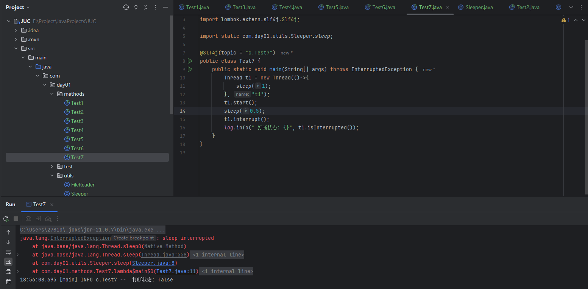

    ​`t1`​ 启动后立刻调用 `sleep(1)`​，进入阻塞（Sleeping）状态。主线程休眠 0.5 秒后，调用 `t1.interrupt()`​ 发送中断。收到中断后，抛出 InterruptedException 异常，打断标记被自动清除（重置为 false）。

  - 打断正常线程

    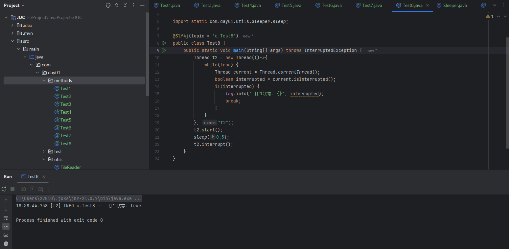

    ​`t2`​ 线程在运行中没有进入阻塞状态，只是在 `while(true)`​ 中不断检查是否被中断。调用 `t2.interrupt()`​ 后，打断标记被设置为 `true`​。线程在 `isInterrupted()`​ 检查到 `true`​，主动退出循环。
- 设计模式 —— 两阶段终止

  - 目标：**在一个线程 T1 中如何优雅终止线程 T2？** ——优雅指的是给 T2 一个后置处理器。
  - 流程图

    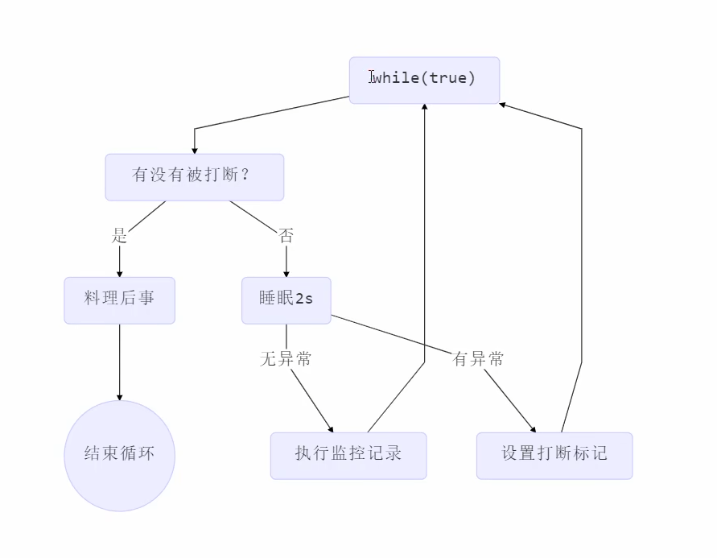

    如果被打断，那么就料理后事，结束循环，如果没有被打断，那么 首先睡眠 2s，如果无异常，就正常的执行监控记录，然后继续循环；如果有异常，则重新设置打断标记。
  - 代码

    ```java
    import lombok.extern.slf4j.Slf4j;

    @Slf4j(topic = "c.Test9")
    public class Test9 {
        public static void main(String[] args) throws InterruptedException {
            TwoPhaseTermination tpt = new TwoPhaseTermination();
            tpt.start();

            Thread.sleep(3500);
            tpt.stop();
        }
    }


    @Slf4j(topic = "c.TwoPhaseTermination")
    class TwoPhaseTermination {
        private Thread monitor;

        public void start(){
            monitor = new Thread(() -> {
                while(true) {
                    Thread current = Thread.currentThread();
                    if(current.isInterrupted()) {
                        log.info("料理后事");
                        break;
                    }
                    try {
                        Thread.sleep(1000);
                        log.info("将结果保存");
                    } catch (InterruptedException e) {
                        e.printStackTrace();
                        // 打断 sleep后会清除 打断标记，所以需要重新设置打断标记
                        current.interrupt();
                    }

                }
            },"监控线程");
            monitor.start();
        }

        public void stop() {
            monitor.interrupt();
        }

    }
    ```
  - 结果

    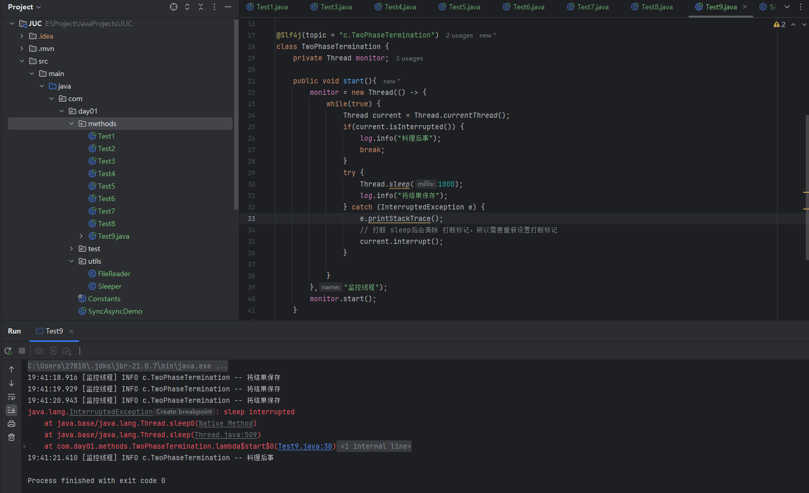
- 打断 park 线程

  - park 作用类似 sleep，打断 park 线程，不会清空打断状态（true）

    ```java
    public static void main(String[] args) throws Exception {
        Thread t1 = new Thread(() -> {
            System.out.println("park...");
            LockSupport.park();
            System.out.println("unpark...");
            System.out.println("打断状态：" + Thread.currentThread().isInterrupted());//打断状态：true
        }, "t1");
        t1.start();
        Thread.sleep(2000);
        t1.interrupt();
    }
    ```
  - 如果打断标记已经是 true, 则 park 会失效

    ```java
    LockSupport.park();
    System.out.println("unpark...");
    LockSupport.park();//失效，不会阻塞
    System.out.println("unpark...");//和上一个unpark同时执行

    // 可以使用 Thread.interrupted()，清除打断标记
    ```
- 小结

  - Java 中的 `interrupt()`​ 并不会强制终止线程，而是**设置一个打断标记**。如果线程在阻塞中（如 sleep），会抛出异常并清除标记；否则线程需要自行检测打断标记并决定是否响应中断。
  - 打断的线程会发生上下文切换，操作系统会保存线程信息，抢占到 CPU 后会从中断的地方接着运行（打断不是停止）。

#### 4.6  主线程与守护线程

- 默认情况下，Java 进程需要等待所有线程都运行结束，才会结束。有一种特殊的线程叫做守护线程，只要其他非守护线程运行结束了，即使守护线程的代码没有执行完，也会强制结束。
- 示例代码

  ```java
  @Slf4j(topic = "c.Test10")
  public class Test10 {
      public static void main(String[] args) {
          Thread t1 = new Thread(() -> {
              while (true) {
                  if (Thread.currentThread().isInterrupted()) {
                      break;
                  }
              }
              log.info("子线程运行结束...");
          }, "t1");

          t1.start();
          sleep(1);       // 主线程等待1秒
          log.info("主线程运行结束...");
      }
  }
  ```
- 运行结果

  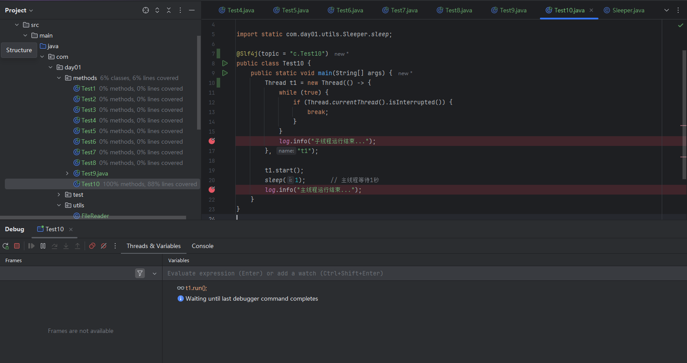

  可以发现，主线程已经运行结束，但Java进程并没有结束，这是因为t1线程陷入了死循环，还没有结束。

  使用`t1.setDaemon(true)`​ 将t1线程设置为守护线程。

  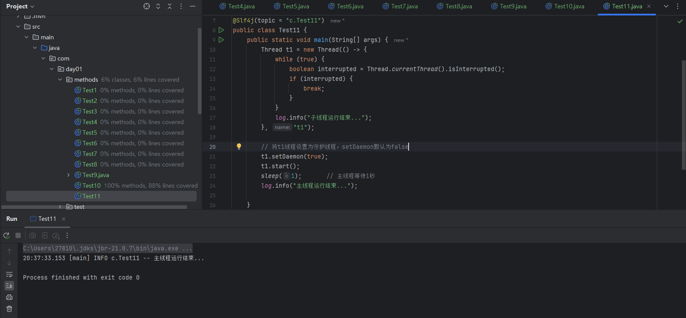

  当主线程运行结束后，守护线程t1也会强制结束。

#### 4.7  线程状态

- 五种状态（从操作系统层面来描述）

  - 状态图

    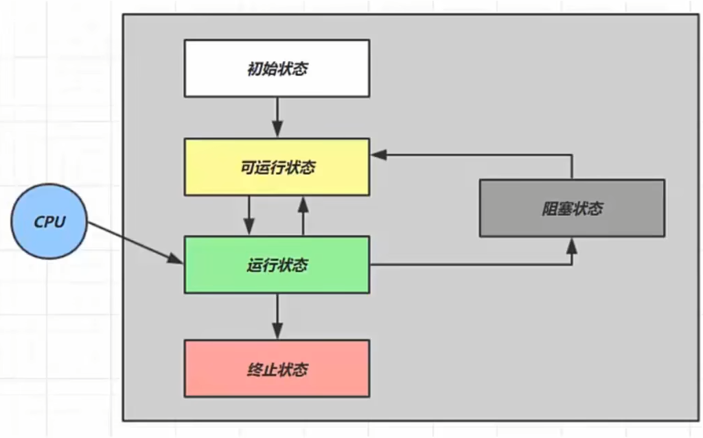
  - 描述

    - **初始状态** ：仅是在语言层面创建了线程对象，还未与操作系统线程关联（相当于 new了线程还没有start）。
    - **可运行状态**：（就绪状态）指该线程已经被创建（与操作系统线程关联），可以由 CPU 调度执行。
    - **运行状态**：指获取了 CPU 时间片运行中的状态。

      - 当 CPU 时间片用完，会从【运行状态】转换至【可运行状态】，会导致线程的上下文切换。
    - **阻塞状态**：

      - 如果调用了阻塞 API，如 BIO 读写文件，这时该线程实际不会用到 CPU，会导致线程上下文切换，进入【阻塞状态】。
      - 等 BIO 操作完毕，会由操作系统唤醒阻塞的线程，转换至【可运行状态】。
      - 与【可运行状态】的区别是，对【阻塞状态】的线程来说只要它们一直不唤醒，调度器就一直不会考虑调度它们。
    - **终止状态**：表示线程已经执行完毕，生命周期已经结束，不会再转换为其它状态。
- 六种状态（从 Java API 层面来描述）

  - 状态图

    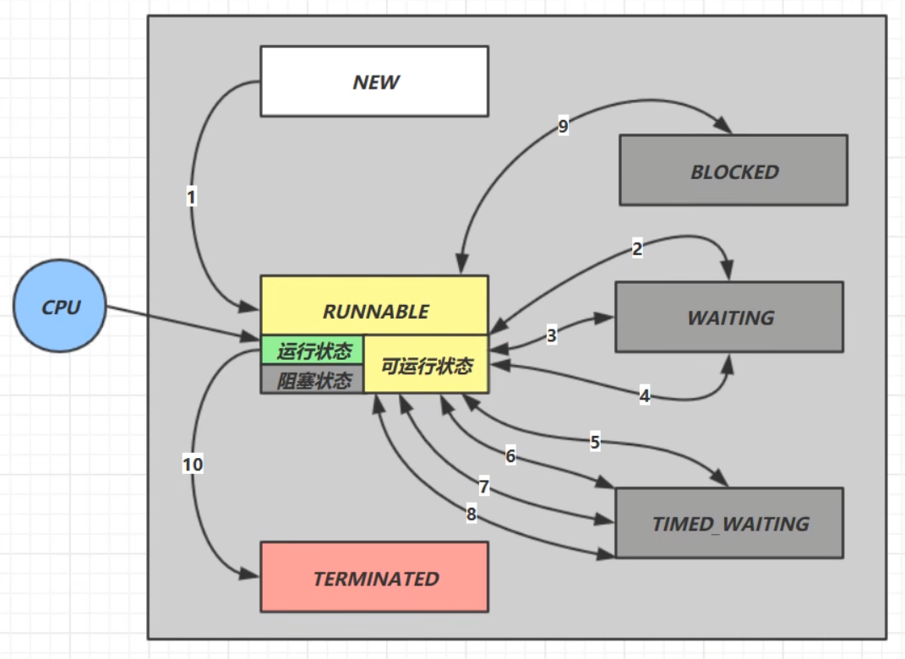
  - 描述

    当线程被创建并启动以后，既不是一启动就进入了执行状态，也不是一直处于执行状态，在`java.lang.Thread.State`​这个枚举中给出了六种线程状态：

    |线程状态|导致状态发生条件|
    | ----------------------------| -------------------------------------------------------------------------------------------------------------------------------------------------------|
    |NEW（新建）|线程刚被创建，但是并未启动，还没调用 `start`​ 方法，只有线程对象，没有线程特征。|
    |Runnable（可运行）|线程可以在 Java 虚拟机中运行的状态，可能正在运行自己代码，也可能没有，这取决于操作系统处理器是否调用了 `t.start()`​ 方法。|
    |Blocked（阻塞）|当一个线程试图获取一个对象锁，而该对象锁被其他的线程持有，则该线程进入 `Blocked`​ 状态；当该线程持有锁时，该线程将变成 `Runnable`​ 状态。|
    |Waiting（无限等待）|一个线程在等待另一个线程执行一个（唤醒）动作时，该线程进入 Waiting 状态，进入这个状态后不能自动唤醒，必须等待另一个线程调用 `notify`​ 或者 `notifyAll`​ 方法才能唤醒。|
    |Timed Waiting （限期等待）|有几个方法有超时参数，调用将进入 `Timed Waiting`​ 状态，这一状态将一直保持到超时期满或者接收到唤醒通知。带有超时参数的常用方法有 `Thread.sleep`​ 、`Object.wait`​。|
    |Teminated（结束）|run 方法正常退出而死亡，或者因为没有捕获的异常终止了 run 方法而死亡。|

    - ​`NEW → RUNNABLE`​

      - 当我们使用 `new Thread()`​ 创建线程对象时，它还没有“活跃”，处于 `NEW`​ 状态。
      - 只有调用 `t.start()`​ 方法，JVM 才会将线程注册到系统线程调度器中，进入 **RUNNABLE（可运行）**  状态。
    - ​`RUNNABLE <--> WAITING`​

      - 线程可以在某些情况下从 RUNNABLE 进入 WAITING 状态，也可以被其他线程唤醒回到 RUNNABLE。
      - 进入 WAITING 状态的方式：

        - **调用** **​`obj.wait()`​** ​ **方法**  
          当前线程会进入“无限期等待”，直到被其他线程 `notify()`​ 或 `notifyAll()`​ 唤醒。
        - **调用** **​`t.join()`​** ​ **方法**  
          当前线程会等待线程 `t`​ 执行完毕。
        - **调用** **​`LockSupport.park()`​** ​ **方法**  
          当前线程进入无限期等待状态。
      - 从 WAITING 回到 RUNNABLE 的方式：

        - **调用** **​`obj.notify()`​** ​ **或** **​`notifyAll()`​** ​

          - 会唤醒等待在这个对象监视器上的线程。
        - **调用** **​`t.interrupt()`​** ​

          - 被中断的线程将抛出 `InterruptedException`​，提前退出等待状态。
        - **在调用**​` obj.notify()`​、`obj.notifyAll()`​、`t.interrupt()`​**时：**

          - 如果竞争锁成功，线程进入 RUNNABLE；
          - 如果竞争失败（其他线程仍持有锁），线程会短暂进入 BLOCKED。
    - ​`RUNNABLE <--> TIMED_WAITING`​

      - TIMED\_WAITING 是带有“超时限制”的等待状态，一般用于等待一段指定时间后自动返回。
      - **进入 TIMED_WAITING 的方式：**

        - ​`Thread.sleep(long millis)`​  
          线程睡眠一段时间后自动恢复。
        - ​`obj.wait(long millis)`​  
          等待一段时间后自动恢复。
        - ​`t.join(long millis)`​  
          等待某个线程运行一段时间或完成。
        - ​`LockSupport.parkNanos()`​ / `parkUntil()`​  
          精确等待一段时间。
      - **从 TIMED_WAITING 回到 RUNNABLE：**

        - 时间到了自动恢复；
        - 或被中断（`interrupt()`​）提前恢复；
        - 或者被其他线程唤醒（`notify()`​）
    - ​`RUNNABLE <--> BLOCKED`​

      - BLOCKED 是**线程在等待锁（synchronized）资源**时进入的一种状态。
      - **进入 BLOCKED 状态的方式：**

        - 线程调用了 `synchronized(obj)`​，但是该对象锁已被其他线程占用，则该线程会**被阻塞**。
      - **从 BLOCKED 回到 RUNNABLE：**

        - 当前占有锁的线程释放锁；
        - 等待中的线程获得锁，进入 RUNNABLE，准备执行代码。
  - 示例代码

    ```java
    @Slf4j(topic = "c.TestState")
    public class TestState {
        public static void main(String[] args) throws IOException {
            Thread t1 = new Thread("t1") {
                @Override
                public void run() {
                    log.info("running...");
                }
            };

            Thread t2 = new Thread("t2") {
                @Override
                public void run() {
                    while(true) { // runnable

                    }
                }
            };
            t2.start();

            Thread t3 = new Thread("t3") {
                @Override
                public void run() {
                    log.info("running...");
                }
            };
            t3.start();

            Thread t4 = new Thread("t4") {
                @Override
                public void run() {
                    synchronized (TestState.class) {
                        try {
                            Thread.sleep(1000000); // timed_waiting
                        } catch (InterruptedException e) {
                            e.printStackTrace();
                        }
                    }
                }
            };
            t4.start();

            Thread t5 = new Thread("t5") {
                @Override
                public void run() {
                    try {
                        t2.join(); // waiting
                    } catch (InterruptedException e) {
                        e.printStackTrace();
                    }
                }
            };
            t5.start();

            Thread t6 = new Thread("t6") {
                @Override
                public void run() {
                    synchronized (TestState.class) { // blocked
                        try {
                            Thread.sleep(1000000);
                        } catch (InterruptedException e) {
                            e.printStackTrace();
                        }
                    }
                }
            };
            t6.start();

            try {
                Thread.sleep(500);
            } catch (InterruptedException e) {
                e.printStackTrace();
            }
            log.info("t1 state {}", t1.getState());
            log.info("t2 state {}", t2.getState());
            log.info("t3 state {}", t3.getState());
            log.info("t4 state {}", t4.getState());
            log.info("t5 state {}", t5.getState());
            log.info("t6 state {}", t6.getState());
            System.in.read();
        }
    }
    ```
  - 运行结果

    

    - ​`t1`​ 的状态为`NEW`​，这是因为虽然创建了线程对象，但没有调用 `.start()`​，所以还没进入就绪状态。
    - ​`t2`​的状态为`RUNNABLE`​，这是因为`t2`​ 启动后一直在死循环中，占用 CPU 或排队等待 CPU，所以处于可运行状态。
    - ​`t3`​的状态为`TERMINATED`​，这是因为这个线程仅打印一行日志，启动后立刻结束，所以很快变成终止状态。
    - ​`t4`​的状态为`TIMED_WAITING`​，这是因为线程拿到锁后进入 `Thread.sleep(1000000)`​，即进入“限期等待状态”。
    - ​`t5`​的状态为`WAITING`​，这是因为 `t2`​ 是无限循环，永不结束，`t5`​一直在等待`t2`​的结束，所以进入无限 `WAITING`​ 状态。
    - ​`t6`​的状态为`BLOCKED`​，这是因为`t4`​已经拿到了 `TestState.class`​ 的锁并在休眠中，`t6`​尝试拿锁失败，于是进入阻塞状态，等待锁释放。
  - 各状态资源占用情况

    - **新建状态（New）：** 在新建状态下，线程并不占用任何系统资源，只是占用了一些内存空间来存储线程对象本身的信息。
    - **可运行状态（Runnable）：** 在可运行状态下，线程占用了一些系统资源，包括程序计数器、虚拟机栈和一些线程私有数据。这些资源主要用于保存线程的执行上下文和局部变量等信息。
    - **运行状态（Running）：** 在运行状态下，线程会占用CPU资源，以便执行线程的任务。此时，除了占用的CPU资源外，线程还会继续占用可运行状态下的资源。
    - **阻塞状态（Blocked）：** 在阻塞状态下，线程暂时不占用CPU资源，但仍然占用了一些系统资源。具体资源的占用情况取决于线程被阻塞的原因。例如，如果线程因为等待获取锁而被阻塞，那么它会占用一定数量的锁资源和等待队列。
    - **等待状态（Waiting）：** 在等待状态下，线程通常不占用CPU资源和锁资源，但仍然占用了一些系统资源。这些资源包括等待队列、条件变量和一些其他线程同步机制所需的资源。
    - **终止状态（Terminated）：** 在终止状态下，线程不再占用任何系统资源。它的执行上下文和局部变量等信息都会被释放，线程对象本身也可以被垃圾回收。
    - 需要注意的是，不同状态下线程所占用的资源情况是动态变化的。线程的状态会根据线程的调度、等待条件的满足以及任务的完成而发生变化。因此，在编写多线程程序时，需要注意合理管理线程的状态和资源，以避免资源的浪费和性能的下降。

# 5、本章小结

#### 本章的重点在于掌握：

- **线程的创建方式**
- **线程常用 API**：包括 `start`​、`run`​、`sleep`​、`join`​、`interrupt`​ 等方法的用法与区别
- **线程的生命周期与状态切换**
- **线程的应用场景**：

  - **异步调用**：主线程执行过程中，子线程可异步执行耗时任务，提高响应性
  - **效率提升**：利用多线程并行计算，缩短整体运算时间
  - **同步等待**：通过 `join`​ 等手段实现线程间的同步控制
  - **统筹规划**：合理地设计和调度线程，达到资源利用与性能的最优平衡
- **线程运行的底层原理**：

  - 包括线程的栈与栈帧结构、程序计数器、上下文切换机制等
  - ​`Thread`​ 类两种创建方式的源码解析
- **线程设计模式**：

  - **两阶段终止模式**：实现线程的优雅关闭
