# JUC-03  共享资源与线程安全性

# 1、资源共享带来的问题

#### 1.1  在Java中的体现

两个线程对初始值为 0 的静态变量一个做自增，一个做自减，各做 50000 次，结果是 0 吗？

- 示例代码

  ```java
  import lombok.extern.slf4j.Slf4j;

  @Slf4j
  public class Test01 {
      static int counter = 0;

      public static void main(String[] args) throws InterruptedException {
          Thread t1 = new Thread(() -> {
              for (int i = 0; i < 50000; i++) {
                  counter++;
              }
          }, "t1");

          Thread t2 = new Thread(() -> {
              for (int i = 0; i < 50000; i++) {
                  counter--;
              }
          }, "t2");

          t1.start();
          t2.start();
          t1.join();
          t2.join();

          log.info("{}",counter);
      } 
  }
  ```
- 运行结果

  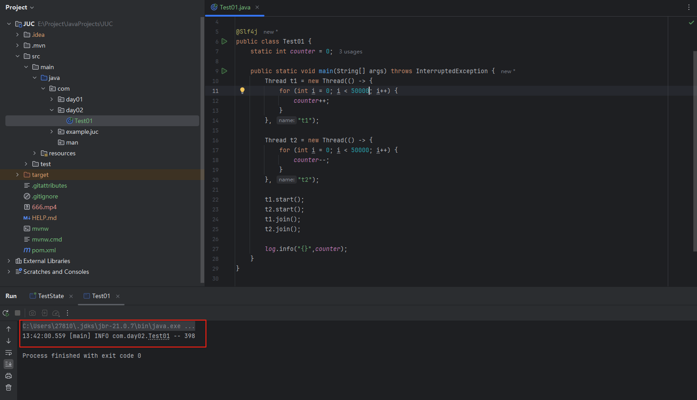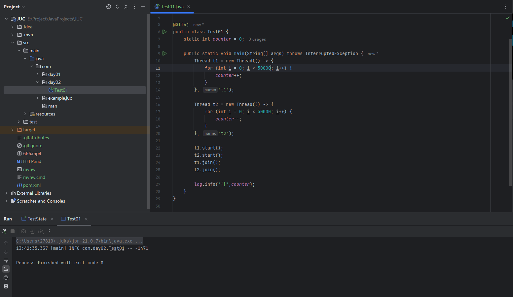
- 结果分析

  - 按理来说，对一个初始值为 `0`​ 的静态变量做 `50000`​ 次自增和自减，取得的结果理论上还是 `0`​ 。但是从运行的结果来看，最终的结果可能大于 `0`​ ，也可能小于 `0`​ ，这与我们的预期不符。
  - 这是因为 Java 中对静态变量的**自增，自减**操作并**不是原子操作**。
  - 对于 `i++`​ 而言（`i`​ 为静态变量），实际会产生如下的 JVM 字节码指令：

    ```java
    getstatic i 	// 获取静态变量i的值
    iconst_1 		// 准备常量1
    iadd 			// 自增
    putstatic i 	// 将修改后的值存入静态变量i
    ```
  - 对于 `i--`​ 而言（`i`​ 为静态变量），实际会产生如下的 JVM 字节码指令：

    ```java
    getstatic i 	// 获取静态变量i的值
    iconst_1		// 准备常量1
    isub 			// 自减
    putstatic i 	// 将修改后的值存入静态变量i
    ```
  - Java 的内存模型如下，完成静态变量的**自增，自减**需要**在主存和工作内存中进行数据交换**：

    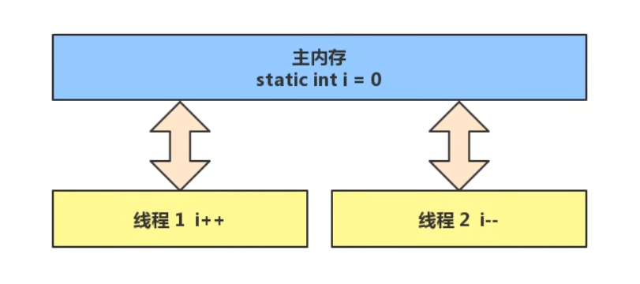
  - 如果是**单线程**，以上的8行代码将会按照**顺序执行**，**不会出错**：

    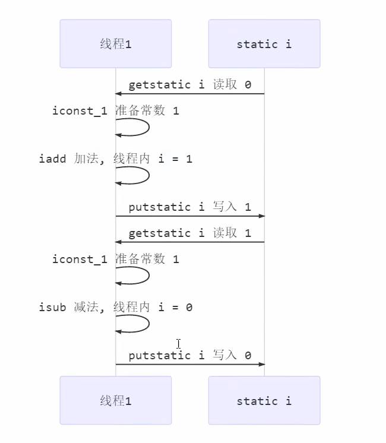
  - 如果是**多线程**，以上的8行代码就可能会**交错执行**：

    - 出现负数的情况：

      - 线程2首先读取到了0，准备好常数1之后，开始做减法，但此时还没有来得及将`i=-1`​写入static，就发生了上下文切换。
      - 线程1读取到了0，准备好常数1之后，开始做加法，此时`i=1`​，由于没有发生上下文切换，它很顺利地将`i=1`​写入static。
      - 发生上下文切换，线程2将`i=-1`​写入static。
      - 最终，`static=-1`​。

        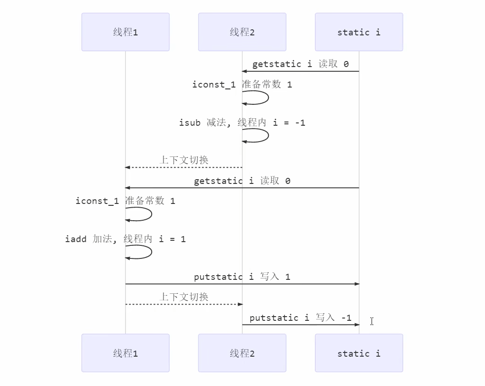
    - 出现正数的情况：

      - 线程1首先读取到了0，准备好常数1之后，开始做加法，但此时还没有来得及将`i=1`​写入static，就发生了上下文切换。
      - 线程2读取到了0，准备好常数1之后，开始做减法，此时`i=-1`​，由于没有发生上下文切换，它很顺利地将`i=-1`​写入static。
      - 发生上下文切换，线程1将`i=1`​写入static。
      - 最终，`static=1`​。

        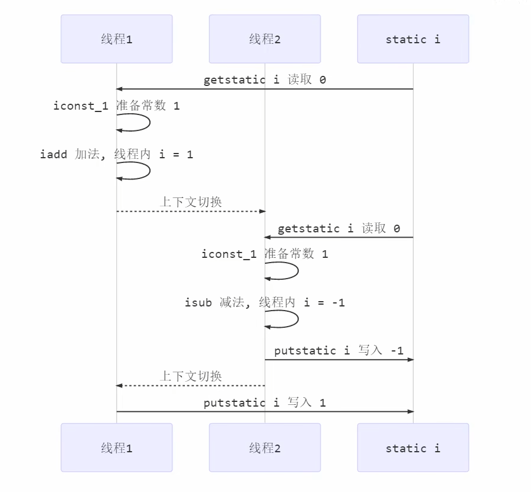

#### 1.2  临界区 Critical Section

- 一个程序运行多个线程本身是没有问题的，问题出在多个线程访问**共享资源。**

  - 假设多线程只读共享资源，通常是安全的，因为没有发生**数据修改。** ​
  - 但如果多个线程在对共享资源进行**读写**操作时，发生了指令交错，就会**出现问题**。
- 一段代码块内如果存在对**共享资源**的多线程读写操作，称这段代码块为**临界区。**

  - 示例代码

    ```java
    static int counter = 0;

    static void increment() 
    // 临界区
    { 
     counter++;
    }

    static void decrement() 
    // 临界区
    { 
     counter--;
    }
    ```

#### 1.3  竞态条件 Race Condition

- 多个线程在临界区内执行，由于代码的**执行序列不同**而导致结果无法预测，称之为发生了**竞态条件。**

  - 示例代码

    ```java
    Thread t1 = new Thread(() -> {
                for (int i = 0; i < 50000; i++) {
                    counter++;
                }
            }, "t1");
    ```
  - 解释：for循环中的代码块`{counter++;}`​是一个**临界区**，在多线程访问它时，发生了**竞态条件**。
- 为了避免临界区的竞态条件发生，有多种手段可以达到目的。

  - 阻塞式的解决方案：**synchronized**，**Lock**。
  - 非阻塞式的解决方案：**原子变量**。

# 2、synchronized解决方案

> **synchronized**，即俗称的 **【对象锁】** ，它采用互斥的方式让同一时刻至多只有一个线程能持有 **【对象锁】** ，其他线程再想获取这个 **【对象锁】** 时就会阻塞住。这样就能保证拥有锁的线程可以安全的执行临界区内的代码，不用担心线程上下文切换。
>
> **注意：** 虽然 java 中互斥和同步都可以采用 synchronized 关键字来完成，但它们还是有区别的：
>
> - **互斥**侧重于**控制对共享资源的访问**，避免多个线程同时执行会导致竞态条件的代码块。它解决的是**并发访问的安全问题**。
> - **同步**侧重于**协调线程之间的执行顺序**，例如一个线程需要等待另一个线程执行到某一阶段或完成某个任务，解决的是**执行先后顺序的问题**。

#### 2.1  synchronized

- 基本语法

  ```java
  // 如果线程1先访问到这里，则获得一个对象锁；此时，后访问到这里的线程将被阻塞，直到线程1将锁释放掉
  synchronized(对象) // 线程1， 线程2(blocked) 
  {
   临界区
  }
  ```
- 使用 synchronized 解决1.1中出现的问题

  - 示例代码

    ```java
    import lombok.extern.slf4j.Slf4j;

    @Slf4j
    public class Test02 {
        static int counter = 0;
        static final Object lock = new Object();

        public static void main(String[] args) throws InterruptedException {
            Thread t1 = new Thread(() -> {
                for (int i = 0; i < 50000; i++) {
                    synchronized (lock) {
                        counter++;
                    }
                }
            }, "t1");

            Thread t2 = new Thread(() -> {
                for (int i = 0; i < 50000; i++) {
                    synchronized (lock) {
                        counter--;
                    }
                }
            }, "t2");

            t1.start();
            t2.start();
            t1.join();
            t2.join();

            log.info("{}",counter);
        }
    }
    ```
  - 运行结果

    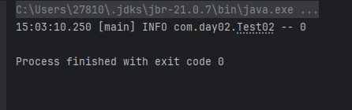

    此时，无论执行多少次，结果都是0。
- 深入思考

  - 如果把 `synchronized(lock)`​ 放在 `for`​ 循环的外面，如何理解？

    改成外层加锁后，只**加锁一次，执行完整个 for 循环后再解锁。**
  - 如果 t1 `synchronized(obj1)`​，而 t2 `synchronized(obj2)`​ 会怎样运作？

    - **t1 和 t2 不再互相阻塞**，因为它们用的是 **不同的锁对象**（`obj1`​ 和 `obj2`​）。
    - 虽然用了 `synchronized`​，**但并没有实现真正的同步**，相当于没加锁。
  - 如果 t1 `synchronized(obj)`​，而 t2 没有加锁，会怎么样？

    - **加锁只保护了 t1 的操作，t2** 是**完全不受限制**地访问 **​`counter`​**​。
    - 所以这个锁**没有任何线程安全的保证**。
    - t2 仍然可能在 t1 的加锁区域内**同时修改** **​`counter`​**​，导致数据竞争，因为 t2 根本不需要获取锁。
- 面向对象的改进（把需要保护的共享变量放入一个类）

  - 示例代码

    ```java
    package com.day02;


    import lombok.extern.slf4j.Slf4j;

    @Slf4j
    public class Test3 {

        public static void main(String[] args) throws InterruptedException {
            Room room = new Room();
            Thread t1 = new Thread(() -> {
                for (int j = 0; j < 5000; j++) {
                    room.increment();
                }
            }, "t1");
            Thread t2 = new Thread(() -> {
                for (int j = 0; j < 5000; j++) {
                    room.decrement();
                }
            }, "t2");
            t1.start();
            t2.start();
            t1.join();
            t2.join();
            log.debug("count: {}", room.get());
        }
    }

    // 把需要保护的共享变量放入一个类
    class Room {
        int value = 0;

        public void increment() {
            synchronized (this) {
                value++;
            }
        }

        public void decrement() {
            synchronized (this) {
                value--;
            }
        }

        public int get() {
            synchronized (this) {
                return value;
            }
        }
    }
    ```
  - ​`Room`​ 类专注于维护和操作一个“房间内的计数值”，**将数据和操作数据的方法封装在一起**，对外提供接口，提供线程安全的操作方法，隐藏实现细节。
  - ​`Test3`​ 类则是程序的入口，负责线程的创建和启动，**使用** **​`Room`​**​ **类提供的接口完成任务**，而不是混杂在一个类中完成所有功能。

# 3、方法上的synchronized

#### 3.1  等价替换

- 示例代码

  ```java
  class Test1 {
      public synchronized void test() {

      }
  }
  //  等价于
  class Test {
      public void test() {
          synchronized (this) { // 实际上是对 对象实例上锁，而不是对象本身

          }
      }
  }


  class Test2 {
      public synchronized static void test() {
      }
  }
  //  等价于
  class Test {
      public static void test() {
          synchronized (Test.class) {

          }
      }
  }
  ```

#### 3.2  “线程八锁”

- 说明：主要关注锁住的对象是不是同一个

  - 锁住类对象，所有类的实例的方法都是安全的，类的所有实例都相当于同一把锁。
  - 锁住 this 对象，只有在当前实例对象的线程内是安全的，如果有多个实例就不安全。
- 示例代码1

  ```java
  class Number {
      public synchronized void a() {
          log.debug("1");
      }
      public synchronized void b() {
          log.debug("2");
      }
  }
  public static void main(String[] args) {
      Number n1 = new Number();
      new Thread(() -> { n1.a(); }).start();
      new Thread(() -> { n1.b(); }).start();
  }
  ```

  - 结果

    ```java
    1 2
    // 或者
    2 1
    ```
  - 解释

    - ​`a()`​ 和 `b()`​ 都是 **​`synchronized`​**​ **实例方法**，是同一个对象 `n1`​ 的 **对象锁。谁先抢到锁，谁先执行。**
- 示例代码2

  ```java
  class Number {
      public synchronized void a() {
          sleep(1);
          log.debug("1");
      }
      public synchronized void b() {
          log.debug("2");
      }
  }
  public static void main(String[] args) {
      Number n1 = new Number();
      Number n2 = new Number();
      new Thread(() -> { n1.a(); }).start();
      new Thread(() -> { n2.b(); }).start();
  }
  ```

  - 结果

    ```java
    // 等待一秒之后，立马输出1和2
    1 2

    // 或者，先输出2，等待一秒之后再输出1
    2 1
    ```
  - 解释

    - **谁先抢到锁，谁先执行。**
- 示例代码3

  ```java
  class Number {
      public synchronized void a() {
          sleep(1);
          log.debug("1");
      }
      public synchronized void b() {
          log.debug("2");
      }
      public void c() {
          log.debug("3");
      }
  }
  public static void main(String[] args) {
      Number n1 = new Number();
      new Thread(() -> { n1.a(); }).start();
      new Thread(() -> { n1.b(); }).start();
      new Thread(() -> { n1.c(); }).start();
  }

  ```

  - 结果

    ```java
    // 3  等待1秒，输出 1 2 
    // 3 2    等待1秒，输出 1
    // 2 3    等待1秒，输出 1
    ```
  - 解释

    - ​`c()`​ 是普通方法，没有加锁，因此**不受任何影响。**
- 示例代码4

  ```java

  class Number {
      public synchronized void a() {
          sleep(1);
          log.debug("1");
      }
      public synchronized void b() {
          log.debug("2");
      }
  }
  public static void main(String[] args) {
      Number n1 = new Number();
      new Thread(() -> { n1.a(); }).start();
      new Thread(() -> { n1.b(); }).start();
  }

  ```

  - 结果

    ```java
    // 2  1秒后  输出1
    ```
  - 解释

    - ​`synchronized（this）`​ 锁住的是实例对象，而main中有两个不一样的实例，那么其实就相当于没加锁，所以自然是这个执行顺序。
- 示例代码5

  ```java
  class Number {
      public static synchronized void a() {
          sleep(1);
          log.debug("1");
      }

      public synchronized void b() {
          log.debug("2");
      }
  }

  public static void main(String[] args) {
      Number n1 = new Number();
      new Thread(() -> {
          n1.a();
      }).start();
      new Thread(() -> {
          n1.b();
      }).start();
  }
  ```

  - 结果

    ```java
    // 2  1秒后  输出1
    ```
  - 解释

    - 如果给静态方法加锁，实际上的锁对象是类本身，而不是实例对象，而给普通方法加锁，锁对象是实例对象。那么其实就相当于没加锁。
- 示例代码6

  ```java
  class Number {
      public static synchronized void a() {
          sleep(1);
          log.debug("1");
      }

      public static synchronized void b() {
          log.debug("2");
      }
  }

  public static void main(String[] args) {
      Number n1 = new Number();
      new Thread(() -> {
          n1.a();
      }).start();
      new Thread(() -> {
          n1.b();
      }).start();
  }
  ```

  - 结果

    ```java
    // 2  一秒后输出1    
    // 一秒后输出 1 2  
    ```
  - 解释

    - 锁住的是类对象，**谁先抢到锁，谁先执行。**
- 示例代码7

  ```java
  class Number {
      public static synchronized void a() {
          sleep(1);
          log.debug("1");
      }

      public synchronized void b() {
          log.debug("2");
      }
  }

  public static void main(String[] args) {
      Number n1 = new Number();
      Number n2 = new Number();
      new Thread(() -> {
          n1.a();
      }).start();
      new Thread(() -> {
          n2.b();
      }).start();
  }

  ```

  - 结果

    ```java
    // 2  一秒后输出1    
    ```
  - 解释

    - 相当于没加锁。
- 示例代码8

  ```java
  class Number {
      public static synchronized void a() {
          sleep(1);
          log.debug("1");
      }

      public static synchronized void b() {
          log.debug("2");
      }
  }

  public static void main(String[] args) {
      Number n1 = new Number();
      Number n2 = new Number();
      new Thread(() -> {
          n1.a();
      }).start();
      new Thread(() -> {
          n2.b();
      }).start();
  }
  ```

  - 结果

    ```java
    // 2  一秒后输出1    
    // 一秒后输出 1 2      
    ```
  - 解释

    - **谁先抢到锁，谁先执行。**

# 4、变量的线程安全分析

#### 4.1  成员变量和静态变量是否线程安全

- 如果它们没有共享，则线程安全。
- 如果它们被共享了，根据它们的状态是否能够改变，又分两种情况：

  - 如果只有读操作，则线程安全。
  - 如果有读写操作，则这段代码是临界区，需要考虑线程安全。

#### 4.2  局部变量是否线程安全

- 局部变量是线程安全的。

  - 局部变量是 ​**定义在方法内部的变量**​，每次方法调用时都会在该线程的 **栈帧（栈内存）**  中创建一份副本。
  - 因为栈是 **线程私有** 的，所以 ​**局部变量只能被当前线程访问**​，​**不会被多个线程共享**​，也就​**不存在线程安全问题**​。
- 但局部变量引用的对象则未必是线程安全的：

  - 如果该对象没有逃离方法的作用访问（比如没有作为返回值、没有赋值给类成员变量），它是线程安全的。

    - ```java
      public void process() {
          StringBuilder sb = new StringBuilder(); // 创建于方法内
          sb.append("hello"); // 仅当前线程使用
          sb.append(" world");
          System.out.println(sb.toString()); // 安全
      }
      ```
  - 如果该对象逃离方法的作用范围（把这个对象传递给了其他线程、返回给外部调用者，或赋值给共享变量），需要考虑线程安全。

#### 4.3  局部变量的线程安全分析

- 局部变量是线程安全的：

  - 示例代码 （变量 `i`​ 是一个 **局部变量**，定义在方法 `test1()`​ 中，作用域仅限于当前方法。变量 `i`​ 是线程安全的。）

    ```java
    public static void test1() {
        int i = 10;
        i++;
    }
    ```
  - 为什么线程安全？因为**局部变量存储在每个线程自己的栈帧中。**

    - Java 中每个线程在方法调用时，会创建一个自己独立的**栈帧（Stack Frame）。** 局部变量 `i`​ 存在**当前线程的栈帧中**，则**不会与其他线程共享。**

    - 因此，每个线程调用 `test1()`​ 时， **​`i`​**​ 都是独立的。无论多少线程同时调用 `test1()`​，它们的 `i`​ 都是**互不影响**的 **。**

    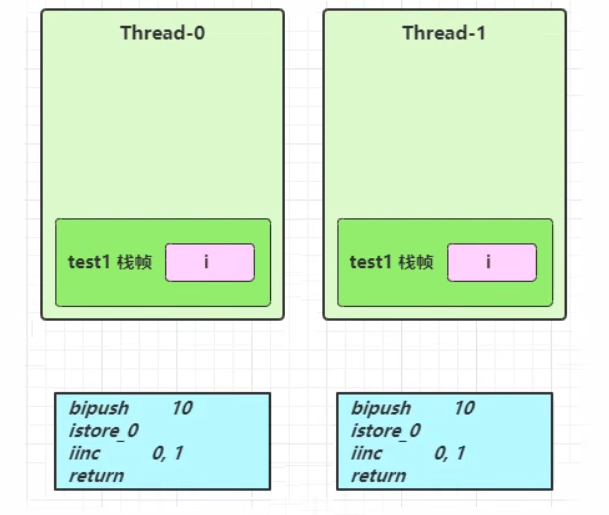
- 局部变量的引用

  - 先看一个成员变量的例子

    - 示例代码

      ```java
      import java.util.ArrayList;

      public class TestThreadSafe {
          static final int THREAD_NUMBER = 2;
          static final int LOOP_NUMBER = 200;
          public static void main(String[] args) {
              ThreadUnsafe test = new ThreadUnsafe();
              for (int i = 0; i < THREAD_NUMBER; i++) {
                  new Thread(() -> {
                      test.method1(LOOP_NUMBER);
                  }, "Thread" + i).start();
              }
          }
      }

      class ThreadUnsafe {
          
          ArrayList<String> list = new ArrayList<>();

          public void method1(int loopNumber) {
              for (int i = 0; i < loopNumber; i++) {
                  // { 临界区, 会产生竞态条件
                  method2();
                  method3();
                  // } 临界区
              }
          }

          private void method2() {
              list.add("1");
          }
          private void method3() {
              list.remove(0);
          }
      }
      ```
    - 运行结果

      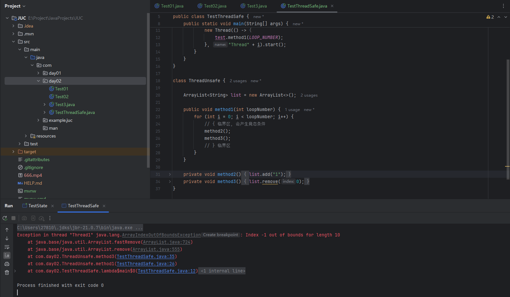
    - 分析

      - 这段代码中，多个线程**同时操作同一个** **​`ArrayList`​**​ **对象**，并且执行的是非线程安全的 `add()`​ 和 `remove()`​ 操作，因此会出现**竞态条件（race condition）** ，最终可能导致出现错误。
      - 无论哪个线程中的 `method2()`​ 引用的都是同一个对象中的 list 成员变量。 `method3()`​ 同理。
      - 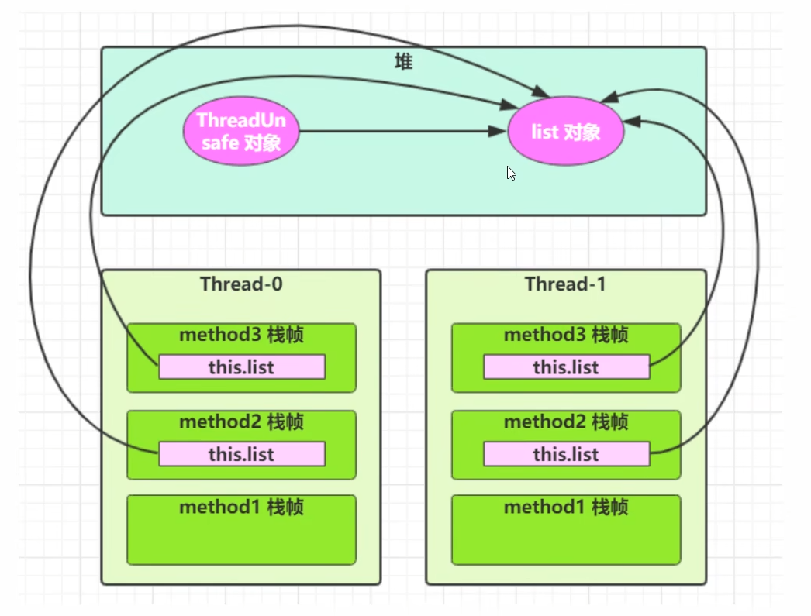
  - 局部变量

    - 示例代码

      ```java
      class ThreadSafe {
          public final void method1(int loopNumber) {
              ArrayList<String> list = new ArrayList<>();
              for (int i = 0; i < loopNumber; i++) {
                  method2(list);
                  method3(list);
              }
          }
          private void method2(ArrayList<String> list) {
              list.add("1");
          }
          private void method3(ArrayList<String> list) {
              list.remove(0);
          }
      }
      ```
    - 运行结果

      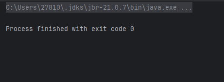
    - 分析

      - 每个线程在调用 `method1()`​ 时，都会创建自己的 `list`​，`list`​ 只在 `method1()`​ 中使用，不存在共享，并且作为参数传给 `method2()`​ 和 `method3()`​。 `method2()`​ 和 `method3()`​也只是局部操作，不会将 `list`​ 保存到全局变量或字段中，也不会传给其他线程。
      - 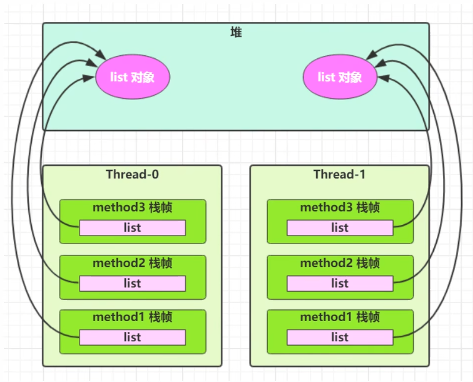
    - 思考：如果将 `method2()`​ 和 `method3()`​ 的访问修饰符由 `private`​ 改为 `public`​ 会怎样？

      - 情况 1：其他线程调用 `method2()`​ 和 `method3()`​，传入非局部的共享 list。

        - **一旦方法为** **​`public`​**​ **，外部线程可以传入任何 list**（不再是方法内局部变量），此时**线程安全无法保障**。
      - 情况 2：子类覆盖 `method2()`​ 或 `method3()`​，并引入共享变量或副作用。

        - 将方法改为 `public`​，子类会重写该方法，可能引入共享状态，**线程安全就不再有保障**。

#### 4.4  常见线程安全类

- **String：**​`String`​ 是 **不可变类（immutable）** 。一旦创建，内容不能更改，因此在多线程中共享是安全的。
- **Integer：**​`Integer`​ 是 **不可变对象**（包装类），单独使用是线程安全的。但如果将它作为**可变字段**（例如 `Integer count++`​），就**不是线程安全**，因为 `++`​ 是复合操作。
- **StringBuffer：** 内部的方法大多使用 `synchronized`​ 修饰。多线程场景下的字符串拼接使用 `StringBuffer`​，单线程推荐 `StringBuilder`​（非线程安全，所以更快）。
- **Vector：** 所有方法都使用 `synchronized`​ 修饰，安全但性能差。推荐使用 `Collections.synchronizedList(new ArrayList<>())`​ 或更高级的 `CopyOnWriteArrayList`​。
- **Hashtable：** 方法使用 `synchronized`​ 修饰，但更推荐使用 `ConcurrentHashMap`​（分段锁 + 无锁优化）。
- **java.util.concurrent 包下的类：** 这是 Java 提供的高性能并发包，包含很多线程安全的类，**效率和扩展性更强**。

> 当多个线程调用它们同一个实例的某个方法时，是线程安全的，因为它们的每个方法是原子的。但当多个方法组合在一起，就不是原子的了，会存在线程安全问题。

- 多个线程调用同一个实例的同一个方法

  ```java
  // 由于Hashtable的put方法被synchronized修饰，因此是线程安全的
  Hashtable table = new Hashtable();
  	
  new Thread(()->{
  	table.put("key", "value1");
  }).start();

  new Thread(()->{
  	table.put("key", "value2");
  }).start();
  ```
- 多个线程调用同一个实例的不同方法

  ```java
  Hashtable table = new Hashtable();
  	
  if(table.get("key")!=null) {
  	table.put("key",value);
  }
  ```

  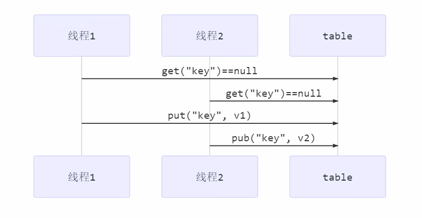

  - 虽然 `Hashtable.get()`​ 和 `Hashtable.put()`​ **各自是线程安全的**（方法加了 `synchronized`​），但是多个线程之间的**组合操作不是原子的。**
  - 在线程1 `get()`​ 到 `put()`​ 的这段时间内，线程2可能也`get()`​ 到 key 的值，或者已经修改了 key 的值，从而导致**竞态条件（** 多个线程在临界区内执行，由于代码的**执行序列不同**而导致结果无法预测，称之为发生了**竞态条件）。**

#### 4.5  不可变类的安全性（暂时先简单了解一下）

> String、Integer 等都是不可变类（只能读，不能改），因为其内部的状态不可以改变，因此它们的方法都是线程安全的。  然而，String 有 **​`replace()`​** ​，**​`substring`​**​ 等方法**可以改变值**，那么这些方法又是如何保证线程安全的呢？

- 一个类被称为“不可变”，指的是：

  - 一旦创建，其**内部状态（字段）不能被修改。**
  - 所有“看起来”是修改的操作，**其实都是创建了一个新的对象。**
- 这个问题的核心在于：**不可变对象本身的设计就天然线程安全**，`String.replace()`​ 的源码完美体现了这一点。

  - ​`replace()`​方法的源码

    ```java
    public String(@NotNull char[] value, int offset, int count) {
        if (offset < 0) {
            throw new StringIndexOutOfBoundsException(offset);
        }
        if (count <= 0) {
            if (count < 0) {
                throw new StringIndexOutOfBoundsException(count);
            }
            if (offset <= value.length) {
                this.value = "".value; // 空字符串的共享值
                return;
            }
        }

        // Note: offset or count might be near -1 >>> 1
        if (offset > value.length - count) {
            throw new StringIndexOutOfBoundsException(offset + count);
        }

        this.value = Arrays.copyOfRange(value, offset, offset + count);
    }


    public String replace(char oldChar, char newChar) {
            if (oldChar != newChar) {
                int len = value.length;
                int i = -1;
                char[] val = value; /* avoid getfield opcode */

                while (++i < len) {
                    if (val[i] == oldChar) {
                        break;
                    }
                }
                if (i < len) {
                    char buf[] = new char[len];
                    for (int j = 0; j < i; j++) {
                        buf[j] = val[j];
                    }
                    while (i < len) {
                        char c = val[i];
                        buf[i] = (c == oldChar) ? newChar : c;
                        i++;
                    }
                    return new String(buf, true);
                }
            }
            return this;
        }
    ```
  - 对源码的分析

    - ​`String.replace()`​ 通过复制原始 `value`​ 数组内容到 `buf`​ 中，构建一个**新的 char[]。**
    - ​`new String(buf, true)`​ 是 `String`​ 的**包内私有构造方法**，生成新的 `String`​ 实例。
    - **原始的** **​`value`​**​ **（即旧字符串的底层数据）从头到尾没有被修改。**
  - 总结

    - ​`String.replace()`​ 等方法之所以线程安全，是因为它们**根本不修改**原对象，所有“变化”都是通过创建新的数据副本（`char[] buf`​）并生成一个新对象，最终实际上只是**返回新的字符串对象。**
