# JUC-04  synchronized底层原理

# 1、Monitor

#### 1.1  Java对象头（以32位虚拟机为例）

- 普通对象

  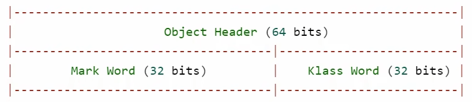
- 数组对象

  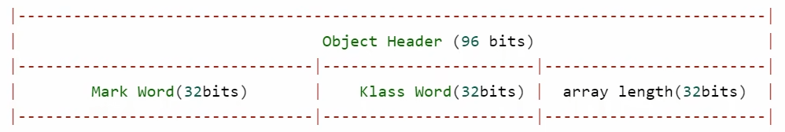
- Mark Word的结构

  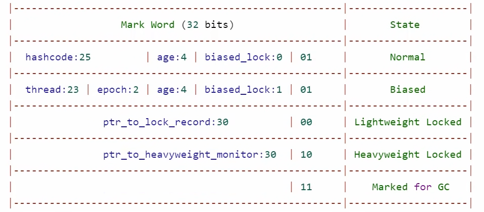

  - 状态位说明（**Mark Word 的最低两位（即最后的 2 bits）表示对象当前的锁状态**）

    |末尾2位（二进制）|状态|说明|
    | ------------------------------| -----------------------------------| -----------------------------------------------------------------|
    |​`01`​|无锁（Normal） / 偏向锁（Biased）|还未加锁，或正处于偏向锁模式（需要配合 biased\_lock 位判断）|
    |​`00`​|轻量级锁（Lightweight Locked）|对象处于轻量级锁状态，Mark Word 存的是指向锁记录的指针|
    |​`10`​|重量级锁（Heavyweight Locked）|对象处于重量级锁，Mark Word 存的是指向 Monitor 的指针|
    |​`11`​|GC 标记（Marked for GC）|对象正在被 GC 标记为可回收（ **Garbage Collection，垃圾回收** ）|
    |​`01`​&& biased\_lock\=1|偏向锁（Biased）|指向持有该锁的线程 ID、epoch、age 等|

#### 1.2  Monitor工作原理

- Monitor 被翻译为**监视器**或**管程。**
- 每个 Java 对象都可以关联一个 Monitor 对象，如果使用 synchronized 给对象上锁（重量级）之后，该对象头的 Mark Word 中就被设置指向 Monitor 对象的指针。Monitor 的结构如下：

  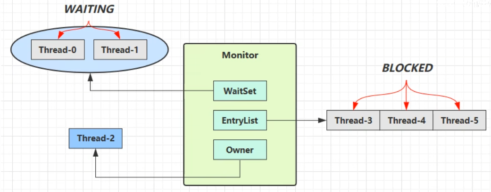

  - 刚开始 Monitor 中 `Owner`​ 为 `null`​ 。
  - 当 Thread-2 执行 `synchronized(obj)`​ 就会将 Monitor 的所有者 `Owner`​ 置为 Thread-2，Monitor中只能有一个 `Owner`​。
  - 在 Thread-2 上锁的过程中，如果 Thread-3，Thread-4，Thread-5 也来执行 `synchronized(obj)`​，就会进入 `EntryList BLOCKED`​。
  - Thread-2 执行完同步代码块的内容，然后唤醒 EntryList 中等待的线程来竞争锁，竞争是**非公平**的， `EntryList`​ 中的线程并非按照先来后到的顺序获得锁。
  - 图中 WaitSet 中的 Thread-0，Thread-1 是之前获得过锁，但条件不满足，进入 WAITING 状态的线程，后面讲wait-notify 时会分析。

    - 条件不满足，一般指线程虽然拥有锁，但**因为业务上的判断未通过（如队列为空）** ，无法继续执行，于是通过 `wait()`​ 进入 `WaitSet`​ 暂时挂起，等待条件满足后被 `notify()`​ 或 `notifyAll()`​ 唤醒继续执行。
- 注意

  - synchronized 必须是进入同一个对象（**不同的对象会关联不同的monitor**）的 monitor ，才有上述的效果。
  - 不加 synchronized 的对象不会关联监视器，不遵从以上规则。

# 2、synchronized优化原理

#### 2.1  轻量级锁

- 轻量级锁

  - 一个对象有多个线程要加锁，但加锁的时间是错开的（没有竞争），可以使用轻量级锁来优化。轻量级锁对使用者是透明的（不可见），即语法仍然是 synchronized。
  - ```java
    static final Object obj = new Object();

    public static void method1() {
        synchronized (obj) {

        }
    }
    ```
- 可重入锁（Reentrant Lock）

  - 线程可以进入任何一个它已经拥有的锁所同步着的代码块，可重入锁最大的作用是**避免死锁。**
  - 轻量级锁在没有竞争时（锁重入时），每次重入仍然需要执行 CAS 操作，Java 6 才引入的偏向锁来优化。
- 锁重入实例：

  ```java
  static final Object obj = new Object();
  public static void method1() {
      synchronized( obj ) {
          // 同步块 A
          method2();
      }
  }
  public static void method2() {
      synchronized( obj ) {
      	// 同步块 B
      }
  }
  ```

  - 创建锁记录（Lock Record）对象，每个线程的**栈帧**都会包含一个锁记录的结构，用于记录该线程对锁对象的持有情况。

    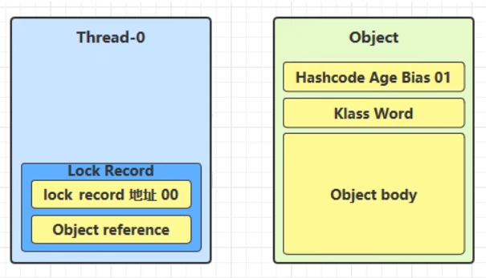
  - 让锁记录中 Object reference 指向锁住的对象，并尝试用 CAS 替换 Object 的 Mark Word，将 Mark Word 的值存入锁记录。

    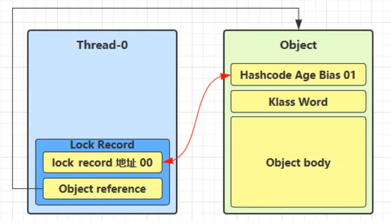
  - 如果 CAS 替换成功，对象头中存储了锁记录地址和状态 00（轻量级锁） ，表示由该线程给对象加锁。

    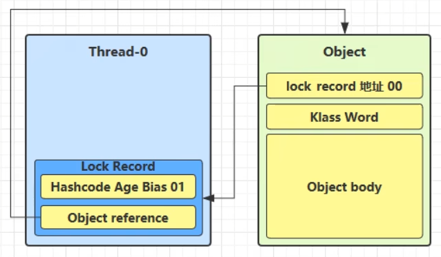
  - 如果 CAS 失败，有两种情况：

    - 如果是其他线程已经持有了该 Object 的轻量级锁，这时表明有竞争，进入锁膨胀过程。
    - 如果是线程自己执行了 synchronized 锁重入，就添加一条 Lock Record 作为重入的计数。

      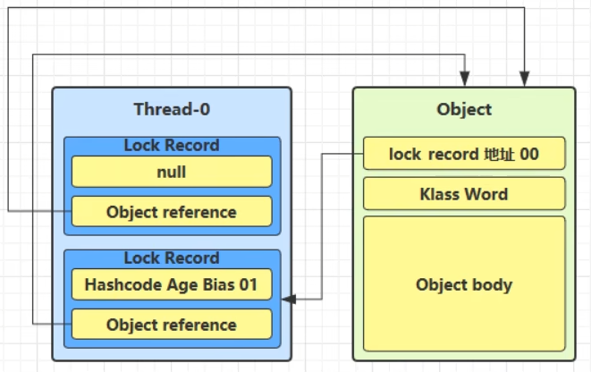
  - 当退出 synchronized 代码块（解锁时）

    - 如果有取值为 null 的锁记录，表示有重入，这时重置锁记录，表示重入计数减 1。

      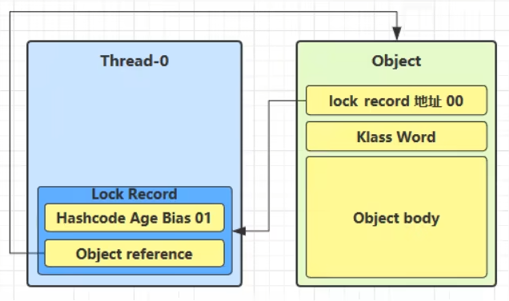
    - 如果锁记录的值不为 null，这时使用 CAS **将 Mark Word 的值恢复给对象头。**

      - 成功，则解锁成功。
      - 失败，说明轻量级锁进行了锁膨胀或已经升级为重量级锁，进入重量级锁解锁流程。

#### 2.2  锁膨胀

- 如果在尝试加轻量级锁的过程中，CAS 操作无法成功，这时一种情况就是有其他线程为此对象加上了轻量级锁（有竞争），这时需要进行锁膨胀，将**轻量级锁**变为**重量级锁**。
- 举例

  - 当 Thread-1 进行轻量级加锁时，Thread-0 已经对该对象加了轻量级锁。

    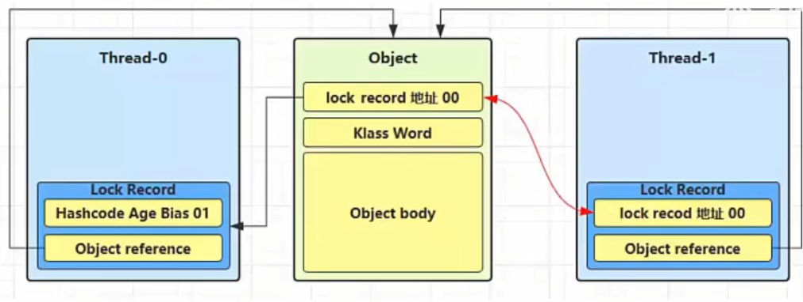
  - Thread-1 加轻量级锁失败，进入锁膨胀流程：

    - 为 Object 对象申请 Monitor 锁，**通过 Object 对象头获取到持锁线程**，将 Monitor 的 Owner 置为 Thread-0，将 Object 的对象头指向重量级锁地址。
    - 然后自己进入 Monitor 的 EntryList BLOCKED。

      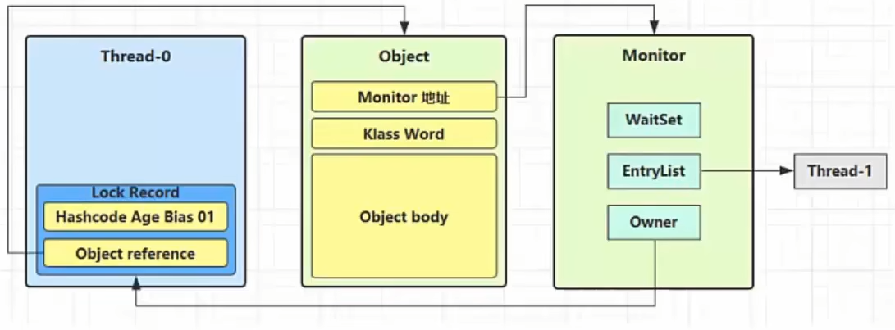
  - 当 Thread-0 退出同步块解锁时，使用 CAS 将 Mark Word 的值恢复给对象头失败，这时进入重量级解锁流程，即按照 Monitor 地址找到 Monitor 对象，设置 Owner 为 null，唤醒 EntryList 中 BLOCKED 线程。

#### 2.3  自旋优化

- 重量级锁竞争时，尝试获取锁的线程不会立即进入阻塞状态，可以使用**自旋**（默认 10 次）来进行优化，采用循环的方式去尝试获取锁。
- 注意：

  - 自旋占用 CPU 时间，单核 CPU 自旋就是浪费时间，因为同一时刻只能运行一个线程，多核 CPU 自旋才能发挥优势。
  - 自旋失败的线程会进入阻塞状态。
- 优点：不会进入阻塞状态，**减少线程上下文切换的消耗。**

  缺点：当自旋的线程越来越多时，会不断的消耗 CPU 资源。
- **自旋成功的情况：**

  - |线程1 (CPU 1上)|对象Mark|线程2 (CPU 2上)|
    | -------------------------| ------------------------| -------------------------|
    |-|10（重量锁）|-|
    |访问同步块，获取monitor|10（重量锁）重量锁指针|-|
    |成功（加锁）|10（重量锁）重量锁指针|-|
    |执行同步块|10（重量锁）重量锁指针|-|
    |执行同步块|10（重量锁）重量锁指针|访问同步块，获取monitor|
    |执行同步块|10（重量锁）重量锁指针|自旋重试|
    |执行完毕|10（重量锁）重量锁指针|自旋重试|
    |成功（解锁）|01（无锁）|自旋重试|
    |-|10（重量锁）重量锁指针|成功（加锁）|
    |-|10（重量锁）重量锁指针|执行同步块|
    |...|...|...|
- **自旋失败的情况：**

  - |线程 1（cpu 1 上）|对象 Mark|线程 2（cpu 2 上）|
    | --------------------------| -----------------------------| --------------------------|
    |-|10（重量级锁）|-|
    |访问同步块，获取 monitor|10（重量级锁） 重量级锁指针|-|
    |成功（加锁）|10（重量级锁） 重量级锁指针|-|
    |执行同步块|10（重量级锁） 重量级锁指针|-|
    |执行同步块|10（重量级锁） 重量级锁指针|访问同步块，获取 monitor|
    |执行同步块|10（重量级锁） 重量级锁指针|自旋重试|
    |执行同步块|10（重量级锁） 重量级锁指针|自旋重试|
    |执行同步块|10（重量级锁） 重量级锁指针|自旋重试|
    |执行同步块|10（重量级锁） 重量级锁指针|阻塞|
    |...||...|

#### 2.4  偏向锁

- 偏向锁的思想是偏向于第一个获取锁对象的线程，这个线程之后重新获取该锁不再需要同步操作：

  - 当锁对象第一次被线程获得的时候进入偏向状态，标记为 101，同时**使用 CAS 操作将线程 ID 记录到 Mark Word**。如果 CAS 操作成功，这个线程以后进入这个锁相关的同步块，查看这个线程 ID 是自己的就表示没有竞争，就不需要再进行任何同步操作。
  - 当有另外一个线程去尝试获取这个锁对象时，偏向状态就宣告结束，此时撤销偏向（Revoke Bias）后恢复到未锁定或轻量级锁状态。

    
- 一个对象创建时：

  - 如果开启了偏向锁（默认开启），那么对象创建后，MarkWord 值为 0x05 即最后 3 位为 101，thread、epoch、age 都为 0。
  - 偏向锁是默认是延迟的，不会在程序启动时立即生效，如果想避免延迟，可以加 VM 参数 `-XX:BiasedLockingStartupDelay=0`​ 来禁用延迟。JDK 8 延迟 4s 开启偏向锁原因：在刚开始执行代码时，会有好多线程来抢锁，如果开偏向锁效率反而降低。
  - 当一个对象已经计算过 hashCode，就再也无法进入偏向状态了。
  - 添加 VM 参数 `-XX:-UseBiasedLocking`​ 禁用偏向锁。
- 撤销偏向锁的状态：

  - 调用对象的 hashCode：偏向锁的对象 MarkWord 中存储的是线程 id，调用 hashCode 导致偏向锁被撤销。
  - 当有其它线程使用偏向锁对象时，会将偏向锁升级为轻量级锁。
  - 调用 wait/notify，需要申请 Monitor，进入 WaitSet。
- **批量撤销**：如果对象被多个线程访问，但没有竞争，这时偏向了线程 T1 的对象仍有机会重新偏向 T2，重偏向会重置对象的 Thread ID。

  - 批量重偏向：当撤销偏向锁阈值超过 20 次后，JVM 会觉得是不是偏向错了，于是在给这些对象加锁时重新偏向至加锁线程。
  - 批量撤销：当撤销偏向锁阈值超过 40 次后，JVM 会觉得自己确实偏向错了，根本就不该偏向，于是整个类的所有对象都会变为不可偏向的，新建的对象也是不可偏向的。

#### 2.5  锁消除

- 锁消除是指对被检测出不可能存在竞争的共享数据的锁进行消除，这是 JVM **即时编译器的优化。**
- 其核心思想是：**当确定某段代码中的锁对象不会被多个线程共享时，JVM 会自动去掉不必要的加锁操作，避免了加锁带来的上下文切换和内存同步，从而提升性能。**
- 举例说明

  - 示例代码

    ```java
    public void test() {
        StringBuffer sb = new StringBuffer(); // StringBuffer 是线程安全的，内部有 synchronized
        sb.append("Hello");
        sb.append("World");
        System.out.println(sb.toString());
    }
    ```
  - 分析

    - 虽然 `StringBuffer`​ 是线程安全的，它的方法内部用的是 `synchronized`​，但 **​`sb`​**​ **是局部变量，只在当前线程中使用，不存在并发访问的风险**。
    - 优化前，JVM 默认认为 `append()`​ 可能需要加锁。
    - 优化后，JIT 编译器分析后发现 `sb`​ 逃逸范围只在当前方法内部，不存在线程共享，于是去掉加锁操作，相当于变成了 `StringBuilder`​（StringBuilder 是非线程安全的）。
- 锁消除主要是通过**逃逸分析**来支持，如果堆上的共享数据不可能逃逸出去被其它线程访问到，那么就可以把它们当成私有数据对待，也就可以将它们的锁进行消除（同步消除：JVM 逃逸分析）。

#### 2.6  总结

- 轻量级锁是当多个线程**交替（而非并发）访问同步块**时，用来避免重量级锁开销的一种优化手段。不会触发线程上下文切换，适合**线程之间存在竞争，但冲突很少**的场景。
- 可重入锁是指同一个线程**可以多次获取同一把锁**而不会发生死锁。每次获取锁，锁的计数器 +1。每次释放锁，计数器 -1，直到为 0，才真正释放锁。
- 锁膨胀是指**轻量级锁升级为重量级锁**，当多个线程竞争同一把锁时，轻量级锁无法满足，就会膨胀为重量级锁。
- 在尝试获取锁失败时，线程不立即挂起，而是**原地不停尝试（“空转”）一段时间**，期望很快能拿到锁。自旋失败的线程会进入阻塞状态。避免线程上下文切换的成本。
- 偏向锁是**为了优化只有一个线程访问锁的情况**，将锁“偏向”这个线程，之后只要这个线程再次进入同步块，不用做任何同步操作。首次加锁时，把线程 ID 记录在 Mark Word 中，下次该线程进入时，只需检查 ID 是否一致即可。若有其他线程尝试竞争，则撤销偏向锁并升级为轻量级锁。
- 锁消除是JVM **通过逃逸分析发现锁是多余的**，在编译期间将其去除，优化性能。
