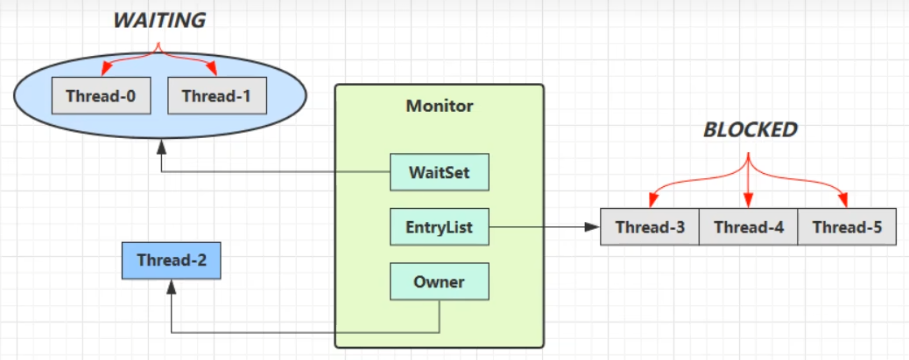
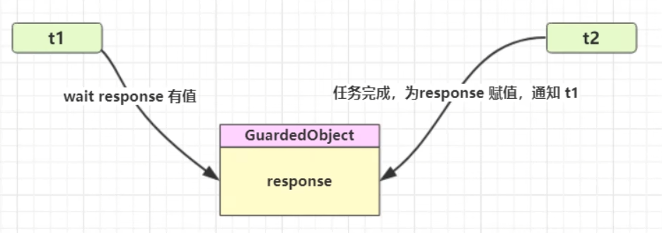
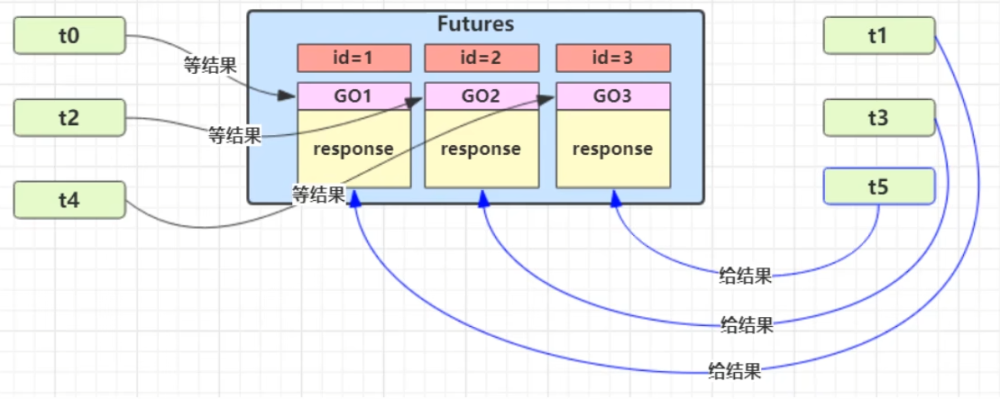
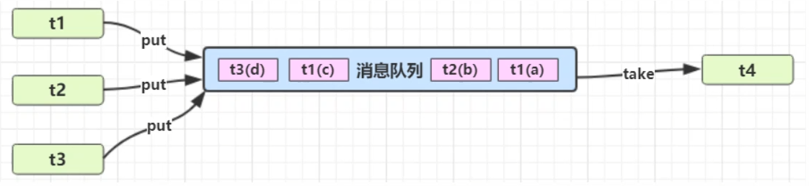
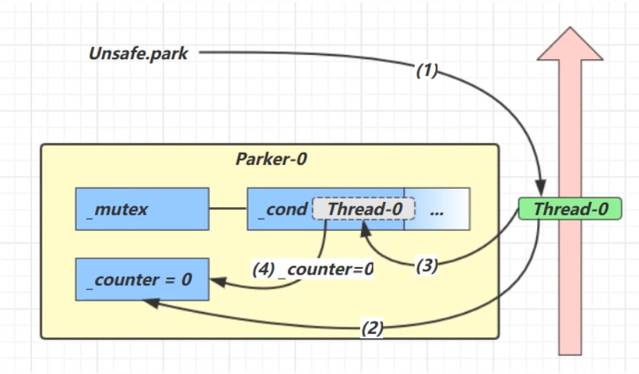
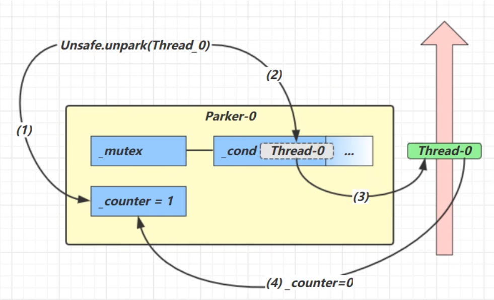
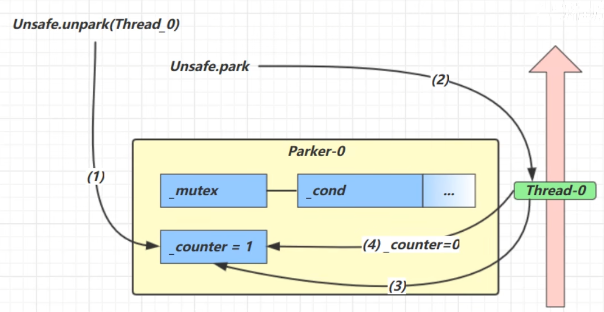

# JUC-05 wait(), notify() 与 park(), unpark()

# 1、wait()  && nofity()

#### 1.1  基本使用

- 需要获取对象锁后才可以调用`锁对象.wait()`​，`notify()`​ 随机唤醒一个线程，`notifyAll()`​ 唤醒所有线程去竞争 CPU。

  - ```java
    import java.util.concurrent.TimeUnit;

    public class WaitNotifyExample {
        private static final Object lock = new Object(); // 共享锁对象

        public static void main(String[] args) throws InterruptedException {
            // 创建并启动 3 个等待线程
            for (int i = 1; i <= 3; i++) {
                new Thread(() -> {
                    synchronized (lock) {
                        try {
                            System.out.println(Thread.currentThread().getName() + " 获取锁，进入等待状态");
                            lock.wait(); // 释放锁并等待
                            System.out.println(Thread.currentThread().getName() + " 被唤醒，重新获取锁");
                        } catch (InterruptedException e) {
                            e.printStackTrace();
                        }
                    }
                }, "等待线程-" + i).start();
            }

            TimeUnit.SECONDS.sleep(1); // 确保等待线程先执行

            // 唤醒一个线程（随机）
            synchronized (lock) {
                System.out.println("\n主线程调用 notify()，随机唤醒一个线程");
                lock.notify(); // 随机唤醒一个等待线程
            }

            TimeUnit.SECONDS.sleep(2); // 给被唤醒的线程执行时间

            // 唤醒所有剩余线程
            synchronized (lock) {
                System.out.println("\n主线程调用 notifyAll()，唤醒所有线程");
                lock.notifyAll(); // 唤醒所有等待线程
            }
        }
    }
    ```
- 注意：**wait 是挂起线程，需要唤醒的都是挂起操作**，阻塞线程可以自己去争抢锁，挂起的线程需要唤醒后去争抢锁。
- Object 类 API：

  ```java
  public final void notify():唤醒正在等待对象监视器的单个线程。
  public final void notifyAll():唤醒正在等待对象监视器的所有线程。
  public final void wait():导致当前线程等待，直到另一个线程调用该对象的 notify() 方法或 notifyAll()方法。
  public final native void wait(long timeout):有时限的等待, 到n毫秒后结束等待，或是被唤醒
  ```

- 与`sleep()`​的对比：

  - 原理不同：`sleep()`​ 方法是属于 Thread 类，是线程用来控制自身流程的，使此线程暂停执行一段时间而把执行机会让给其他线程；`wait()`​方法属于 Object 类，用于线程间通信。
  - 对比**锁的处理机制**：

    - 调用  `sleep()`​ 方法的过程中，线程不会释放对象锁；
    - 调用  `wait()`​ 方法的时候，线程会放弃对象锁，进入等待此对象的等待锁定池，从而让其他线程就机会获取对象的锁。无限制等待，直到被 `notify()`​。
    - 但是  `sleep()`​ 方法和 `wait()`​ 方法都会释放 CPU。
  - 使用区域不同：

    - ​`wait()`​ 方法必须放在**同步控制方法和同步代码块（先获取锁）** 中使用，否则会抛出异常；
    - `sleep()`​ 方法则可以放在任何地方使用。
- 底层原理：

  - Owner 线程发现条件不满足，调用 `wait()`​ 方法，即可进入 WaitSet 变为 `WAITING`​ 状态。
  - ​`BLOCKED`​ 和 `WAITING`​ 的线程都处于阻塞状态，不占用 CPU 时间片。
  - ​`BLOCKED`​ 线程会在 Owner 线程释放锁时被唤醒。
  - ​`WAITING`​ 线程会在 Owner 线程调用 `notify()`​ 或 `notifyAll()`​ 时被唤醒，唤醒后并不意味着立刻获得锁，**需要进入 EntryList 重新竞争。**

    
- 可能出现的问题

  - 虚假唤醒：`notify()`​ 只能**随机唤醒一个** WaitSet 中的线程，这时如果有其它线程也在等待，那么就可能唤醒不了正确的线程。

    - 解决方法：采用 `notifyAll()`​ 。
  - ​`notifyAll()`​ 仅解决某个线程的唤醒问题，使用 `if + wait`​ 判断仅有一次机会，一旦条件不成立，无法重新判断。

    - ```java
      if (!hasCigarette) {
      	log.debug("没烟，先歇会！");
      try {
      	room.wait();
      } catch (InterruptedException e) {
      	e.printStackTrace();
      	}
      }
      ```
    - 解决方法：用 while + wait()，当条件不成立，再次 `wait()`​ 。

      - ```java
        while (!hasCigarette) {
        	log.debug("没烟，先歇会！");
        try {
        	room.wait();
        } catch (InterruptedException e) {
        	e.printStackTrace();
        	}
        }
        ```
- 正确使用

  - ```java
    synchronized(lock) {
    	while(条件不成立) {
        	lock.wait();
        }
        // 干活
    }
    //另一个线程
    synchronized(lock) {
    	lock.notifyAll();
    }
    ```

# 2、设计模式

#### 2.1  同步模式

- 保护性暂停

  - **Guarded Suspension**，用在一个线程等待另一个线程的执行结果。

    - 有一个结果需要从一个线程传递到另一个线程，让它们关联同一个 GuardedObject。
    - 如果有结果不断从一个线程到另一个线程那么可以使用消息队列（见生产者/消费者）。
    - JDK 中，join 的实现、Future 的实现，采用的就是此模式。
  - 单任务版

    - 原理图

      

      - ​`join()`​的局限性是只能等第二个线程结束。使用`join()`​办法，等待结果的那个变量只能设计成全局的，而使用保护性暂停的话可以设计成局部的。
      - **保护性暂停**是通过一个共享对象来进行线程间通信，典型结构是：一个线程等待结果（阻塞）；另一个线程产生结果后唤醒它。它可以等待一个**具体事件或结果**，而不仅仅是线程结束。可以把“等待结果的变量”设计成**局部变量**，线程安全，封装更好。
      - ​`join()`​ 只能等待线程“终止”，而不能等待“中间结果”；并且拿结果时往往要用**全局变量**。而 **保护性暂停**可以等待**任意结果或事件**，并且让结果变量变成**局部变量**，线程安全，封装性好。
    - **保护性暂停**代码实现

      ```java
      class GuardedObject {
       	private Object response;
       	private final Object lock = new Object();
       	public Object get() {
      			synchronized (lock) {
      			// 条件不满足则等待
      				while (response == null) {
      					try {
      						lock.wait();
      					}catch (InterruptedException e) {
      						e.printStackTrace();
      					}
      				}
      			return response;
      		}
      	}
       	public void complete(Object response) {
      		synchronized (lock) {
      			// 条件满足，通知等待线程
      			this.response = response;
      			lock.notifyAll();
      		}
       	}
      }
      ```
    - 需要控制超时时间的**保护性暂停**代码实现

      - 这段代码通过自定义的 `GuardedObject.get(long millis)`​ 实现了一个**带超时控制的保护性暂停机制**，它的目标是：**等待一段时间（最多 millis 毫秒）以获取结果**，如果超时还没获取到，就主动放弃等待，返回 `null`​。
      - 为什么要自己计算超时而不直接 `wait(millis)`​ 一次？

        - ​`Object.wait(millis)`​ 可能被**虚假唤醒**（spurious wakeup）提前返回。
        - 单次 wait 并不能保证等足 millis 毫秒。
        - 多次 wait 必须确保 **总等待时间不超过 millis。**

      ```java
      public static void main(String[] args) {
          GuardedObject object = new GuardedObjectV2();
          new Thread(() -> {
              sleep(1);
              object.complete(Arrays.asList("a", "b", "c"));
          }).start();
          
          Object response = object.get(2500);
          if (response != null) {
              log.debug("get response: [{}] lines", ((List<String>) response).size());
          } else {
              log.debug("can't get response");
          }
      }

      class GuardedObject {
          private Object response;
          private final Object lock = new Object();

          //获取结果
          //timeout :最大等待时间
          public Object get(long millis) {
              synchronized (lock) {
                  // 1) 记录最初时间
                  long begin = System.currentTimeMillis();
                  // 2) 已经经历的时间
                  long timePassed = 0;
                  while (response == null) {
                      // 4) 假设 millis 是 1000，结果在 400 时唤醒了，那么还有 600 要等
                      long waitTime = millis - timePassed;
                      log.debug("waitTime: {}", waitTime);
                      //经历时间超过最大等待时间退出循环
                      if (waitTime <= 0) {
                          log.debug("break...");
                          break;
                      }
                      try {
                          lock.wait(waitTime);
                      } catch (InterruptedException e) {
                          e.printStackTrace();
                      }
                      // 3) 如果提前被唤醒，这时已经经历的时间假设为 400
                      timePassed = System.currentTimeMillis() - begin;
                      log.debug("timePassed: {}, object is null {}",
                              timePassed, response == null);
                  }
                  return response;
              }
          }

          //产生结果
          public void complete(Object response) {
              synchronized (lock) {
                  // 条件满足，通知等待线程
                  this.response = response;
                  log.debug("notify...");
                  lock.notifyAll();
              }
          }
      }
      ```
  - 多任务版

    - 原理图

      - 图中 Futures 就好比居民楼一层的信箱（每个信箱有房间编号），左侧的 t0，t2，t4 就好比等待邮件的居民，右侧的 t1，t3，t5 就好比邮递员。
      - 如果需要在多个类之间使用 GuardedObject 对象，作为参数传递不是很方便，因此设计一个用来解耦的中间类，这样不仅能够解耦【结果等待者】和【结果生产者】，还能够同时支持多个任务的管理。
      - 
    - 代码实现

      - 这段代码设计了一个用来实现**线程间解耦通信的中间类结构**，核心思想是：通过一个中介类 `Mailboxes`​ 管理多个 `GuardedObject`​，实现了**发送者（Postman）和接收者（People）之间的解耦通信**。

        - ​`People`​（接收者线程）

          - 模拟等待快递的“人”。从 `Mailboxes.createGuardedObject()`​ 获取一个唯一编号的信箱（`GuardedObject`​）。
          - 调用 `guardedObject.get(5000)`​ 等待最多 5 秒接收邮件（阻塞）。
          - 特点：解耦——完全不知道谁、何时、如何给自己送信。
        - ​`Postman`​（发送者线程）

          - 模拟投递快递的“快递员”。根据 id 从 `Mailboxes.getGuardedObject(id)`​ 取出对应信箱。
          - 调用 `guardedObject.complete(mail)`​ 投递邮件，唤醒等待的 `People`​。
          - 特点：只需知道投递地址（id），不关心收件人是哪个线程。
        - ​`Mailboxes`​（中间调度器 / 路由表）

          - **等待结果 + 接收结果 + 唤醒线程** 的同步通信工具。

        ```java
        public static void main(String[] args) throws InterruptedException {
            for (int i = 0; i < 3; i++) {
                new People().start();
            }
            Thread.sleep(1000);
            for (Integer id : Mailboxes.getIds()) {
                new Postman(id, id + "号快递到了").start();
            }
        }

        @Slf4j(topic = "c.People")
        class People extends Thread{
            @Override
            public void run() {
                // 收信
                GuardedObject guardedObject = Mailboxes.createGuardedObject();
                log.debug("开始收信i d:{}", guardedObject.getId());
                Object mail = guardedObject.get(5000);
                log.debug("收到信id:{}，内容:{}", guardedObject.getId(),mail);
            }
        }

        class Postman extends Thread{
            private int id;
            private String mail;
            //构造方法
            @Override
            public void run() {
                GuardedObject guardedObject = Mailboxes.getGuardedObject(id);
                log.debug("开始送信i d:{}，内容:{}", guardedObject.getId(),mail);
                guardedObject.complete(mail);
            }
        }

        class  Mailboxes {
            private static Map<Integer, GuardedObject> boxes = new Hashtable<>();
            private static int id = 1;

            //产生唯一的id
            private static synchronized int generateId() {
                return id++;
            }

            public static GuardedObject getGuardedObject(int id) {
                return boxes.remove(id);
            }

            public static GuardedObject createGuardedObject() {
                GuardedObject go = new GuardedObject(generateId());
                boxes.put(go.getId(), go);
                return go;
            }

            public static Set<Integer> getIds() {
                return boxes.keySet();
            }
        }

        class GuardedObject {
            //标识，Guarded Object
            private int id;//添加get set方法
        }
        ```

#### 2.2  异步模式

- 生产者/消费者 模式

  - 消费队列可以用来平衡生产和消费的线程资源，不需要产生结果和消费结果的线程一 一对应。
  - 生产者仅负责产生结果数据，不关心数据该如何处理，而消费者专心处理结果数据。
  - 消息队列是有容量限制的，满时不会再加入数据，空时不会再消耗数据。
  - JDK 中各种阻塞队列，采用的就是这种模式。
  - 原理图

    - 
  - 代码实现

    ```java
    public class demo {
        public static void main(String[] args) {
            MessageQueue queue = new MessageQueue(2);
            for (int i = 0; i < 3; i++) {
                int id = i;
                new Thread(() -> {
                    queue.put(new Message(id,"值"+id));
                }, "生产者" + i).start();
            }
            
            new Thread(() -> {
                while (true) {
                    try {
                        Thread.sleep(1000);
                        Message message = queue.take();
                    } catch (InterruptedException e) {
                        e.printStackTrace();
                    }
                }
            },"消费者").start();
        }
    }

    //消息队列类，Java间线程之间通信
    class MessageQueue {
        private LinkedList<Message> list = new LinkedList<>();//消息的队列集合
        private int capacity;//队列容量
        public MessageQueue(int capacity) {
            this.capacity = capacity;
        }

        //获取消息
        public Message take() {
            //检查队列是否为空
            synchronized (list) {
                while (list.isEmpty()) {
                    try {
                        sout(Thread.currentThread().getName() + ":队列为空，消费者线程等待");
                        list.wait();
                    } catch (InterruptedException e) {
                        e.printStackTrace();
                    }
                }
                //从队列的头部获取消息返回
                Message message = list.removeFirst();
                sout(Thread.currentThread().getName() + "：已消费消息--" + message);
                list.notifyAll();
                return message;
            }
        }

        //存入消息
        public void put(Message message) {
            synchronized (list) {
                //检查队列是否满
                while (list.size() == capacity) {
                    try {
                        sout(Thread.currentThread().getName()+":队列为已满，生产者线程等待");
                        list.wait();
                    } catch (InterruptedException e) {
                        e.printStackTrace();
                    }
                }
                //将消息加入队列尾部
                list.addLast(message);
                sout(Thread.currentThread().getName() + ":已生产消息--" + message);
                list.notifyAll();
            }
        }
    }

    final class Message {
        private int id;
        private Object value;
    	//get set
    }
    ```

# 3、park() && unpark()

#### 3.1  基本使用

- 代码实现

  - ​`LockSupport.park()`​：暂停当前线程。
  - ​`LockSupport.unpark(暂停线程对象)`​：恢复某个线程的运行。
- 特点（与 Object 的 `wait()`​ && `notify()`​ 相比）

  - ​`wait()`​，`notify()`​和 `notifyAll()`​ 必须配合 Object Monitor （必须先获得monitor锁才可以）一起使用，而 `park()`​，`unpark()`​ 不必。
  - ​`park()`​ & `unpark()`​ 是以线程为单位来【阻塞】和【唤醒】线程，而 `notify()`​ 只能随机唤醒一个等待线程，`notifyAll()`​是唤醒所有等待线程，就不那么【精确】。
  - ​`park()`​ & `unpark()`​ 可以先 `unpark()`​ ，而 `wait()`​ & `notify()`​ 不能先 `notify()`​。
- 使用建议

  - 用 `wait/notify`​ 的情况：

    - 快速实现线程通信的简单逻辑。
    - 要求线程之间基于**共享资源的状态变化**进行协调（如“队列不空才消费”）。
    - 想要自动释放锁资源时。
  - 用 `park/unpark`​ 的情况：

    - 需要精确控制线程挂起与恢复，或者线程调度灵活性更高。
    - 要构建**底层并发工具**（如：ReentrantLock、Future、线程池、CountDownLatch、Semaphore）。
    - 不需要使用 `synchronized`​，更适合配合 `Lock`​、`AQS`​ 等高级组件使用。

#### 3.2  原理

- 每个线程都有自己的一个 Parker 对象，由三部分组成：`_counter`​ ，`_cond`​和 `_mutex`​。

- 先调用`park()`​，再调用`unpark()`​

  - 分析

    - 1. 当前线程调用 `Unsafe.park()`​ 方法；
      2. 检查 `_counter`​，本情况为 0，这时，获得 `_mutex`​互斥锁；
      3. 线程进入`_cond`​条件变量阻塞；
      4. 设置`_counter`​\= 0。
    - 1. 调用 `Unsafe.unpark(Thread\_0)`​ 方法，设置`_counter`​为 1；
      2. 唤醒`_cond`​条件变量中的 Thread\_0；
      3. Thread\_0 恢复运行；
      4. 设置 `_counter`​ 为 0。
  - 原理图

    - 
- 先调用`unpark()`​，再调用`park()`​

  - 分析

    - 1. 调用 `Unsafe.unpark(Thread_0)`​ 方法，设置 `_counter`​为 1；
      2. 当前线程调用 `Unsafe.park()`​ 方法；
      3. 检查`_counter`​，本情况为 1，这时线程无需阻塞，继续运行；
      4. 设置`_counter`​为 0。
    - 注意：多次调用`unpark()`​也仅仅只是将`_counter`​设置为1。
  - 原理图

    - 
