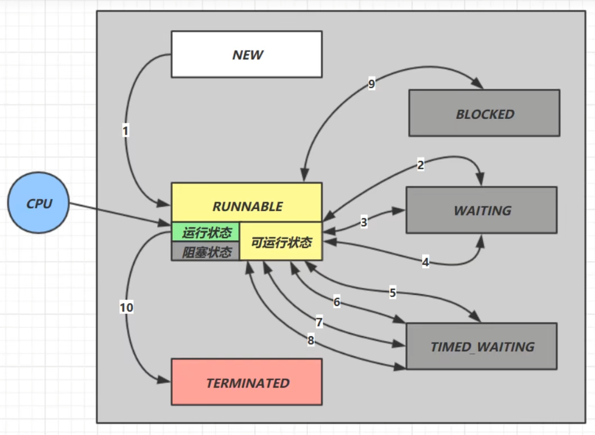
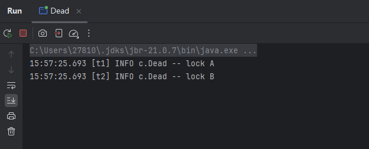
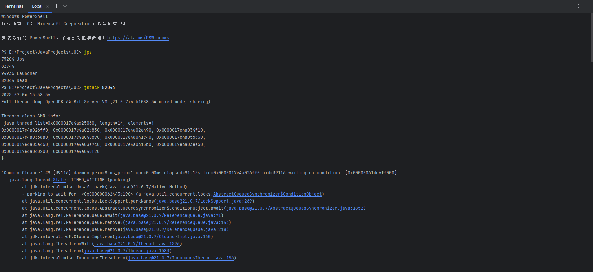
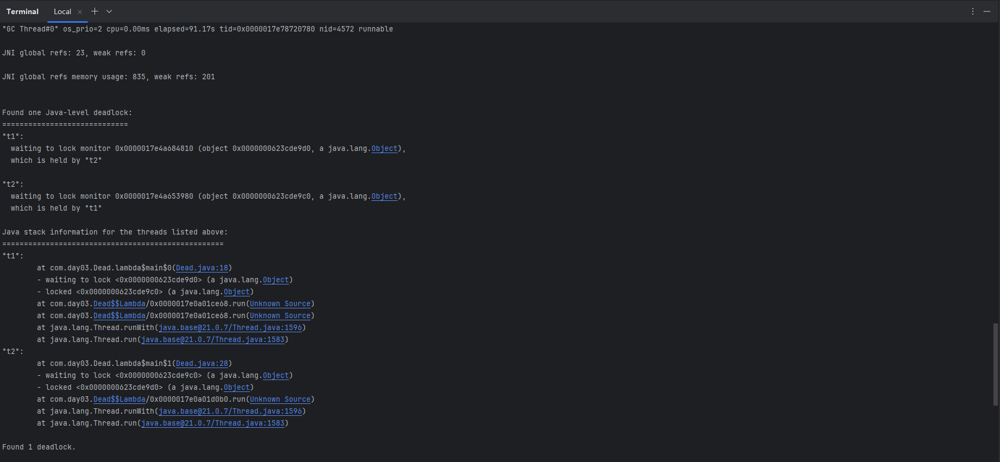
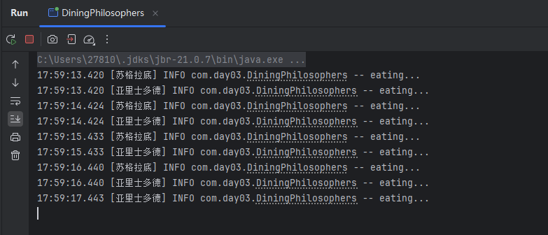
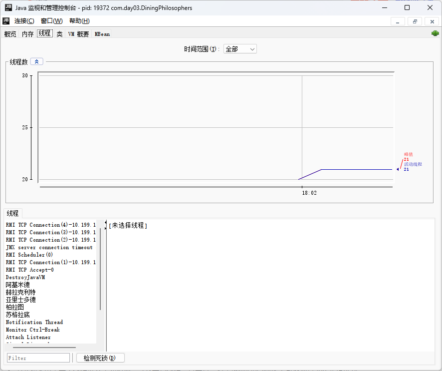
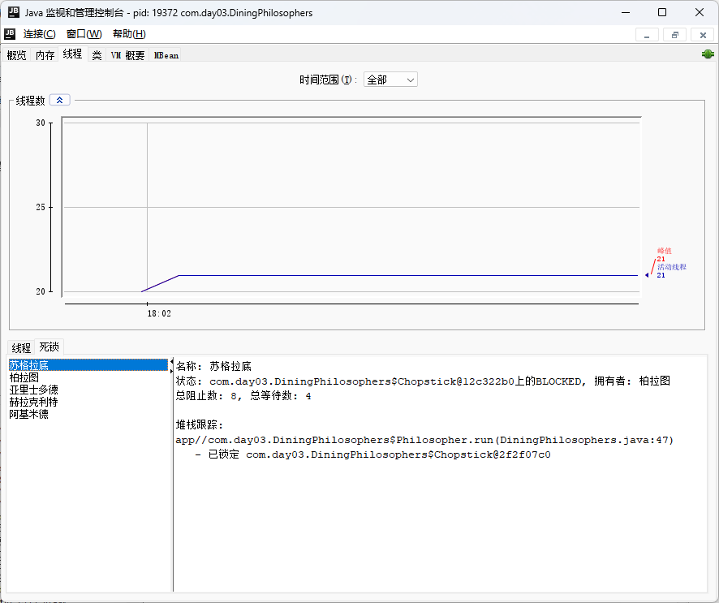
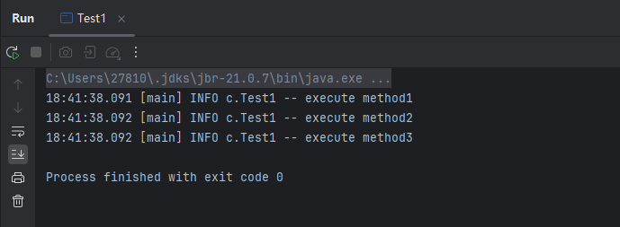
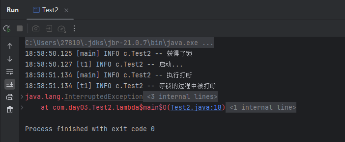
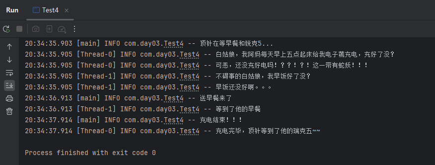

# JUC-06  线程状态转换

# 1、重新理解线程状态转换

> 

**假设有一个线程**​**​`Thread t`​**​ **。**

#### 1.1  情况 1 NEW --\> RUNNABLE

- 调用 `t.start()`​ 方法，由 `NEW`​ 状态进入 `RUNNABLE（可运行）`​ 状态。

#### 1.2  情况 2 RUNNABLE \<–\> WAITING

- t 线程用 `synchronized(obj)`​获取了对象锁后。

  - 调用 `obj.wait()`​ 方法，由`RUNNABLE`​转入`WAITING`​状态。
  - 调用`obj.notify()`​、`obj.notifyAll()`​、`t.interrupt()`​

    - 如果竞争锁成功，线程由`WAITING`​进入 `RUNNABLE`​；
    - 如果竞争失败（其他线程仍持有锁），线程会短暂由`WAITING`​进入 `BLOCKED`​。

#### 1.3  情况 3 RUNNABLE \<–\> WAITING

- 当前线程t调用 `join()`​ 方法时，由`RUNNABLE`​转入`WAITING`​状态 **（注意：是当前线程在t 线程对象的监视器上等待）。**
- t 线程运行结束，或调用了当前线程的 `interrupt()`​ 时，当前线程从 `WAITING`​转入`RUNNABLE`​。

#### 1.4  情况 4 RUNNABLE \<–\> WAITING

- 当前线程调用 `LockSupport.park()`​ 方法会让当前线程从`RUNNABLE`​ --\> `WAITING`​。
- 调用 `LockSupport.unpark(目标线程)`​ 或调用了线程的 `interrupt()`​ ，会让目标线程从 `WAITING`​--\> `RUNNABLE`​。

#### 1.5  情况 5 RUNNABLE \<–\> TIMED\_WAITING

- t 线程用 `synchronized(obj)`​ 获取了对象锁后

  - 调用 `obj.wait(long n)`​ 方法时，t 线程从 `RUNNABLE`​ --> `TIMED_WAITING`​。
  - t 线程等待时间超过了 n 毫秒，或调用 `obj.notify()`​、`obj.notifyAll()`​、`t.interrupt()`​ 时：

    - 竞争锁成功，t 线程从 TIMED\_WAITING --\> `RUNNABLE`​。
    - 竞争锁失败，t 线程从 TIMED\_WAITING --\> `BLOCKED`​。

#### 1.6  情况 6 RUNNABLE \<–\> TIMED\_WAITING

- 当前线程调用`t.join(long n)`​ 方法时，当前线程从 `RUNNABLE`​ --> `TIMED_WAITING`​，注意是当前线程在t 线程对象的监视器上等待。
- 当前线程等待时间超过了 n 毫秒，或 t 线程运行结束，或调用了当前线程的 `interrupt()`​时，当前线程从`TIMED_WAITING`​  --> `RUNNABLE`​。

#### 1.7  情况 7 RUNNABLE \<–\> TIMED\_WAITING

- 当前线程调用 `Thread.sleep(long n)`​，当前线程从 `RUNNABLE`​--\> `TIMED_WAITING`​。
- 当前线程等待时间超过了 n 毫秒，当前线程从`TIMED_WAITING`​ --\> `RUNNABLE`​。

#### 1.8  情况 8 RUNNABLE \<–\> TIMED\_WAITING

- 当前线程调用 `LockSupport.parkNanos(long nanos)`​ 或 `LockSupport.parkUntil(long millis)`​ 时，当前线程从 `RUNNABLE`​ --> `TIMED_WAITING`​。
- 调用 `LockSupport.unpark(目标线程)`​ 或调用了线程的 `interrupt()`​，或是等待超时，会让目标线程从`TIMED_WAITING`​–> `RUNNABLE`​。

#### 1.9  情况 9 RUNNABLE \<–\> BLOCKED

- t 线程用 `synchronized(obj)`​  获取了对象锁时如果竞争失败，从 `RUNNABLE`​ --> `BLOCKED`​。
- 持 obj 锁线程的同步代码块执行完毕，会唤醒该对象上所有`BLOCKED`​的线程重新竞争，如果其中 t 线程竞争成功，从 `BLOCKED`​ --> `RUNNABLE`​ ，其它失败的线程仍然`BLOCKED`​。

#### 1.10  情况 10 RUNNABLE \<–\> TERMINATED

- 当前线程所有代码运行完毕，进入`TERMINATED`​。

# 2、锁

#### 2.1  多把锁

- 多把不相干的锁：一间大屋子有两个功能睡觉、学习，互不相干。现在一人要学习，一人要睡觉，如果只用一间屋子（一个对象锁）的话，那么并发度很低。
- **解决方法：** 将锁的粒度细分，准备多个对象锁：

  - **好处：** 可以增强并发度。
  - **坏处：** 如果一个线程需要同时获得多把锁，就容易发生死锁。
  - 代码实现

    ```java
    public static void main(String[] args) {
        BigRoom bigRoom = new BigRoom();
        new Thread(() -> { bigRoom.study(); }).start();
        new Thread(() -> { bigRoom.sleep(); }).start();
    }
    class BigRoom {
        private final Object studyRoom = new Object();
        private final Object sleepRoom = new Object();

        public void sleep() throws InterruptedException {
            synchronized (sleepRoom) {
                System.out.println("sleeping 2 小时");
                Thread.sleep(2000);
            }
        }

        public void study() throws InterruptedException {
            synchronized (studyRoom) {
                System.out.println("study 1 小时");
                Thread.sleep(1000);
            }
        }
    }
    ```

#### 2.2  线程的活跃性

> 一个线程是否能够继续向前执行，是否“活着”并能完成它的任务。在并发编程中，一个线程是否处于“活跃状态”，不是指它是否正在运行（不是指 `RUNNABLE`​），而是指它有没有陷入 **阻塞、停滞或无法推进的状态**。常见的线程活跃问题包括：
>
> |问题类型|定义|线程状态|是否消耗 CPU|是否可被感知|典型场景与原因|
> | ----------| --------------------------------------------------------| ------------------| --------------| --------------| ------------------------------------------------------|
> |死锁|多个线程互相等待对方持有的资源，导致都无法继续执行|阻塞（Blocked）|否|易于检测|线程 A 拿到锁 1，等锁 2；线程 B 拿到锁 2，等锁 1|
> |活锁|线程不断地相互让步或重试操作，导致程序无法推进实际工作|活跃（Runnable）|是|不易发现|两个线程都尝试让出资源，结果都重复失败、重复尝试|
> |饥饿|某个线程长期得不到资源或调度，导致无法执行|等待（Waiting）|否|不易发现|高优先级线程频繁抢占 CPU，低优先级线程得不到运行机会|

##### 2.2.1  死锁

- 多个线程同时被阻塞，它们中的一个或者全部都在等待某个资源被释放，由于线程被无限期地阻塞，因此程序不可能正常终止。
- **Java 死锁产生的四个必要条件：** 

  1. **互斥条件：** 即当资源被一个线程使用（占有）时，别的线程不能使用。
  2. **不可剥夺条件：** 资源请求者不能强制从资源占有者手中夺取资源，资源只能由资源占有者主动释放。
  3. **请求和保持条件：** 即当资源请求者在请求其他的资源的同时保持对原有资源的占有。
  4. **循环等待条件：** 即存在一个等待循环队列：p1 要 p2 的资源，p2 要 p1 的资源，形成了一个等待环路。

  - 注意：**四个条件都成立的时候，便形成死锁。死锁情况下打破上述任何一个条件，便可让死锁消失**。
- 会产生死锁的代码示例：

  ```java
  @Slf4j(topic = "c.Dead")
  public class Dead {

      public static void main(String[] args) {
          Object A = new Object();
          Object B = new Object();
          Thread t1 = new Thread(() -> {
              synchronized (A) {
                  log.info("lock A");
                  sleep(1);
                  synchronized (B) {
                      log.info("lock B");
                      log.info("操作...");
                  }
              }
          }, "t1");
          Thread t2 = new Thread(() -> {
              synchronized (B) {
                  log.info("lock B");
                  sleep(0.5);
                  synchronized (A) {
                      log.info("lock A");
                      log.info("操作...");
                  }
              }
          }, "t2");
          t1.start();
          t2.start();

      }
  }
  ```

  
- 定位死锁的方法

  - 使用 `jps`​ 定位进程 id，再用 `jstack`​ 定位死锁

    ```java
    cmd -> jps

    cmd -> jstack 进程id
    ```

    - 先在终端执行`jps`​，获取进程的id，接着再执行`jstack`​查看是否有死锁。

    - 
    - 
  - 避免死锁：避免死锁要注意加锁顺序。
  - 可以使用 `jconsole`​ 工具，在 `jdk\bin`​ 目录下。
  - Linux 下可以通过 `top`​ 先定位到 CPU 占用高的 Java 进程，再利用 `top -Hp 进程id`​ 来定位是哪个线程，最后再用 `jstack`​ 的输出来看各个线程栈。
- 哲学家就餐问题

  - 问题描述：有五位哲学家，围坐在圆桌旁。他们只做两件事，思考和吃饭，思考一会吃口饭，吃完饭后接着思考。吃饭时要用两根筷子吃，桌上共有 5 根筷子，每位哲学家左右手边各有一根筷子。如果筷子被身边的人拿着，自己就得等待。
  - 示例代码

    ```java
    import org.slf4j.Logger;
    import org.slf4j.LoggerFactory;

    import java.util.concurrent.TimeUnit;

    public class DiningPhilosophers {
        private static final Logger log = LoggerFactory.getLogger(DiningPhilosophers.class);

        static class Chopstick {
            String name;
            public Chopstick(String name) {
                this.name = name;
            }
            @Override
            public String toString() {
                return "筷子{" + name + '}';
            }
        }

        static class Philosopher extends Thread {
            Chopstick left;
            Chopstick right;
            public Philosopher(String name, Chopstick left, Chopstick right) {
                super(name);
                this.left = left;
                this.right = right;
            }
            private void eat() {
                log.info("eating...");
                try {
                    TimeUnit.SECONDS.sleep(1);
                } catch (InterruptedException e) {
                    e.printStackTrace();
                }
            }

            @Override
            public void run() {
                while (true) {
                    // 获得左手筷子
                    synchronized (left) {
                        // 获得右手筷子
                        synchronized (right) {
                            // 吃饭
                            eat();
                        }
                        // 放下右手筷子
                    }
                    // 放下左手筷子
                }
            }
        }

        public static void main(String[] args) {
            Chopstick c1 = new Chopstick("1");
            Chopstick c2 = new Chopstick("2");
            Chopstick c3 = new Chopstick("3");
            Chopstick c4 = new Chopstick("4");
            Chopstick c5 = new Chopstick("5");
            
            new Philosopher("苏格拉底", c1, c2).start();
            new Philosopher("柏拉图", c2, c3).start();
            new Philosopher("亚里士多德", c3, c4).start();
            new Philosopher("赫拉克利特", c4, c5).start();
            new Philosopher("阿基米德", c5, c1).start();
        }
    }
    ```
  - 运行结果

    
  - 分析

    - 上述代码执行了一会，便不再向下运行了。
    - 使用 `win+R`​ 进入 `jconsole`​ 查看是否存在死锁。

      

      
    - 上述5个线程都进入了死锁。

##### 2.2.2  活锁

- 活锁指的是任务或者执行者没有被阻塞，由于某些条件没有满足，导致一直重复尝试—失败—尝试—失败的过程。例如，两个线程互相改变对方的结束条件，最后谁也无法结束。

  ```java
  class TestLiveLock {
      static volatile int count = 10;
      static final Object lock = new Object();
      public static void main(String[] args) {
          new Thread(() -> {
              // 期望减到 0 退出循环
              while (count > 0) {
                  Thread.sleep(200);
                  count--;
                  System.out.println("线程一count:" + count);
              }
          }, "t1").start();
          new Thread(() -> {
              // 期望超过 20 退出循环
              while (count < 20) {
                  Thread.sleep(200);
                  count++;
                  System.out.println("线程二count:"+ count);
              }
          }, "t2").start();
      }
  }
  ```

##### 2.2.3  饥饿

- 一个线程由于优先级太低，始终得不到 CPU 调度执行，也不能够结束。

#### 2.3  ReentrantLock（可重入锁）

> 与 synchronized 一样，都支持**可重入**。相对于 synchronized 它具备如下特点：
>
> - 可中断
> - 可以设置超时时间
> - 可以设置为公平锁
> - 支持多个条件变量

##### 2.3.1  基本语法

```java
// 获取锁
reentrantLock.lock();
try {
    // 临界区
} finally {
    // 释放锁
    reentrantLock.unlock();
}
```

##### 2.3.2  特性

1. 可重入

    - 可重入是指同一个线程如果首次获得了这把锁，那么因为它是这把锁的拥有者，因此有权利再次获取这把锁。
    - 如果是不可重入锁，那么第二次获得锁时，自己也会被锁挡住。
    - 示例代码

      ```java
      @Slf4j(topic="c.Test1")
      public class Test1 {
          static ReentrantLock lock = new ReentrantLock();
          public static void main(String[] args) {
              method1();
          }
          public static void method1() {
              lock.lock();
              try {
                  log.info("execute method1");
                  method2();
              } finally {
                  lock.unlock();
              }
          }
          public static void method2() {
              lock.lock();
              try {
                  log.info("execute method2");
                  method3();
              } finally {
                  lock.unlock();
              }
          }
          public static void method3() {
              lock.lock();
              try {
                  log.info("execute method3");
              } finally {
                  lock.unlock();
              }
          }

      }
      ```
    - 运行结果

      
2. 可打断

    - 可打断性指的是线程在等待获取锁的过程中能够响应中断请求的特性。这是`ReentrantLock`​相比`synchronized`​关键字的一个重要优势。
    - 示例代码

      ```java
      @Slf4j(topic = "c.Test2")
      public class Test2 {
          static ReentrantLock lock = new ReentrantLock();

          public static void main(String[] args) {

              Thread t1 = new Thread(() -> {
                  log.info("启动...");
                  try {
                      lock.lockInterruptibly(); // 上锁，这是可打断的。
                      // 如果没有竞争，那么此方法就会获取lock对象锁
                      // 如果有竞争，就进入到阻塞队列，也就是阻塞状态，可以被其他线程用interrupt方法打断，并抛出异常
                  } catch (InterruptedException e) {
                      e.printStackTrace();
                      log.info("等锁的过程中被打断");
                      return;
                  }
                  try {
                      log.info("获得了锁");
                  } finally {
                      lock.unlock();
                  }
              }, "t1");

              lock.lock(); // main线程上锁，此时 lock.lockInterruptibly  就阻塞了
              log.info("获得了锁");
              t1.start();
              try {
                  sleep(1);
                  t1.interrupt();
                  log.info("执行打断");
              } finally {
                  lock.unlock();
              }
          }
      }
      ```
    - 运行结果

      
3. 锁超时

    - **锁超时**是指在对共享资源加锁时设置一个时间限制，如果在该时间内无法获取锁，则放弃等待并执行其他操作或抛出异常。
    - 避免线程因无法获取锁而永久阻塞，是解决死锁问题的一种常见手段。
    - 立即放弃等待

      ```java
      ReentrantLock lock = new ReentrantLock();
      Thread t1 = new Thread(() -> {
          log.debug("启动...");
          if (!lock.tryLock()) {
              log.debug("获取立刻失败，返回");
              return;
          }
          try {
              log.debug("获得了锁");
          } finally {
              lock.unlock();
          }
      }, "t1");
      lock.lock();
      log.debug("获得了锁");
      t1.start();
      try {
          sleep(2);
      } finally {
          lock.unlock();
      }
      ```
    - 等待一段时间后放弃等待

      ```java
      ReentrantLock lock = new ReentrantLock();
      Thread t1 = new Thread(() -> {
          log.debug("启动...");
          try {
              if (!lock.tryLock(1, TimeUnit.SECONDS)) {
                  log.debug("获取等待 1s 后失败，返回");
                  return;
              }
          } catch (InterruptedException e) {
              e.printStackTrace();
          }
          try {
              log.debug("获得了锁");
          } finally {
              lock.unlock();
          }
      }, "t1");
      lock.lock();
      log.debug("获得了锁");
      t1.start();
      try {
          sleep(2);
      } finally {
          lock.unlock();
      }
      ```
4. 公平锁

    - 公平性是指锁在多个线程竞争时分配锁的策略，分为**公平模式**和**非公平模式**。`ReentrantLock`​默认是**非公平模式**。

      - 公平锁：严格按照线程请求锁的顺序（FIFO）。
      - 非公平锁：允许插队（可能后请求的线程先获取到锁）。
    - 源码分析

      - 代码

        ```java
        /**
         * 创建一个具有指定公平策略的ReentrantLock实例
         * 
         * @param fair 如果为{@code true}，则此锁使用公平排序策略
         */
        public ReentrantLock(boolean fair) {
            sync = fair ? new FairSync() : new NonfairSync();
        }


        //  使用
        ReentrantLock fairLock = new ReentrantLock(true);   // 公平锁
        ReentrantLock unfairLock = new ReentrantLock(false); // 非公平锁（默认）
        ```
      - 分析

        - 参数`fair`​决定锁的公平性：

          - ​`true`​：创建公平锁（FairSync），按照线程请求顺序获取锁。
          - ​`false`​：创建非公平锁（NonfairSync，默认模式），允许插队获取锁。
    - 公平锁与非公平锁的对比

      |对比项|公平锁（Fair Lock）|非公平锁（Non-Fair Lock）|
      | ----------------| -----------------------------------------| ------------------------------------------------|
      |获取顺序|按照请求锁的顺序 FIFO|谁先抢到谁获取，允许插队|
      |性能|较低（线程切换频繁）|较高（减少上下文切换）|
      |是否易出现饥饿|不易出现|可能让某些线程长时间得不到锁（饥饿）|
      |实现复杂度|更复杂|更简单|
      |推荐使用场景|高并发+强公平性要求，如队列、银行系统等|大多数场景推荐，性能优先，如线程池、缓存系统等|

##### 2.3.3  条件变量

- ​`synchronized`​ 中也有条件变量，当条件不满足时进入 `waitSet`​ 等待。
- ​`ReentrantLock`​ 的条件变量比 `synchronized`​ 强大之处在于，它是支持多个条件变量的，这就好比：

  - ​`synchronized`​ 是那些不满足条件的线程都在一间休息室等消息。
  - 而 `ReentrantLock`​ 支持多间休息室，有专门休息室（等学习，等放假，等睡觉...），唤醒时也是按休息室来唤醒。
- 基本用法

  ```java
  public class Test3 {
      static ReentrantLock lock = new ReentrantLock();  // 修正变量名首字母小写
      
      public static void main(String[] args) throws InterruptedException {  // 添加throws声明
          // 创建两个条件变量（休息室）
          Condition condition1 = lock.newCondition();
          Condition condition2 = lock.newCondition();

          lock.lock();
          try {
              // 进入休息室等待（需要处理InterruptedException）
              condition1.await();
          } finally {
              lock.unlock();  // 确保锁被释放
          }

          // 以下代码需要放在同步块中才能调用
          lock.lock();
          try {
              condition1.signal();    // 唤醒一个等待线程
              condition1.signalAll(); // 唤醒所有等待线程
          } finally {
              lock.unlock();
          }
      }
  }
  ```
- 使用流程

  - ​`await`​ 前需要获得锁。
  - ​`await`​ 执行后，会释放锁，进入 `conditionObject`​ 等待。
  - ​`await`​ 的线程被唤醒（或打断、或超时）取重新竞争 `lock`​ 锁。
  - 竞争 `lock`​ 锁成功后，从 `await`​ 后继续执行。
- 应用代码

  - 代码

    ```java
    public class Test4 {
        private static final Logger log = LoggerFactory.getLogger(Test4.class);
        static ReentrantLock lock = new ReentrantLock();
        static Condition waitCigaretteQueue = lock.newCondition();
        static Condition waitBreakfastQueue = lock.newCondition();
        static volatile boolean hasCigrette = false;
        static volatile boolean hasBreakfast = false;

        public static void main(String[] args) {
            log.info("顶针在等早餐和锐克5...");

            new Thread(() -> {
                try {
                    lock.lock();
                    log.info("白姑娘，我阿妈每天早上五点起床给我电子蔫充电，充好了没？");
                    while (!hasCigrette) {
                        log.info("可恶，还没充好电吗！？？！？！这一带有蛇妖！！！");
                        try {
                            waitCigaretteQueue.await();
                        } catch (InterruptedException e) {
                            e.printStackTrace();
                        }
                    }
                    log.info("充电完毕，顶针等到了他的瑞克五~~");
                } finally {
                    lock.unlock();
                }
            }).start();

            new Thread(() -> {
                try {
                    lock.lock();
                    log.info("不碍事的白姑娘，我早饭好了没？");
                    while (!hasBreakfast) {
                        log.info("早饭还没好啊。。。");
                        try {
                            waitBreakfastQueue.await();
                        } catch (InterruptedException e) {
                            e.printStackTrace();
                        }
                    }
                    log.info("等到了他的早餐");
                } finally {
                    lock.unlock();
                }
            }).start();

            sleep(1);
            sendBreakfast();
            sleep(1);
            sendCigarette();
        }

        private static void sendCigarette() {
            lock.lock();
            try {
                log.info("充电结束！！！");
                hasCigrette = true;
                waitCigaretteQueue.signal();
            } finally {
                lock.unlock();
            }
        }

        private static void sendBreakfast() {
            lock.lock();
            try {
                log.info("送早餐来了");
                hasBreakfast = true;
                waitBreakfastQueue.signal();
            } finally {
                lock.unlock();
            }
        }

        private static void sleep(int seconds) {
            try {
                Thread.sleep(seconds * 1000);
            } catch (InterruptedException e) {
                Thread.currentThread().interrupt();
            }
        }
    }
    ```
  - 结果

    

##### 2.3.4  同步模式之顺序控制

- 固定运行顺序（比如必须先打印线程2的结果，后打印线程1的结果）

  - ​`wait()`​ `notify()`​ 版

    - ```java
      // 用来同步的对象
      static Object obj = new Object();
      // t2 运行标记， 代表 t2 是否执行过
      static boolean t2runed = false;
      public static void main(String[] args) {
          Thread t1 = new Thread(() -> {
              synchronized (obj) {
                  // 如果 t2 没有执行过
                  while (!t2runed) {
                      try {
                          // t1 先等一会
                          obj.wait();
                      } catch (InterruptedException e) {
                          e.printStackTrace();
                      }
                  }
              }
              System.out.println(1);
          });
          Thread t2 = new Thread(() -> {
              System.out.println(2);
              synchronized (obj) {
                  // 修改运行标记
                  t2runed = true;
                  // 通知 obj 上等待的线程（可能有多个，因此需要用 notifyAll）
                  obj.notifyAll();
              }
          });
          t1.start();
          t2.start();
      }
      ```
      - ​`t1`​ 一开始进入 `synchronized (obj)`​，拿到锁。
      - 如果 `t2runed == false`​（即 `t2`​ 还没执行），那么它就调用 `obj.wait()`​ 进入等待状态，并**释放锁**。
      - 一旦 `obj.notifyAll()`​ 被调用，`t1`​ 会被唤醒并重新尝试获取锁。
      - 唤醒后，重新判断 `while (!t2runed)`​ 是否成立 —— 防止虚假唤醒。
      - 满足条件后，跳出循环，打印 `1`​。
  - ​`park()`​ `unpark()`​版

    - ```java
      Thread t1 = new Thread(() -> {
          try { Thread.sleep(1000); } catch (InterruptedException e) { }
          // 当没有『许可』时，当前线程暂停运行；有『许可』时，用掉这个『许可』，当前线程恢复运行
          LockSupport.park();
          System.out.println("1");
      });
      Thread t2 = new Thread(() -> {
          System.out.println("2");
          // 给线程 t1 发放『许可』（多次连续调用 unpark 只会发放一个『许可』）
          LockSupport.unpark(t1);
      });

      t1.start();
      t2.start();
      ```
      - ​`t1.start()`​ 启动线程 `t1`​。

        - ​`t1`​ 先睡眠 1 秒（模拟延迟），然后调用 `LockSupport.park()`​ 进入“阻塞等待”状态，直到收到许可。
      - ​`t2.start()`​ 启动线程 `t2`​。

        - ​`t2`​ 立即执行，打印 `2`​；
        - 然后调用 `LockSupport.unpark(t1)`​ —— 给 `t1`​ 发放一个许可。
      - 如果 `t2`​ 在 `t1`​ 调用 `park()`​ 之前就调用了 `unpark(t1)`​，那么：

        - ​`t1`​ 在稍后调用 `park()`​ 时会发现已经有许可，不会阻塞，继续执行 `System.out.println("1")`​。
      - 如果 `t1`​ 在 `t2`​ 调用 `unpark()`​ 之后才调用 `park()`​，它也能立刻通过 `park()`​ 恢复。
- 交替输出（输出“abcabcabcabcabc”）

  - ​`wait()`​ `notify()`​ 版

    - ```java
      @Slf4j(topic = "c.Test5")
      public class Test5 {
          public static void main(String[] args) {
              WaitNotify wn = new WaitNotify(1, 5);
              new Thread(() -> {
                  wn.print("a", 1, 2);
              }).start();
              new Thread(() -> {
                  wn.print("b", 2, 3);
              }).start();
              new Thread(() -> {
                  wn.print("c", 3, 1);
              }).start();
          }
      }

      /*
      输出内容       等待标记     下一个标记
         a           1             2
         b           2             3
         c           3             1
       */
      class WaitNotify {
          // 打印               a           1             2
          public void print(String str, int waitFlag, int nextFlag) {
              for (int i = 0; i < loopNumber; i++) {
                  synchronized (this) {
                      while(flag != waitFlag) {
                          try {
                              this.wait();
                          } catch (InterruptedException e) {
                              e.printStackTrace();
                          }
                      }
                      System.out.print(str);
                      flag = nextFlag;
                      this.notifyAll();
                  }
              }
          }

          // 等待标记
          private int flag; // 2
          // 循环次数
          private int loopNumber;

          public WaitNotify(int flag, int loopNumber) {
              this.flag = flag;
              this.loopNumber = loopNumber;
          }
      }
      ```
      - 循环 `loopNumber`​ 次；
      - 每次进入临界区（`synchronized(this)`​）后检查当前 `flag`​；
      - 若不等于自己负责的 `waitFlag`​，就 `wait()`​；
      - 如果轮到自己：

        - 打印字符；
        - 修改 `flag`​ 为 `nextFlag`​（通知下一个线程）；
        - 调用 `notifyAll()`​ 唤醒所有等待线程；
        - 退出临界区，进入下一轮。
  - ​`await()`​ `signal()`​ 版

    - ```java
      public class Test6 {
          public static void main(String[] args) throws InterruptedException {
              AwaitSignal awaitSignal = new AwaitSignal(5);
              Condition a = awaitSignal.newCondition();
              Condition b = awaitSignal.newCondition();
              Condition c = awaitSignal.newCondition();
              new Thread(() -> {
                  awaitSignal.print("a", a, b);
              }).start();
              new Thread(() -> {
                  awaitSignal.print("b", b, c);
              }).start();
              new Thread(() -> {
                  awaitSignal.print("c", c, a);
              }).start();

              Thread.sleep(1000);
              awaitSignal.lock();
              try {
                  System.out.println("开始...");
                  a.signal();
              } finally {
                  awaitSignal.unlock();
              }

          }
      }

      class AwaitSignal extends ReentrantLock {
          private int loopNumber;

          public AwaitSignal(int loopNumber) {
              this.loopNumber = loopNumber;
          }
          //            参数1 打印内容， 参数2 进入哪一间休息室, 参数3 下一间休息室
          public void print(String str, Condition current, Condition next) {
              for (int i = 0; i < loopNumber; i++) {
                  lock();
                  try {
                      current.await();
                      System.out.print(str);
                      next.signal();
                  } catch (InterruptedException e) {
                      e.printStackTrace();
                  } finally {
                      unlock();
                  }
              }
          }
      }
      ```
      - 这段代码通过 `ReentrantLock + Condition`​ 创建多个“等待室”，每个线程按序唤醒下一个线程，从而实现线程间有序打印字符。每个线程的执行逻辑：

        - **加锁**；
        - **进入自己的等待室** **​`current.await()`​** ​ **，等待被唤醒**；
        - **被唤醒后打印字符** **​`str`​**​；
        - **唤醒下一个线程所在的休息室** **​`next.signal()`​** ​；
        - **释放锁，进行下一轮**；
  - ​`park()`​ `unpark()`​ 版

    - ```java
      @Slf4j(topic = "c.Test7")
      public class Test7 {
          static Thread t1;
          static Thread t2;
          static Thread t3;
          public static void main(String[] args) {
              ParkUnpark pu = new ParkUnpark(5);
              t1 = new Thread(() -> {
                  pu.print("a", t2);
              });
              t2 = new Thread(() -> {
                  pu.print("b", t3);
              });
              t3 = new Thread(() -> {
                  pu.print("c", t1);
              });
              t1.start();
              t2.start();
              t3.start();

              LockSupport.unpark(t1);
          }
      }

      class ParkUnpark {
          public void print(String str, Thread next) {
              for (int i = 0; i < loopNumber; i++) {
                  LockSupport.park();
                  System.out.print(str);
                  LockSupport.unpark(next);
              }
          }

          private int loopNumber;

          public ParkUnpark(int loopNumber) {
              this.loopNumber = loopNumber;
          }
      }
      ```
      - 每个线程一开始执行 `park()`​，若没有许可会阻塞；
      - 一旦获得许可，打印字符；
      - 然后发放许可给下一个线程，继续循环。
