# JUC-08  共享模型之无锁

# 1、CAS 与 volatile

#### 1.1  案例展示

- 现在，需要保证 account.withdraw 取款方法的线程安全

  - 示例代码

    ```java
    public interface Account {
        // 获取余额
        Integer getBalance();

        // 取款
        void withdraw(Integer amount);

        // 测试方法：启动 1000 个线程，每次扣 10 元
        static void demo(Account account) {
            List<Thread> ts = new ArrayList<>();
            long start = System.nanoTime();
            for (int i = 0; i < 1000; i++) {
                ts.add(new Thread(() -> account.withdraw(10)));
            }
            ts.forEach(Thread::start);
            ts.forEach(t -> {
                try {
                    t.join();
                } catch (InterruptedException e) {
                    e.printStackTrace();
                }
            });
            long end = System.nanoTime();
            System.out.println(account.getClass().getSimpleName() +
                    " final balance: " + account.getBalance() +
                    " cost: " + (end - start) / 1_000_000 + " ms");
        }
    }
    ```
- 不安全的实现（会出现**指令交错**的情况）

  - ```java
    public class AccountUnsafe implements Account {
        private Integer balance;

        public AccountUnsafe(Integer balance) {
            this.balance = balance;
        }

        @Override
        public Integer getBalance() {
            return balance;
        }

        @Override
        public void withdraw(Integer amount) {
            balance -= amount;
        }
    }

    ```
- 加锁版本

  - ```java
    public class AccountSync implements Account {
        private Integer balance;

        public AccountSync(Integer balance) {
            this.balance = balance;
        }

        @Override
        public synchronized Integer getBalance() {
            return balance;
        }

        @Override
        public synchronized void withdraw(Integer amount) {
            balance -= amount;
        }
    }

    ```
- 原子类实现（无锁版本）

  - ```java
    package com.example.juc;

    import java.util.concurrent.atomic.AtomicInteger;

    public class AccountSafe implements Account {
        private AtomicInteger balance;

        public AccountSafe(Integer balance) {
            this.balance = new AtomicInteger(balance);
        }

        @Override
        public Integer getBalance() {
            return balance.get();
        }

        @Override
        public void withdraw(Integer amount) {
            while (true) {
                int prev = balance.get();
                int next = prev - amount;
                if (balance.compareAndSet(prev, next)) {
                    break;
                }
            }
            // 也可以使用 balance.addAndGet(-amount);
        }
    }
    ```
- 测试入口类

  - ```java
    public class AccountTest {
        public static void main(String[] args) {
            Account.demo(new AccountUnsafe(10000));
            Account.demo(new AccountSync(10000));
            Account.demo(new AccountSafe(10000));
        }
    }
    ```
- 测试结果

  - 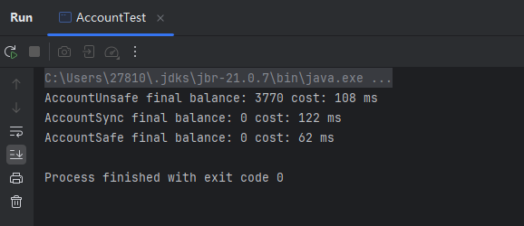

#### 1.2  案例分析

1. 什么是无锁

    - 无锁（**lock-free**）编程是一种避免使用显式互斥锁（`synchronized`​ / `Lock`​）来实现线程安全的方法，常通过原子操作（如 `CAS`​）实现。
    - 它的本质特征是：

      - 不使用互斥锁（`synchronized`​、`Lock`​ 等阻塞原语）；
      - 使用原子指令（CPU级支持）保证数据一致性；
      - 通常通过 `CAS`​（Compare-And-Swap）操作实现；
      - 在高并发场景下性能比加锁更优；
      - 非阻塞：一个线程挂掉不会影响其他线程的执行。
2. ​`AccountSafe`​ 是无锁实现

    - ​`AccountSafe`​ 的代码中

      - **没有用 synchronized 或 Lock。**
      - 使用了 `AtomicInteger`​ 的 `compareAndSet()`​（CAS）。
      - 循环尝试直到成功，称为 **乐观锁策略。**
3. 源码分析

    - 查看 Java 中`AtomicInteger`​类中的 `getAndIncrement()`​是怎么实现的

      - ```java
        public final int getAndIncrement() {
            return U.getAndAddInt(this, VALUE, 1);
        }
        ```
    - ​`getAndIncrement()`​调用的是 Unsafe 类的`getAndAddInt`​方法

      - ```java
        @IntrinsicCandidate
        public final int getAndAddInt(Object o, long offset, int delta) {
            int v;
            do {
                v = getIntVolatile(o, offset);
            } while (!weakCompareAndSetInt(o, offset, v, v + delta));
            return v;
        }
        ```
      - 第一步：读取值

        - 从对象 `o`​ 的内存偏移位置 `offset`​ 读取一个 `int`​ 类型的值。
        - 是 ​**volatile 读**​，保证可见性（其他线程写入后的值能及时看到）。
      - 第二步：CAS 操作（自旋）

        - 尝试将字段的值从 `v`​ 更新为 `v + delta`​。
        - 使用的是 ​**CAS（Compare-And-Set）** ​：

          - 如果当前值仍然是 `v`​，则将其更新为 `v + delta`​；
          - 如果被其他线程改了（即值不等于 `v`​），CAS 失败，循环重试。
        - **为什么用** **​`while`​**​ **？**

          - 因为 CAS 是非阻塞的，失败后需要继续重试，直到成功为止（**乐观锁的典型模式**）。
      - 第三步：返回旧值

        - 返回的是操作前读取到的旧值，即 “getAndAdd” 的语义。
    - 怎么保证 `compareAndSwapInt`​ （CAS）的原子性？

      - CAS 的底层是 lock cmpxchg 指令，在单核 CPU 和多核 CPU 下都能够保证【比较-交换】的原子性。
      - 在多核状态下，某个核执行到带 lock 的指令时，CPU 会让总线锁住，当这个核把此指令执行完毕，再开启总线。这个过程中不会被线程的调度机制所打断，保证了多个线程对内存操作的准确性，是原子的。

#### 1.3  CAS 与 volatile 的分析

1. CAS

    - CAS 的全称是 Compare-And-Swap，是 **CPU 并发原语。**

      - CAS 并发原语体现在 Java 语言中就是 sun.misc.Unsafe 类的各个方法，调用 UnSafe 类中的 CAS 方法，JVM 会实现出 CAS 汇编指令，这是一种完全依赖于硬件的功能，实现了原子操作。
      - CAS 是一种系统原语，原语属于操作系统范畴，是由若干条指令组成 ，用于完成某个功能的一个过程，并且原语的执行必须是连续的，执行过程中不允许被中断，所以 CAS 是一条 CPU 的原子指令，不会造成数据不一致的问题，是线程安全的。
    - 底层原理：CAS 的底层是 `lock cmpxchg`​ 指令（X86 架构），在单核和多核 CPU 下都能够保证比较交换的原子性。

      - 程序是在单核处理器上运行，会省略 lock 前缀，单处理器自身会维护处理器内的顺序一致性，不需要 lock 前缀的内存屏障效果。
      - 程序是在多核处理器上运行，会为 cmpxchg 指令加上 lock 前缀。当某个核执行到带 lock 的指令时，CPU 会执行**总线锁定或缓存锁定**，将修改的变量写入到主存，这个过程不会被线程的调度机制所打断，保证了多个线程对内存操作的原子性。
    - 作用：比较当前工作内存中的值和主物理内存中的值，如果相同则执行规定操作，否则继续比较直到主内存和工作内存的值一致为止。
    - CAS 特点：

      - CAS 体现的是**无锁并发、无阻塞并发**，线程不会陷入阻塞，线程不需要频繁切换状态（上下文切换，系统调用）。
      - CAS 是基于**乐观锁**的思想。
    - CAS 缺点：

      - 执行的是循环操作，如果比较不成功一直在循环，最差的情况某个线程一直取到的值和预期值都不一样，就会无限循环导致饥饿。**使用 CAS 线程数不要超过 CPU 的核心数**，采用分段 CAS 和自动迁移机制。
      - 只能保证一个共享变量的原子操作

        - 对于一个共享变量执行操作时，可以通过循环 CAS 的方式来保证原子操作。
        - 对于多个共享变量操作时，循环 CAS 就无法保证操作的原子性，这个时候**只能用锁来保证原子性。**
      - 引出来 **ABA** 问题。

        - ABA 问题是指：

          1. 线程 1 从内存中读取了一个值 `A`​；
          2. 在进行 CAS 时，检查值仍为 `A`​；
          3. 但这时经过线程 2 的修改，值其实已经发生了 `A -> B -> A`​ 的变化；
          4. CAS 操作仍然成功，但线程 A **错误地认为值没有变过**。

          ABA 问题会导致**并发场景中隐藏的状态变更**被忽视，进而引发逻辑错误。
        - 解决 ABA 问题的方法

          |方式|说明|
          | ------| ------------------------------------------|
          |​`AtomicStampedReference`​|为引用添加“版本号”，每次修改都更新版本|
          |​`AtomicMarkableReference`​|添加一个布尔标记，仅关注是否修改过|
    - **CAS 与 synchronized 总结：**

      - synchronized 是从悲观的角度出发：总是假设最坏的情况，每次去拿数据的时候都认为别人会修改，所以每次在拿数据的时候都会上锁，这样别人想拿这个数据就会阻塞（共享资源每次只给一个线程使用，其他线程阻塞，用完后再把资源转让给其他线程），因此 synchronized 也称之为悲观锁，ReentrantLock 也是一种悲观锁，性能较差。
      - CAS 是从乐观的角度出发：总是假设最好的情况，每次去拿数据的时候都认为别人不会修改，所以不会上锁，但是在更新的时候会判断一下在此期间别人有没有去更新这个数据。**如果别人修改过，则获取现在最新的值，如果别人没修改过，直接修改共享数据的值**，CAS 这种机制也称之为乐观锁，综合性能较好。
2. volatile

- ​`AtomicInteger`​ 源码里面 应用到了 `volatile`​。
- 获取共享变量时，为了保证该变量的可见性，需要使用  `volatile`​ 修饰。它可以用来修饰成员变量和静态成员变量，他可以避免线程从自己的工作缓存中查找变量的值，必须到主存中获取  
  它的值，线程操作 `volatile`​ 变量都是直接操作主存。即一个线程对 `volatile`​ 变量的修改，对另一个线程可见。
- 注意：

  -  `volatile`​ 仅仅保证了共享变量的可见性，让其它线程能够看到最新值，但不能解决指令交错问题（不能保证原子性）。
  - CAS 必须借助 `volatile`​ 才能读取到共享变量的最新值来实现【比较并交换】的效果。

# 2、原子整数

#### 2.1  基本概念

- 常见原子类

  - AtomicInteger
  - AtomicBoolean
  - AtomicLong
- 构造方法

  - ​`public AtomicInteger()`​：初始化一个默认值为 0 的原子型 Integer
  - ​`public AtomicInteger(int initialValue)`​：初始化一个指定值的原子型 Integer
- 常用API

  - |方法|作用|
    | ---------------------------------------| ------------------------------------------------------------------------------|
    |public final int get()|获取 AtomicInteger 的值|
    |public final int getAndIncrement()|以原子方式将当前值加 1，返回的是自增前的值|
    |public final int incrementAndGet()|以原子方式将当前值加 1，返回的是自增后的值|
    |public final int getAndSet(int value)|以原子方式设置为 newValue 的值，返回旧值|
    |public final int addAndGet(int data)|以原子方式将输入的数值与实例中的值相加并返回<br />实例：AtomicInteger 里的 value|

#### 2.2  原理分析

以 **AtomicInteger 为例**

- **AtomicInteger 原理**：自旋锁 + CAS 算法

  - **CAS 算法：** 有 3 个操作数（内存值 V， 旧的预期值 A，要修改的值 B）

    - 当旧的预期值 A \=\= 内存值 V ，此时可以修改，将 V 改为 B
    - 当旧的预期值 A !\= 内存值 V ，此时不能修改，并重新获取现在的最新值，重新获取的动作就是自旋
- 分析 `getAndSet()`​ 方法

  - 源码

    - ```java
      public final int getAndSet(int newValue) {
          /**
          * this: 		当前对象
          * valueOffset:	内存偏移量，内存地址
          */
          return unsafe.getAndSetInt(this, valueOffset, newValue);
      }
      ```
    - - 这是 `AtomicInteger`​ 中的原子设置方法；
      - ​`unsafe.getAndSetInt(...)`​ 是它真正的核心实现；
      - ​`valueOffset`​ 是 `value`​ 字段在内存中的位置（通过 `objectFieldOffset()`​ 获取）；
  - ​`objectFieldOffset()`​ 获取内存偏移

    - ```java
      valueOffset = unsafe.objectFieldOffset(AtomicInteger.class.getDeclaredField("value"));
      ```
    - 使用反射拿到 `value`​ 字段；

      ​`objectFieldOffset`​ 是 JVM 提供的 native 方法，获取该字段相对于对象起始地址的偏移；
    - 后续 `Unsafe`​ 操作就是通过这个偏移在内存中直接读写字段；
  - ​`Unsafe.getAndSetInt()`​ 的内部实现

    - ```java
      // val1: AtomicInteger对象本身，var2: 该对象值得引用地址，var4: 需要变动的数
      public final int getAndSetInt(Object var1, long var2, int var4) {
          int var5;
          do {
              // var5: 用 var1 和 var2 找到的内存中的真实值
              var5 = this.getIntVolatile(var1, var2);
          } while(!this.compareAndSwapInt(var1, var2, var5, var4));

          return var5;
      }
      ```

      - **读取旧值（volatile 可见）** ；
      - 尝试使用 CAS 将旧值替换成新值；
      - 如果失败（其他线程并发修改了该值），继续循环，直到成功；
      - 成功后返回旧值。
  - 可见性由 `volatile`​ 保证

    - ```java
      private volatile int value
      ```
    - ​`AtomicInteger`​ 中的核心字段 `value`​ 是用 `volatile`​ 修饰的；
    - 这确保了**不同线程读写** **​`value`​**​ **时能看到彼此的最新结果**；
    - 但仅靠 `volatile`​ 不能保证原子性，因此还需配合 `CAS`​；
  - 小结

    - ​`getAndSet(int newValue)`​ 是一种无锁的、线程安全的原子操作，通过 `volatile`​ 保证**可见性**，通过 `CAS`​ 保证**原子性**，由 `Unsafe`​ 类实现对内存的直接操作。
- 分析 `getAndUpdate()`​ 方法

  - ​`getAndUpdate()`​ 的实现逻辑：自旋 + CAS

    - ```java
      public final int getAndUpdate(IntUnaryOperator updateFunction) {
          int prev, next;
          do {
              prev = get(); // 获取当前值，作为 CAS 的期望值
              next = updateFunction.applyAsInt(prev); // 应用函数计算新值
          } while (!compareAndSet(prev, next)); // 尝试 CAS，失败则自旋重试
          return prev; // 返回旧值
      }
      ```

      - 使用的是**函数式接口** **​`IntUnaryOperator`​**​，你可以自定义任意的更新逻辑；

        使用 `compareAndSet(prev, next)`​ 做原子更新；

        **如果并发更新失败，则使用** **​`while`​**​ **循环重试（自旋）** ；
      - 返回的是旧值（与 `getAndAdd()`​、`getAndSet()`​ 等保持一致语义）；
    - 自定义更新逻辑：函数式接口使用示例

      - ```java
        AtomicInteger a = new AtomicInteger(5);
        a.getAndUpdate(i -> i + 10); // 相当于 a = a + 10
        ```

        - 传入的 `i -> i + 10`​ 是一个 **​`IntUnaryOperator`​**​ **函数式接口实现**，表示“当前值加 10”。
    - ​`compareAndSet`​ 的底层实现：使用 `Unsafe`​

      - ```java
        public final boolean compareAndSet(int expect, int update) {
            return unsafe.compareAndSwapInt(this, valueOffset, expect, update);
        }
        ```
      - 这是 `AtomicInteger`​ 的核心原子操作：

        - ​`unsafe.compareAndSwapInt(...)`​ 是 JVM 层的原子指令；
        - ​`valueOffset`​ 表示 `AtomicInteger`​ 中 `value`​ 字段的内存偏移量；
        - 这是最底层的**CAS 实现**，CPU 会通过 `cmpxchg`​ 指令来保证**原子性**；
        - 所以即使你多线程同时操作也不会出现数据竞争。

# 3、原子引用

#### 3.1  基本概念

- 原子引用：对 Object 进行原子操作，提供一种读和写都是原子性的对象引用变量
- 原子引用类：AtomicReference、AtomicStampedReference、AtomicMarkableReference

  - AtomicReference 类：

    - 构造方法：`AtomicReference<T> atomicReference = new AtomicReference<T>()`​
    - 常用 API：

      - ​`public final boolean compareAndSet(V expectedValue, V newValue)`​：CAS 操作。
      - ​`public final void set(V newValue)`​：将值设置为 newValue。
      - ​`public final V get()`​：返回当前值。

#### 3.2  案例分析

1. ABA问题

    - 代码

      ```java
      @Slf4j
      class TestABAAtomicReference {
          static AtomicReference<String> ref = new AtomicReference<>("A");

          public static void main(String[] args) throws InterruptedException {
              log.info("main start...");
              String prev = ref.get();
              other();
              Thread.sleep(1000);
              log.info("change A->C {}", ref.compareAndSet(prev, "C"));
          }

          private static void other() {
              new Thread(() -> {
                  log.info("change A->B {}", ref.compareAndSet(ref.get(), "B"));
              }, "t1").start();

              try {
                  Thread.sleep(500);
              } catch (InterruptedException e) {
                  e.printStackTrace();
              }

              new Thread(() -> {
                  log.info("change B->A {}", ref.compareAndSet(ref.get(), "A"));
              }, "t2").start();
          }
      }
      ```
    - 运行结果

      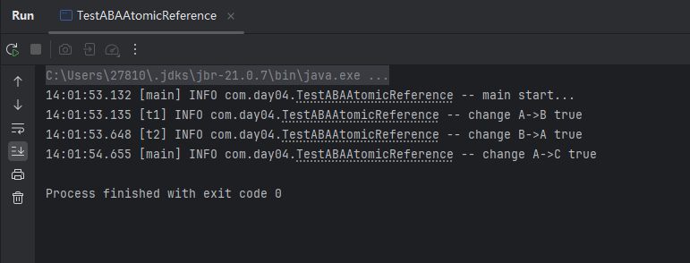

      - 使用 `AtomicReference`​ 模拟了 ABA 问题 **（什么是ABA问题？可以看1.3中的介绍）** 。
      - 主线程仅能判断出共享变量的值与最初值 A 是否相同，不能感知到这种从 A 改为 B 又 改回 A 的情况，如果主线程希望只要有其他线程修改过了共享变量，那么自己的 CAS 就算失败。
      - 这时，仅比较值是不够的，需要再加一个版本号。
2. AtomicStampedReference

    - 原理介绍

      - ​`AtomicStampedReference`​是一个原子引用类型，**在引用值的基础上附带一个整数“版本号”（stamp）** ，用于追踪值的变更历史。可有效避免 **ABA 问题**。
      - 构造方法：`public AtomicStampedReference(V initialRef, int initialStamp)`​。
      - 关键方法

        - ​`V getReference()`​: 获取当前引用对象。
        - ​`int getStamp()`​: 获取当前版本号。
        - ​`boolean compareAndSet(V expectedRef, V newRef, int expectedStamp, int newStamp)`​: 如果当前引用等于期望引用并且当前 stamp 等于期望 stamp，则更新为新引用和新版本。
      - 使用场景：当你需要检测一个共享变量是否**被修改过**（而不仅仅是值是否一致）时，使用它就非常合适。
    - 示例

      - 代码

        ```java
        @Slf4j
        class TestABAAtomicStampedReference {
            static AtomicStampedReference<String> ref = new AtomicStampedReference<>("A", 0);

            public static void main(String[] args) throws InterruptedException {
                log.info("main start...");
                String prev = ref.getReference();
                int stamp = ref.getStamp();
                log.info("版本 {}", stamp);
                other();
                Thread.sleep(1000);
                log.info("change A->C {}", ref.compareAndSet(prev, "C", stamp, stamp + 1));
            }

            private static void other() {
                new Thread(() -> {
                    log.info("change A->B {}", ref.compareAndSet(ref.getReference(), "B",
                            ref.getStamp(), ref.getStamp() + 1));
                    log.info("更新版本为 {}", ref.getStamp());
                }, "t1").start();

                try {
                    Thread.sleep(500);
                } catch (InterruptedException e) {
                    e.printStackTrace();
                }

                new Thread(() -> {
                    log.info("change B->A {}", ref.compareAndSet(ref.getReference(), "A",
                            ref.getStamp(), ref.getStamp() + 1));
                    log.info("更新版本为 {}", ref.getStamp());
                }, "t2").start();
            }
        }
        ```
      - 结果

        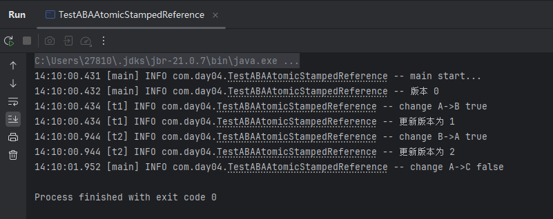

        - 从值上看，变量经历了 A → B → A，**值回到了原点**，但**版本号变了**。
        - 主线程原本是基于版本 0 的 A 去修改，但版本号已经变成 2，所以 `compareAndSet`​ 返回 `false`​。
3. AtomicMarkableReference

    - 原理介绍

      - 和 `AtomicStampedReference`​ 类似，但它不是记录一个整型版本号，而是用一个**布尔值 mark** 标记引用对象是否被改变。
      - 构造方法：`public AtomicMarkableReference(V initialRef, boolean initialMark)`​。
      - 关键方法：

        - ​`V getReference()`​: 获取当前引用。
        - ​`boolean isMarked()`​: 获取当前 mark 值。
        - ​`boolean compareAndSet(V expectedRef, V newRef, boolean expectedMark, boolean newMark)`​: CAS 操作同时比较引用和 mark。
      - 使用场景：当你只关心对象是否被修改过，而**不在意修改了几次**，可以使用它，内存开销比 `AtomicStampedReference`​ 更小。
    - 示例

      - 代码

        ```java
        @Slf4j
        class TestABAAtomicMarkableReference {
            public static void main(String[] args) throws InterruptedException {
                GarbageBag bag = new GarbageBag("装满了垃圾");
                AtomicMarkableReference<GarbageBag> ref = new AtomicMarkableReference<>(bag, true);

                log.info("主线程 start...");
                GarbageBag prev = ref.getReference();
                log.info(prev.toString());

                new Thread(() -> {
                    log.info("打扫卫生的线程 start...");
                    bag.setDesc("空垃圾袋");
                    while (!ref.compareAndSet(bag, bag, true, false)) {}
                    log.info(bag.toString());
                }).start();

                Thread.sleep(1000);
                log.info("主线程想换一只新垃圾袋？");
                boolean success = ref.compareAndSet(prev, new GarbageBag("空垃圾袋"), true, false);
                log.info("换了么？{}", success);
                log.info(ref.getReference().toString());
            }
        }

        class GarbageBag {
            String desc;
            public GarbageBag(String desc) {
                this.desc = desc;
            }
            public void setDesc(String desc) {
                this.desc = desc;
            }
            public String toString() {
                return super.toString() + " " + desc;
            }
        }
        ```
      - 结果

        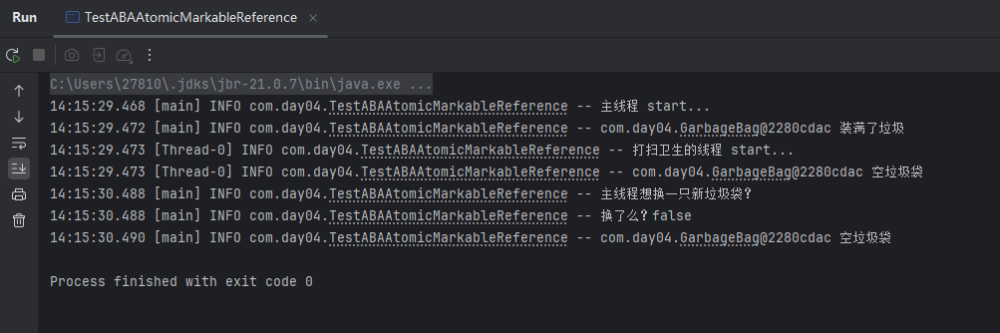

        - 主线程获取引用，并尝试稍后替换为新的垃圾袋。只在 `mark == true`​ 时尝试替换为一个新的空垃圾袋。
        - 子线程清空原来的垃圾袋（设置描述为“空垃圾袋”），并将 mark 改为 `false`​。由于引用地址不变，这个操作成功，mark 被设为 `false`​。
        - 主线程虽然看到垃圾袋引用没有变，但由于标记位已经变成 `false`​，所以 `compareAndSet`​ 失败。
4. AtomicStampedReference 和 AtomicMarkableReference 的区别

    |特性|​`AtomicStampedReference`​|​`AtomicMarkableReference`​|
    | ------------------------| ----------------------------| --------------------|
    |附加信息|整型版本号（stamp）|布尔值标记（mark）|
    |是否能解决 ABA 问题|能|能|
    |是否能统计中间改动次数|能|否|
    |使用场景|精确控制引用状态和变更次数|仅关注是否修改过|
    |内存开销|相对更大|更小|

# 4、原子数组

#### 4.1  基本概念

- 原子数组（Atomic Arrays）是 Java 并发包中的一类工具类，用于在**高并发环境下安全地操作数组中的元素**，避免因竞态条件而产生错误结果。它是对基本类型数组或引用类型数组的**线程安全封装**，内部通过 **CAS（Compare-And-Swap）机制** 实现无锁并发更新。
- 为什么需要原子数组

  - 普通数组不是线程安全的，多个线程并发对数组同一元素操作时，可能导致 ​**数据丢失或错误**​。
  - 原子数组保证对数组某一位置的操作是​**原子的**​，不会被其他线程干扰。
  - 可用于计数器数组、统计数组、缓存等场景。
- 原子数组类型

  - |类名|支持的类型|示例|
    | ------| ---------------| ------|
    |​`AtomicIntegerArray`​|int 类型数组|​`new AtomicIntegerArray(10)`​|
    |​`AtomicLongArray`​|long 类型数组|​`new AtomicLongArray(10)`​|
    |​`AtomicReferenceArray<T>`​|引用类型数组|​`new AtomicReferenceArray<>(10)`​|
- 常用方法

  - ​`get(index)`​：获取指定索引的值
  - ​`set(index, value)`​：设置指定索引的值
  - ​`getAndIncrement(index)`​：获取当前值并自增
  - ​`incrementAndGet(index)`​：自增并获取值
  - ​`compareAndSet(index, expect, update)`​：CAS 操作
  - ​`getAndUpdate(index, unaryOperator)`​：函数式更新

#### 4.2  安全性对比

- 函数式封装说明

  - ```java
    private static <T> void demo(
        Supplier<T> arraySupplier,              // 创建数组
        Function<T, Integer> lengthFun,         // 获取数组长度
        BiConsumer<T, Integer> putConsumer,     // 对数组某个 index 执行操作
        Consumer<T> printConsumer               // 打印结果
    )
    ```
- 不安全版本示例

  - 代码

    ```java
    demo(
        () -> new int[10],
        array -> array.length,
        (array, index) -> array[index]++,  // 非线程安全
        array -> System.out.println(Arrays.toString(array))
    );
    ```
  - **问题说明：**   
    多个线程对同一数组元素 `array[index]++`​ 操作，这看似一个操作，其实包括：

    1. 读当前值
    2. 加 1
    3. 写回新值

    如果线程 A 和线程 B 同时对 `array[0]`​ 做 `++`​，可能都读到 `0`​，都写回 `1`​，结果只加了一次。
- 安全版本示例（使用 `AtomicIntegerArray`​）

  - 代码

    - ```java
      demo(
          () -> new AtomicIntegerArray(10),
          array -> array.length(),
          (array, index) -> array.getAndIncrement(index), // 原子操作
          array -> System.out.println(array)
      );
      ```
  - 结果

    - ​`[10000, 10000, 10000, 10000, 10000, 10000, 10000, 10000, 10000, 10000]`​
    - ​`getAndIncrement()`​ 使用了底层的 `CAS`​ 机制，保证了每个自增操作不会丢失。

# 5、字段更新器

#### 5.1  基本概念

- 字段更新器（Field Updater）是 Java 提供的一种 **基于反射机制的原子操作工具类**，可以对对象的某个 **​`volatile`​**​ **修饰的字段** 进行原子更新，**不需要将整个对象设置为原子类**，从而**节省内存并提升性能**。
- 常见的字段更新器类

  - |类名|更新字段类型|
    | ------| --------------|
    |​`AtomicIntegerFieldUpdater<T>`​|​`int`​类型字段|
    |​`AtomicLongFieldUpdater<T>`​|​`long`​类型字段|
    |​`AtomicReferenceFieldUpdater<T, V>`​|引用类型字段|
- 使用条件

  - **字段必须是** **​`volatile`​**​ **修饰的，** 若字段未被 `volatile`​ 修饰，会抛出异常。
  - **字段不能是** **​`private static`​**​ **或** **​`final`​**​。
  - 字段必须在指定类中定义（不能是父类字段）。
- 实现原理

  字段更新器内部使用了反射来访问并操作字段，并借助 `Unsafe`​ 实现对该字段的 **CAS 操作**。

  **优势：**

  - 相比使用 `AtomicInteger`​ 作为类字段，不会额外创建包装对象，节省内存。
  - 灵活地对某个字段进行原子更新，而不是整体同步整个对象。

#### 5.2  示例

- 代码

  - ```java
    import java.util.concurrent.atomic.AtomicIntegerFieldUpdater;

    public class Test5 {
        // 必须是 volatile
        private volatile int field;

        public static void main(String[] args) {
            // 创建字段更新器，更新 Test5 类中名为 "field" 的字段
            AtomicIntegerFieldUpdater<Test5> fieldUpdater =
                    AtomicIntegerFieldUpdater.newUpdater(Test5.class, "field");

            Test5 test5 = new Test5();

            // 初始值为 0，CAS 修改为 10
            fieldUpdater.compareAndSet(test5, 0, 10);
            System.out.println(test5.field);  // 10

            // 10 -> 20
            fieldUpdater.compareAndSet(test5, 10, 20);
            System.out.println(test5.field);  // 20

            // CAS 失败：预期值为 10，但当前为 20
            fieldUpdater.compareAndSet(test5, 10, 30);
            System.out.println(test5.field);  // 20
        }
    }
    ```
- 结果

  - 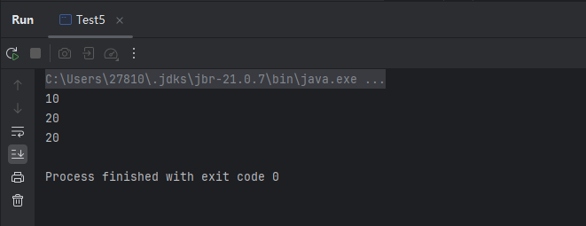

# 6、原子累加器

> **原子累加器**（Atomic Adder）是一种在**高并发场景下**用于**高效、安全地进行数值累加**的工具，主要包括以下两种实现：
>
> - ​`AtomicLong`​（传统原子类）
> - ​`LongAdder`​（高性能原子类）

#### 6.1  实现方式

1. ​`AtomicLong`​（传统原子类）

    - ​`AtomicLong`​ 是 Java 并发包（`java.util.concurrent.atomic`​）中提供的一个原子变量类。
    - 提供原子性的 **读-改-写** 操作，比如：`incrementAndGet()`​、`getAndAdd()`​、`compareAndSet()`​。
    - 所有操作都是基于 **CAS** 实现的。
    - 工作机制（CAS的）

      - 读取当前值（期望值）；
      - 与期望值对比：

        - 如果主内存值等于期望值：执行更新；
        - 否则：不更新，返回 false，再次尝试（​**自旋重试**​）；
      - 全部是​**对一个值操作**​，并发量大时，冲突概率高，CAS 失败多，性能下降。
2. ​`LongAdder`​（高性能原子类）

    - ​`LongAdder`​ 是 Java 8 新增的高性能原子类；
    - 设计目的是 **在高并发下替代 AtomicLong 提供更好的性能**；
    - 通过 **分段累加（Striped64）**  的方式，降低并发竞争。
    - 工作机制：

      - 内部维护了一个 `base`​ 和一个 `Cell[]`​ 数组；
      - 每个线程通过哈希算法映射到一个 `Cell`​；
      - 每次自增时不是去修改 `base`​，而是修改自己对应的 `Cell`​；
      - ​`sum()`​ 时再把 `base + 所有 Cell`​ 相加。

#### 6.2  性能比较

- 代码

  ```java
  import java.util.ArrayList;
  import java.util.List;
  import java.util.concurrent.atomic.AtomicLong;
  import java.util.concurrent.atomic.LongAdder;
  import java.util.function.Consumer;
  import java.util.function.Supplier;

  public class AtomicAdderBenchmark {

      public static void main(String[] args) {
          System.out.println("------ LongAdder ------");
          for (int i = 0; i < 5; i++) {
              demo(() -> new LongAdder(), adder -> adder.increment());
          }

          System.out.println("------ AtomicLong ------");
          for (int i = 0; i < 5; i++) {
              demo(() -> new AtomicLong(), adder -> adder.getAndIncrement());
          }
      }

      private static <T> void demo(Supplier<T> adderSupplier, Consumer<T> action) {
          T adder = adderSupplier.get();
          long start = System.nanoTime();
          List<Thread> ts = new ArrayList<>();
          // 40 个线程，每个线程累加 50 万次
          for (int i = 0; i < 40; i++) {
              ts.add(new Thread(() -> {
                  for (int j = 0; j < 500000; j++) {
                      action.accept(adder);
                  }
              }));
          }
          ts.forEach(Thread::start);
          ts.forEach(t -> {
              try {
                  t.join();
              } catch (InterruptedException e) {
                  e.printStackTrace();
              }
          });
          long end = System.nanoTime();
          System.out.println(adder + " cost: " + (end - start) / 1_000_000 + " ms");
      }
  }
  ```
- 结果

  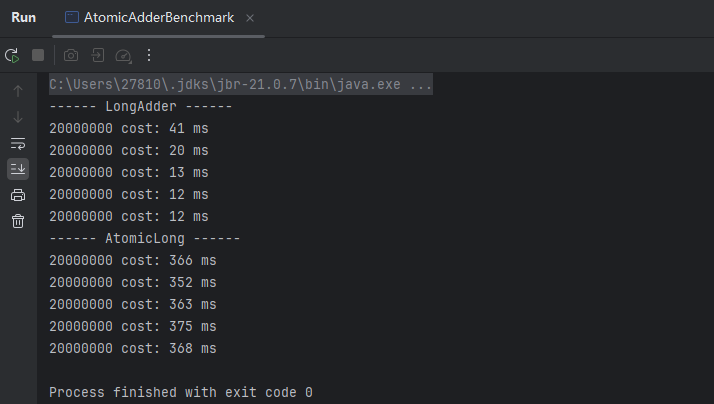

  - 上述代码对比了 `AtomicLong`​ 和 `LongAdder`​ 在高并发累加下的执行效率。
  - ​`LongAdder`​ 在高并发场景下性能优于 `AtomicLong`​，主要得益于其分段累加的设计思想。它通过将总和拆分为多个独立的变量（Cell），每个线程在更新时尽量只访问自己的 Cell，避免了多个线程同时竞争一个共享变量带来的性能瓶颈。等到需要获取最终结果时，再将这些变量的值累加汇总。这种设计显著降低了线程之间的竞争，尤其在多核处理器上，能够大幅提高并发累加操作的吞吐量。
  - 核心越多，`LongAdder`​ 的优势越明显。

#### 6.3  Adder

- 优化机制

  - LongAdder 是 Java8 提供的类，跟 AtomicLong 有相同的效果，但对 CAS 机制进行了优化，尝试使用分段 CAS 以及自动分段迁移的方式来大幅度提升多线程高并发执行 CAS 操作的性能。
  - CAS 底层实现是在一个循环中不断地尝试修改目标值，直到修改成功。如果竞争不激烈修改成功率很高，否则失败率很高，失败后这些重复的原子性操作会耗费性能（导致大量线程**空循环，自旋转**）。
  - 优化核心思想：数据分离，将 AtomicLong 的**单点的更新压力分担到各个节点，空间换时间**，在低并发的时候直接更新，可以保障和 AtomicLong 的性能基本一致，而在高并发的时候通过分散减少竞争，提高了性能。
- 分段 CAS 机制

  - 在发生竞争时，创建 Cell 数组用于将不同线程的操作离散（通过 hash 等算法映射）到不同的节点上。
  - 设置多个累加单元（会根据需要扩容，最大为 CPU 核数），Therad-0 累加 Cell[0]，而 Thread-1 累加 Cell[1] 等，最后将结果汇总。
  - 在累加时操作的不同的 Cell 变量，因此减少了 CAS 重试失败，从而提高性能。
- 自动分段迁移机制

  - 某个 Cell 的 value 执行 CAS 失败，就会自动寻找另一个 Cell 分段内的 value 值进行 CAS 操作。

#### 6.4  伪共享

- Cell 为累加单元：数组访问索引是通过 Thread 里的 threadLocalRandomProbe 域取模实现的，这个域是 ThreadLocalRandom 更新的。

  - ```java
    // Striped64.Cell
    @sun.misc.Contended static final class Cell {
        volatile long value;
        Cell(long x) { value = x; }
        // 用 cas 方式进行累加, prev 表示旧值, next 表示新值
        final boolean cas(long prev, long next) {
        	return UNSAFE.compareAndSwapLong(this, valueOffset, prev, next);
        }
        // 省略不重要代码
    }
    ```
- Cell 是数组形式，**在内存中是连续存储的**，64 位系统中，一个 Cell 为 24 字节（16 字节的对象头和 8 字节的 value），每一个 cache line 为 64 字节，因此缓存行可以存下 2 个的 Cell 对象，当 Core-0 要修改 Cell[0]、Core-1 要修改 Cell[1]，无论谁修改成功都会导致当前缓存行失效，从而导致对方的数据失效，需要重新去主存获取，影响效率。

  - 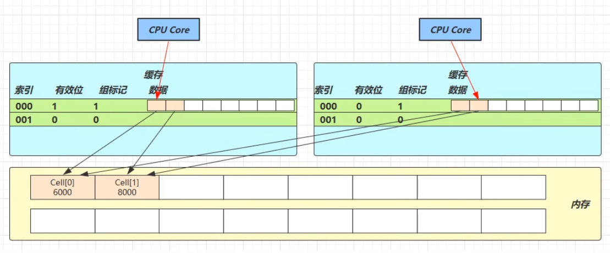
- @sun.misc.Contended：防止缓存行伪共享，在使用此注解的对象或字段的前后各增加 128 字节大小的 padding，使用 2 倍于大多数硬件缓存行让 CPU 将对象预读至缓存时**占用不同的缓存行**，这样就不会造成对方缓存行的失效。

  - 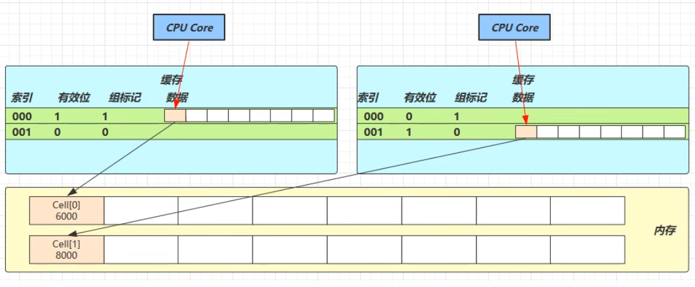

#### 6.5  源码解析

1. Striped64 类成员属性

    ```java
    // 表示当前计算机CPU数量
    static final int NCPU = Runtime.getRuntime().availableProcessors()
    // 累加单元数组, 懒惰初始化
    transient volatile Cell[] cells;
    // 基础值, 如果没有竞争, 则用 cas 累加这个域，当 cells 扩容时，也会将数据写到 base 中
    transient volatile long base;
    // 在 cells 初始化或扩容时只能有一个线程执行, 通过 CAS 更新 cellsBusy 置为 1 来实现一个锁
    transient volatile int cellsBusy;
    ```
2. 工作流程

    - cells 占用内存是相对比较大的，是惰性加载的，在无竞争或者其他线程正在初始化 cells 数组的情况下，直接更新 base 域
    - 在第一次发生竞争时（casBase 失败）会创建一个大小为 2 的 cells 数组，将当前累加的值包装为 Cell 对象，放入映射的槽位上
    - 分段累加的过程中，如果当前线程对应的 cells 槽位为空，就会新建 Cell 填充，如果出现竞争，就会重新计算线程对应的槽位，继续自旋尝试修改
    - 分段迁移后还出现竞争就会扩容 cells 数组长度为原来的两倍，然后 rehash，**数组长度总是 2 的 n 次幂**，默认最大为 CPU 核数，但是可以超过，如果核数是 6 核，数组最长是 8
3. 常用方法分析

    - LongAdder#add：累加方法

      - 代码

        - ```java
          public void add(long x) {
              // as 为累加单元数组的引用，b 为基础值，v 表示期望值
              // m 表示 cells 数组的长度 - 1，a 表示当前线程命中的 cell 单元格
              Cell[] as; long b, v; int m; Cell a;
              
              // cells 为 null 且 casBase 成功：说明当前无并发，使用 base 成功累加，方法直接 return。
              // cells 不为空说明 cells 已经被初始化，线程发生了竞争，去更新对应的 cell 槽位
              // 进入 || 后的逻辑去更新 base 域，更新失败表示发生竞争进入条件
              if ((as = cells) != null || !casBase(b = base, b + x)) {
                  // uncontended 为 true 表示 cell 没有竞争
                  boolean uncontended = true;
                  
                  // 条件一: true 说明 cells 未初始化，多线程写 base 发生竞争需要进行初始化 cells 数组
                  //		  fasle 说明 cells 已经初始化，进行下一个条件寻找自己的 cell 去累加
                  // 条件二: getProbe() 获取 hash 值，& m 的逻辑和 HashMap 的逻辑相同，保证散列的均匀性
                  // 		  true 说明当前线程对应下标的 cell 为空，需要创建 cell
                  //        false 说明当前线程对应的 cell 不为空，进行下一个条件【将 x 值累加到对应的 cell 中】
                  // 条件三: 有取反符号，false 说明 cas 成功，直接返回，true 说明失败，当前线程对应的 cell 有竞争
                  if (as == null || (m = as.length - 1) < 0 ||
                      (a = as[getProbe() & m]) == null ||
                      !(uncontended = a.cas(v = a.value, v + x)))
                      longAccumulate(x, null, uncontended);
                  	// 【uncontended 在对应的 cell 上累加失败的时候才为 false，其余情况均为 true】
              }
          }
          ```
      - 流程图

        - 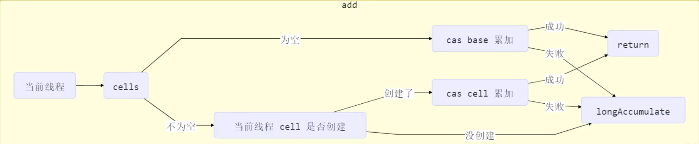
        - 执行多条件判断，尝试将 `x`​ 累加到当前线程命中的 `Cell`​

          - **as**  **==**  **null**：说明 `cells`​ 尚未初始化，调用 `longAccumulate()`​ 初始化。
          - **a**  **==**  **null**：`Cell`​ 没被创建，调用 `longAccumulate()`​ 创建该线程对应的 `Cell`​。
          - **a.cas(...) 失败**：即使 `Cell`​ 存在，也可能因并发导致 CAS 失败，调用 `longAccumulate()`​ 处理竞争。
          - **以上三者任何一个条件成立都进入** **​`longAccumulate()`​** ​。
    - Striped64#longAccumulate：cell 数组创建

      - 代码

        - ```java
          final void longAccumulate(long x, LongBinaryOperator fn, boolean wasUncontended) {
              int h;
              // 当前线程还没有对应的 cell, 需要随机生成一个 hash 值用来将当前线程绑定到 cell
              if ((h = getProbe()) == 0) {
                  // 初始化 probe，获取 hash 值
                  ThreadLocalRandom.current(); 
                  h = getProbe();	
                  // 默认情况下 当前线程肯定是写入到了 cells[0] 位置，不把它当做一次真正的竞争
                  wasUncontended = true;
              }
              // 表示【扩容意向】，false 一定不会扩容，true 可能会扩容
              boolean collide = false; 
              //自旋
              for (;;) {
                  // as 表示cells引用，a 表示当前线程命中的 cell，n 表示 cells 数组长度，v 表示 期望值
                  Cell[] as; Cell a; int n; long v;
                  // 【CASE1】: 表示 cells 已经初始化了，当前线程应该将数据写入到对应的 cell 中
                  if ((as = cells) != null && (n = as.length) > 0) {
                      // CASE1.1: true 表示当前线程对应的索引下标的 Cell 为 null，需要创建 new Cell
                      if ((a = as[(n - 1) & h]) == null) {
                          // 判断 cellsBusy 是否被锁
                          if (cellsBusy == 0) {   
                              // 创建 cell, 初始累加值为 x
                              Cell r = new Cell(x);  
                              // 加锁
                              if (cellsBusy == 0 && casCellsBusy()) {
                                  // 创建成功标记，进入【创建 cell 逻辑】
                                  boolean created = false;	
                                  try {
                                      Cell[] rs; int m, j;
                                      // 把当前 cells 数组赋值给 rs，并且不为 null
                                      if ((rs = cells) != null &&
                                          (m = rs.length) > 0 &&
                                          // 再次判断防止其它线程初始化过该位置，当前线程再次初始化该位置会造成数据丢失
                                          // 因为这里是线程安全的判断，进行的逻辑不会被其他线程影响
                                          rs[j = (m - 1) & h] == null) {
                                          // 把新创建的 cell 填充至当前位置
                                          rs[j] = r;
                                          created = true;	// 表示创建完成
                                      }
                                  } finally {
                                      cellsBusy = 0;		// 解锁
                                  }
                                  if (created)			// true 表示创建完成，可以推出循环了
                                      break;
                                  continue;
                              }
                          }
                          collide = false;
                      }
                      // CASE1.2: 条件成立说明线程对应的 cell 有竞争, 改变线程对应的 cell 来重试 cas
                      else if (!wasUncontended)
                          wasUncontended = true;
                      // CASE 1.3: 当前线程 rehash 过，如果新命中的 cell 不为空，就尝试累加，false 说明新命中也有竞争
                      else if (a.cas(v = a.value, ((fn == null) ? v + x : fn.applyAsLong(v, x))))
                          break;
                      // CASE 1.4: cells 长度已经超过了最大长度 CPU 内核的数量或者已经扩容
                      else if (n >= NCPU || cells != as)
                          collide = false; 		// 扩容意向改为false，【表示不能扩容了】
                      // CASE 1.5: 更改扩容意向，如果 n >= NCPU，这里就永远不会执行到，case1.4 永远先于 1.5 执行
                      else if (!collide)
                          collide = true;
                      // CASE 1.6: 【扩容逻辑】，进行加锁
                      else if (cellsBusy == 0 && casCellsBusy()) {
                          try {
                              // 线程安全的检查，防止期间被其他线程扩容了
                              if (cells == as) {     
                                  // 扩容为以前的 2 倍
                                  Cell[] rs = new Cell[n << 1];
                                  // 遍历移动值
                                  for (int i = 0; i < n; ++i)
                                      rs[i] = as[i];
                                  // 把扩容后的引用给 cells
                                  cells = rs;
                              }
                          } finally {
                              cellsBusy = 0;	// 解锁
                          }
                          collide = false;	// 扩容意向改为 false，表示不扩容了
                          continue;
                      }
                      // 重置当前线程 Hash 值，这就是【分段迁移机制】
                      h = advanceProbe(h);
                  }

                  // 【CASE2】: 运行到这说明 cells 还未初始化，as 为null
                  // 判断是否没有加锁，没有加锁就用 CAS 加锁
                  // 条件二判断是否其它线程在当前线程给 as 赋值之后修改了 cells，这里不是线程安全的判断
                  else if (cellsBusy == 0 && cells == as && casCellsBusy()) {
                      // 初始化标志，开始 【初始化 cells 数组】
                      boolean init = false;
                      try { 
                         	// 再次判断 cells == as 防止其它线程已经提前初始化了，当前线程再次初始化导致丢失数据
                          // 因为这里是【线程安全的，重新检查，经典 DCL】
                          if (cells == as) {
                              Cell[] rs = new Cell[2];	// 初始化数组大小为2
                              rs[h & 1] = new Cell(x);	// 填充线程对应的cell
                              cells = rs;
                              init = true;				// 初始化成功，标记置为 true
                          }
                      } finally {
                          cellsBusy = 0;					// 解锁啊
                      }
                      if (init)
                          break;							// 初始化成功直接跳出自旋
                  }
                  // 【CASE3】: 运行到这说明其他线程在初始化 cells，当前线程将值累加到 base，累加成功直接结束自旋
                  else if (casBase(v = base, ((fn == null) ? v + x :
                                              fn.applyAsLong(v, x))))
                      break; 
              }
          }
          ```
      - 流程图

        - 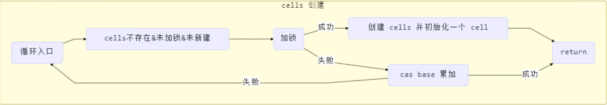
        - 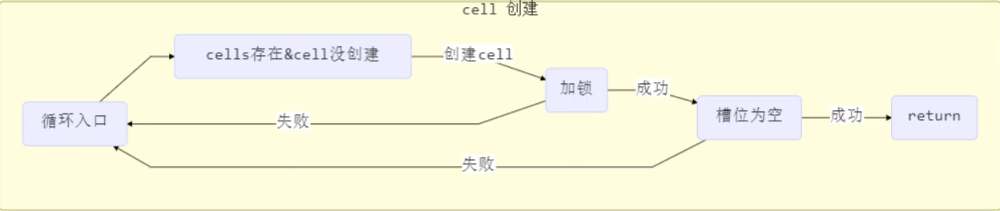
        - 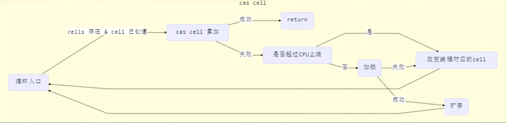
    - sum：获取最终结果通过 sum 整合，**保证最终一致性，不保证强一致性**

      - ```java
        public long sum() {
            Cell[] as = cells; Cell a;
            long sum = base;
            if (as != null) {
                // 遍历 累加
                for (int i = 0; i < as.length; ++i) {
                    if ((a = as[i]) != null)
                        sum += a.value;
                }
            }
            return sum;
        }
        ```

#### 6.6  Unsafe

- Unsafe 是 CAS 的核心类，由于 Java 无法直接访问底层系统，需要通过本地（Native）方法来访问。
- Unsafe 类存在 sun.misc 包，其中所有方法都是 native 修饰的，都是直接调用**操作系统底层资源**执行相应的任务，基于该类可以直接操作特定的内存数据，其内部方法操作类似 C 的指针。
- 模拟实现原子整数：

  - ```java
    public static void main(String[] args) {
        MyAtomicInteger atomicInteger = new MyAtomicInteger(10);
        if (atomicInteger.compareAndSwap(20)) {
            System.out.println(atomicInteger.getValue());
        }
    }

    class MyAtomicInteger {
        private static final Unsafe UNSAFE;
        private static final long VALUE_OFFSET;
        private volatile int value;

        static {
            try {
                //Unsafe unsafe = Unsafe.getUnsafe()这样会报错，需要反射获取
                Field theUnsafe = Unsafe.class.getDeclaredField("theUnsafe");
                theUnsafe.setAccessible(true);
                UNSAFE = (Unsafe) theUnsafe.get(null);
                // 获取 value 属性的内存地址，value 属性指向该地址，直接设置该地址的值可以修改 value 的值
                VALUE_OFFSET = UNSAFE.objectFieldOffset(
                    		   MyAtomicInteger.class.getDeclaredField("value"));
            } catch (NoSuchFieldException | IllegalAccessException e) {
                e.printStackTrace();
                throw new RuntimeException();
            }
        }

        public MyAtomicInteger(int value) {
            this.value = value;
        }
        public int getValue() {
            return value;
        }

        public boolean compareAndSwap(int update) {
            while (true) {
                int prev = this.value;
                int next = update;
                //							当前对象  内存偏移量    期望值 更新值
                if (UNSAFE.compareAndSwapInt(this, VALUE_OFFSET, prev, update)) {
                    System.out.println("CAS成功");
                    return true;
                }
            }
        }
    }
    ```
