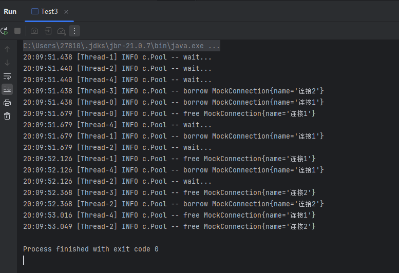

# JUC-09  共享模型之不可变

# 1、final

- 属性用 final 修饰保证了该属性是只读的，不能修改。
- 类用 final 修饰保证了该类中的方法不能被覆盖，防止子类无意间破坏不可变性。
- 设置 final 变量的原理

  - 示例代码

    - ```java
      public class TestFinal {
      	final int a = 20;
      }
      ```
  - 字节码

    - ```java
      0: aload_0
      1: invokespecial #1 // Method java/lang/Object."<init>":()V
      4: aload_0
      5: bipush 20		// 将值直接放入栈中
      7: putfield #2 		// Field a:I
      <-- 写屏障
      10: return
      ```
  - 当使用 `final`​ 修饰变量时，变量的赋值是通过 `putfield`​ 字节码指令完成的。在这条指令之后，JVM 会插入一条**写屏障（write barrier）** ，以确保在赋值操作完成之前，该字段对其他线程不可见，从而保证了**可见性和初始化安全**。
  - 对于被 `final`​ 修饰的字段，一旦构造方法执行完毕并返回，其值在多线程环境下对所有线程都是**安全可见的**，这也是 Java 内存模型对 `final`​ 的特殊保证。
  - 如果不加 `final`​ ，其实是分两步走的，第一步先是分配空间，还没有赋值，初始值是0。如果此时其他线程看到了赋值之前的零，那么变量的使用就是不正确的。
- 获取 final 变量的原理

  - 在Java中，获取final变量的原理与获取普通变量的原理是一样的，都是在运行时访问内存中的变量值。不同的是，对于final变量，编译器会进行优化，将其存储在常量池中，而非存储在堆或栈中。
  - 当程序需要访问final变量时，实际上是直接从**常量池**中读取该变量的值，而不是从内存中读取。这样可以提高程序的执行效率，避免了不必要的内存操作。
- 常量池、堆、栈的概念

  - 常量池

    - 位于方法区（JDK7及之前）或元空间（JDK8及之后）中。
    - 用于存储编译期生成的字面量（Literal）和符号引用（Symbolic Reference）。
    - 存储字符串常量、类和接口的全限定名、字段和方法的名称和描述符等。
    - 常量池的内容在编译时确定，并保存在class文件中，运行时被加载到内存中。
    - 常量池中的数据是不可修改的，可以被多个对象共享。
  - 堆

    - 用于存储对象实例，包括通过new关键字创建的对象。
    - 位于Java虚拟机内存中的一块较大的区域。
    - 堆中的对象由垃圾回收器自动管理，通过垃圾回收机制来释放不再使用的对象。
    - 对象在堆中分配内存，对象的引用存储在栈中。
  - 栈

    - 位于线程私有的内存区域。
    - 每个线程都有自己的栈，用于存储局部变量、方法调用和方法返回等。
    - 栈中的数据是按照“后进先出”的原则进行操作。
    - 栈的大小在虚拟机启动时就可以固定，随着线程的创建和销毁而动态改变。
  - 简单来说，常量池主要用于存储编译期生成的字面量和符号引用，堆用于存储对象实例，栈用于存储方法调用和局部变量。常量池的内容是不可修改的，堆和栈中的数据是动态变化的，并且随着程序的执行而进行内存分配和回收。

# 2、保护性拷贝

- 字符串是不可变对象。可我们平时在使用时，确实会调用一些“修改”字符串的方法，比如 `substring()`​，那它是怎么做到不破坏不可变性的呢？来看一段 `substring(int beginIndex)`​ 方法的源码：

  - ```java
    public String substring(int beginIndex) {
        if (beginIndex < 0) {
            throw new StringIndexOutOfBoundsException(beginIndex);
        }
        int subLen = value.length - beginIndex;
        if (subLen < 0) {
            throw new StringIndexOutOfBoundsException(subLen);
        }
        return (beginIndex == 0) ? this : new String(value, beginIndex, subLen);
    }
    ```
  - 可以看到，`substring()`​ 方法本质上是通过调用构造函数 `new String(...)`​ 创建了一个**新的字符串对象**，并未对当前对象的 `char[] value`​ 数组进行修改。
- 继续深入 `String(char[] value, int offset, int count)`​ 构造方法：

  - ```java
    public String(char value[], int offset, int count) {
        // 省略部分边界检查
        this.value = Arrays.copyOfRange(value, offset, offset + count);
    }
    ```
  - 可以发现：**这里也没有直接引用原有的** **​`value`​**​ **数组，而是通过** **​`Arrays.copyOfRange`​**​ **创建了一份新的副本。**
  - 这就是典型的 **保护性拷贝** —— 为了防止外部修改对象内部状态，创建一个副本进行隔离，从而保证对象的不可变性和安全性。
- 这样做的好处是可以**避免共享可变数据导致的线程安全问题，保证不可变类对象的封装性。**
- 但是，每次操作都会创建新的对象（如新的 `char[]`​），**带来额外的内存和性能开销**。
- 正因如此，在某些对性能敏感的场景下，我们需要一种优化对象重复创建、节省内存的机制 —— **享元模式。**

# 3、**享元模式**

#### 3.1  概念

- 享元模式（Flyweight pattern），是一种结构型设计模式，通过共享对象，减少系统中对象的数量，从而节省内存和提升性能。特别适用于 **大量相似对象频繁创建** 的场景。

#### 3.2  在包装类中的体现

- 在JDK中 Boolean，Byte，Short，Integer，Long，Character 等包装类提供了 valueOf 方法，例如 Long 的 valueOf 会缓存 -128~127 之间的 Long 对象，在这个范围之间会重用对象，大于这个范围，才会新建 Long 对象
- 注意：

  - Byte, Short, Long 缓存的范围都是 -128 ~ 127。
  - Character 缓存的范围是 0~127。
  - Integer的默认范围是 -128~127（最小值不能变、但最大值可以通过调整虚拟机参数-Djava.lang.Integer.IntegerCache.high 来改变）。
  - Boolean 缓存了 TRUE 和 FALSE。

#### 3.3  DIY

- 例子：一个线上商城应用，QPS 达到数千，如果每次都重新创建和关闭数据库连接，性能会受到极大影响。 这时预先创建好一批连接，放入连接池。一次请求到达后，从连接池获取连接，使用完毕后再还回连接池，这样既节约了连接的创建和关闭时间，也实现了连接的重用，不至于让庞大的连接数压垮数据库。
- 自定义连接池：

  - ```java
    class Pool {
        // 1. 连接池大小
        private final int poolSize;
        // 2. 连接对象数组
        private Connection[] connections;
        // 3. 连接状态数组 0 表示空闲， 1 表示繁忙
        private AtomicIntegerArray states;
        // 4. 构造方法初始化
        public Pool(int poolSize) {
            this.poolSize = poolSize;
            this.connections = new Connection[poolSize];
            this.states = new AtomicIntegerArray(new int[poolSize]);
            for (int i = 0; i < poolSize; i++) {
                connections[i] = new MockConnection("连接" + (i+1));
            }
        }
        // 5. 借连接
        public Connection borrow() {
            while(true) {
                for (int i = 0; i < poolSize; i++) {
                    // 获取空闲连接
                    if(states.get(i) == 0) {
                        if (states.compareAndSet(i, 0, 1)) {
                            log.debug("borrow {}", connections[i]);
                            return connections[i];
                        }
                    }
                }
                // 如果没有空闲连接，当前线程进入等待
                synchronized (this) {
                    try {
                        log.debug("wait...");
                        this.wait();
                    } catch (InterruptedException e) {
                        e.printStackTrace();
                    }
                }
            }
        }
        // 6. 归还连接
        public void free(Connection conn) {
            for (int i = 0; i < poolSize; i++) {
                if (connections[i] == conn) {
                    states.set(i, 0);
                    synchronized (this) {
                        log.debug("free {}", conn);
                        this.notifyAll();
                    }
                    break;
                }
            }
        }
    }

    class MockConnection implements Connection {
        // 略
    }
    ```
  - 运行结果

    - 
