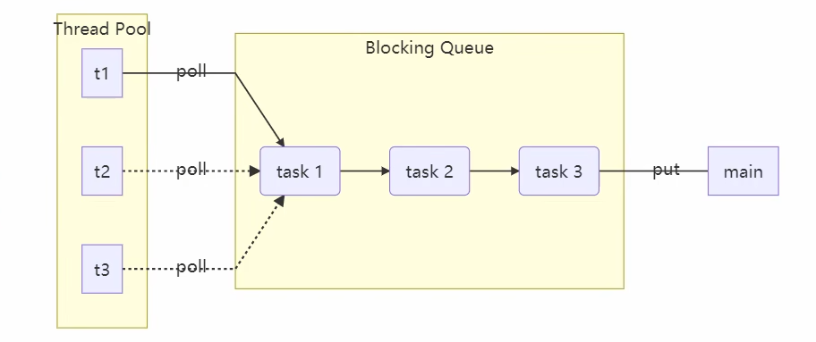

# JUC-10  线程池（一）

# 1、基本概念

- 线程池：一个容纳多个线程的容器，容器中的线程可以重复使用，省去了频繁创建和销毁线程对象的操作。
- 线程池作用：

  1. 降低资源消耗，减少了创建和销毁线程的次数，每个工作线程都可以被重复利用，可执行多个任务。
  2. 提高响应速度，当任务到达时，如果有线程可以直接用，不会出现系统僵死。
  3. 提高线程的可管理性，如果无限制的创建线程，不仅会消耗系统资源，还会降低系统的稳定性，使用线程池可以进行统一的分配，调优和监控。
- 线程池的核心思想：**线程复用**，同一个线程可以被重复使用，来处理多个任务。
- 池化技术 (Pool) ：一种编程技巧，核心思想是资源复用，在请求量大时能优化应用性能，降低系统频繁建连的资源开销。
- 

# 2、自定义线程池

#### 2.1  阻塞任务队列

- ```java
  class BlockingQueue<T> {
      // 首先定义最基本的，也就是任务队列、锁（对队列进行操作时需要用锁去控制）、生产者消费者变量
      // 生产者消费者变量：
      //     使用 Lock 而不是 Synchronized的优势就是 wait 和 notify释放的方式是随机的，而 await signal是指定的，
      //     且Synchronized 只有一个waitset，而Lock可以指定多个条件变量，代码整洁度更加的明显）
      
      // 1. 任务队列
      private Deque<T> queue = new ArrayDeque<>();
      // 2. 锁
      private ReentrantLock lock = new ReentrantLock();
      // 3. 生产者条件变量
      private Condition fullWaitSet = lock.newCondition();
      // 4. 消费者条件变量
      private Condition emptyWaitSet = lock.newCondition();
      // 5. 容量
      private int capcity;
      public BlockingQueue(int capcity) {
          this.capcity = capcity;
      }
      
      // 阻塞分为 不带超时时间 和 带超时时间版本，其实就是当我们获取时 是一直阻塞等待还是超时结束，这里面分别调用不同的API，比如 await 和 awaitNanos
      
      // 带超时阻塞获取
      public T poll(long timeout, TimeUnit unit) {
          lock.lock();
          try {
              // 将 timeout 统一转换为 纳秒
              long nanos = unit.toNanos(timeout);
              while (queue.isEmpty()) {
                  try {
                      // 返回值是剩余时间
                      if (nanos <= 0) {
                          return null;
                      }
                      nanos = emptyWaitSet.awaitNanos(nanos);
                  } catch (InterruptedException e) {
                      e.printStackTrace();
                  }
              }
              T t = queue.removeFirst();
              fullWaitSet.signal();
              return t;
          } finally {
              lock.unlock();
          }
      }
      // 阻塞获取
      public T take() {
          lock.lock();
          try {
              while (queue.isEmpty()) {
                  try {
                      emptyWaitSet.await();
                  } catch (InterruptedException e) {
                      e.printStackTrace();
                  }
              }
              T t = queue.removeFirst();
              fullWaitSet.signal();
              return t;
          } finally {
              lock.unlock();
          }
      }
      
      // 与阻塞获取同理
      // 阻塞添加
      public void put(T task) {
          lock.lock();
          try {
              while (queue.size() == capcity) {
                  try {
                      System.out.println("等待加入任务队列  "+ task);
                      fullWaitSet.await();

                      /**
                       这里面其实是有一个点需要注意的，就是 其实 await 这次阻塞的是主线程，本质上，await还是会阻塞 并释放锁的。
                       */

                  } catch (InterruptedException e) {
                      e.printStackTrace();
                  }
              }
              System.out.println("加入任务队列 "+ task);
              queue.addLast(task);
              emptyWaitSet.signal();
          } finally {
              lock.unlock();
          }
      }

      // 带超时时间阻塞添加
      public boolean offer(T task, long timeout, TimeUnit timeUnit) {
          lock.lock();
          try {
              long nanos = timeUnit.toNanos(timeout);
              while (queue.size() == capcity) {
                  try {
                      if(nanos <= 0) {
                          return false;
                      }

                      System.out.println("等待加入任务队列 "+ task);
                      nanos = fullWaitSet.awaitNanos(nanos);
                  } catch (InterruptedException e) {
                      e.printStackTrace();
                  }
              }

              System.out.println("加入任务队列 "+ task);
              queue.addLast(task);
              emptyWaitSet.signal();
              return true;
          } finally {
              lock.unlock();
          }
      }

      public int size() {
          lock.lock();
          try {
              return queue.size();
          } finally {
              lock.unlock();
          }
      }
  }
  ```

#### 2.2  线程池

- ```java
  class ThreadPool {

      // 目前该版本的是不带拒绝策略的线程池，所以需要的参数有 核心线程数、任务队列、超时时间、单位

      // 任务队列
      private BlockingQueue<Runnable> taskQueue;
      // 线程集合
      private HashSet<Worker> workers = new HashSet<>();
      // 核心线程数
      private int coreSize;
      // 获取任务时的超时时间
      private long timeout;

      private TimeUnit timeUnit;

      // 执行任务
      public void execute(Runnable task) {
          // 当任务数没有超过 coreSize 时，直接交给 worker 对象执行
          // 如果任务数超过 coreSize 时，加入任务队列暂存
          synchronized (workers) {
              if(workers.size() < coreSize) {
                  Worker worker = new Worker(task);
                  System.out.println("新增 worker "+ worker + "    " + task);
                  workers.add(worker);
                  worker.start();
              } else {
                  taskQueue.put(task);
              }
          }
      }

      public ThreadPool(int coreSize, long timeout, TimeUnit timeUnit, int queueCapcity) {
          this.coreSize = coreSize;
          this.timeout = timeout;
          this.timeUnit = timeUnit;
          this.taskQueue = new BlockingQueue<>(queueCapcity);
      }

      class Worker extends Thread{
          private Runnable task;
          public Worker(Runnable task) {
              this.task = task;
          }
          @Override
          public void run() {
              // 执行任务
              // 1) 当 task 不为空，执行任务
              // 2) 当 task 执行完毕，再接着从任务队列获取任务并执行
  //             while(task != null || (task = taskQueue.take()) != null) {
              while(task != null || (task = taskQueue.poll(timeout, timeUnit)) != null) {
                  try {

                      System.out.println("正在执行 "+task);
                      task.run();
                  } catch (Exception e) {
                      e.printStackTrace();
                  } finally {
                      task = null;
                  }
              }
              synchronized (workers) {

                  System.out.println("worker 被移除"+ this);
                  workers.remove(this);
              }
          }
      }
  }
  ```

#### 2.3  拒绝策略

- ```java
  @FunctionalInterface // 拒绝策略
  interface RejectPolicy<T> {
      void reject(BlockingQueue<T> queue, T task);
  }
  ```

#### 2.4  测试方法

- ```java
  @Slf4j(topic = "c.TestPool")
  public class TestPool {
      public static void main(String[] args) {
          ThreadPool threadPool = new ThreadPool(1,
                  1000, TimeUnit.MILLISECONDS, 1, (queue, task)->{
              // 1. 死等
  //            queue.put(task);
              // 2) 带超时等待
  //            queue.offer(task, 1500, TimeUnit.MILLISECONDS);
              // 3) 让调用者放弃任务执行
  //            log.debug("放弃{}", task);
              // 4) 让调用者抛出异常
  //            throw new RuntimeException("任务执行失败 " + task);
              // 5) 让调用者自己执行任务
              task.run();
          });
          for (int i = 0; i < 4; i++) {
              int j = i;
              threadPool.execute(() -> {
                  try {
                      Thread.sleep(1000L);
                  } catch (InterruptedException e) {
                      e.printStackTrace();
                  }
                  log.debug("{}", j);
              });
          }
      }
  }
  ```

#### 2.5  分析

1. 阻塞版

    ```java
    ThreadPool threadPool = new ThreadPool(2, 1000, TimeUnit.MILLISECONDS, 10);

    for (int i = 0; i < 5; i++) {
        int j = i;
        threadPool.execute(() -> {
        try {
            Thread.sleep(1000L);
        } catch (InterruptedException e) {
            e.printStackTrace();
        }
            System.out.println(j);
        });
    }
    ```
    此处创建了一个线程池，核心线程数为 2，任务队列容量为 10。每次提交任务时逻辑如下：

    - 当前运行的线程数小于 coreSize（2），则新建线程执行任务。
    - 超过 coreSize 的任务会进入任务队列等待执行。
    - 如果队列未满，则任务会阻塞在 `put()`​ 方法中直到有空位。
2. 超时阻塞版

    ```java
    class Worker extends Thread{
        private Runnable task;
        public Worker(Runnable task) {
            this.task = task;
        }
        @Override
        public void run() {
            // 执行任务
            // 1) 当 task 不为空，执行任务
            // 2) 当 task 执行完毕，再接着从任务队列获取任务并执行
            //while(task != null || (task = taskQueue.take()) != null) {
            while(task != null || (task = taskQueue.poll(timeout, timeUnit)) != null) {
                try {

                    System.out.println("正在执行 "+task);
                    task.run();
                } catch (Exception e) {
                    e.printStackTrace();
                } finally {
                    task = null;
                }
            }
            synchronized (workers) {

                System.out.println("worker 被移除"+ this);
                workers.remove(this);
            }
        } 
    }
    ```
    将 `taskQueue.take()`​ 改成了 `poll(timeout, timeUnit)`​，引入了超时时间：

    - 如果线程长时间没有获取到新任务，就会因为超时而退出。
    - 线程结束后会从 `workers`​ 中移除，释放资源。
3. 阻塞队列溢出版

    ```java
    for (int i = 0; i < 15; i++) {
        int j = i;
        threadPool.execute(() -> {
            try {
                // 将时间拉长，不能一下子执行完
                Thread.sleep(10000000L);
            } catch (InterruptedException e) {
                e.printStackTrace();
            }
            System.out.println(j);
        });
    }
    ```
    当提交的任务数超过 `coreSize + 队列容量`​ 时会发生以下情况：

    - 前 `coreSize`​ 个任务直接由线程执行。
    - 接下来的任务进入队列。
    - 超过队列容量的新任务会**阻塞等待队列有空位**（默认使用 `put()`​）。
    - 如果迟迟没有消费者取出任务，调用者线程将一直阻塞。
4. 拒绝策略版

    在阻塞任务队列中添加：

    ```java
    public void tryPut(RejectPolicy<T> rejectPolicy, T task) {
        lock.lock();
        try {
            // 判断队列是否满
            if(queue.size() == capcity) {
                rejectPolicy.reject(this, task);
            } else { // 有空闲

                System.out.println("加入任务队列 "+ task);
                queue.addLast(task);
                emptyWaitSet.signal();
            }
        } finally {
            lock.unlock();
        }
    }
    ```
    在线程池中添加：

    ```java
    private RejectPolicy<Runnable> rejectPolicy;

    public ThreadPool(int coreSize, long timeout, TimeUnit timeUnit, int queueCapcity,
                      RejectPolicy<Runnable> rejectPolicy) {
        this.coreSize = coreSize;
        this.timeout = timeout;
        this.timeUnit = timeUnit;
        this.taskQueue = new BlockingQueue<>(queueCapcity);
        this.rejectPolicy = rejectPolicy;
    }

    public void execute(Runnable task) {
        // 当任务数没有超过 coreSize 时，直接交给 worker 对象执行
        // 如果任务数超过 coreSize 时，加入任务队列暂存
        synchronized (workers) {
            if(workers.size() < coreSize) {
                Worker worker = new Worker(task);
                System.out.println("新增 worker "+ worker + "    " + task);
                workers.add(worker);
                worker.start();
            } else {
                //taskQueue.put(task);
                // 1) 死等
                // 2) 带超时等待
                // 3) 让调用者放弃任务执行
                // 4) 让调用者抛出异常
                // 5) 让调用者自己执行任务
                taskQueue.tryPut(rejectPolicy, task);
            }
        }
    }
    ```
    在线程池执行方法中通过 `tryPut()`​ 调用拒绝策略：

    - 队列满时不会阻塞，而是根据策略灵活处理：

      - 死等（put）
      - 超时等待（offer）
      - 抛弃任务
      - 抛出异常
      - 让调用者执行任务（回退策略）
