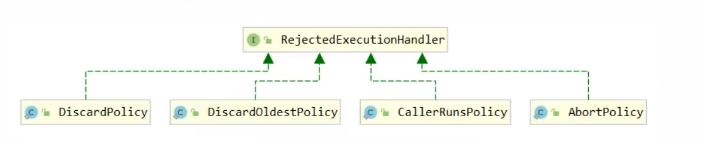
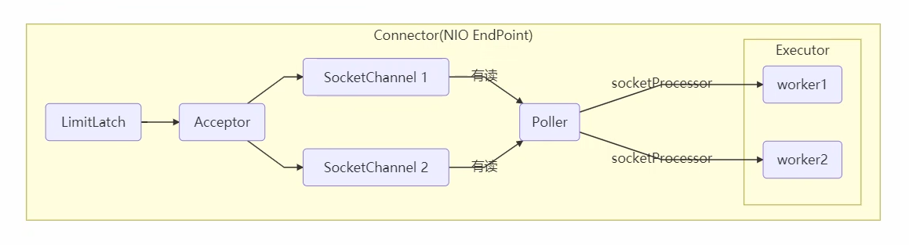
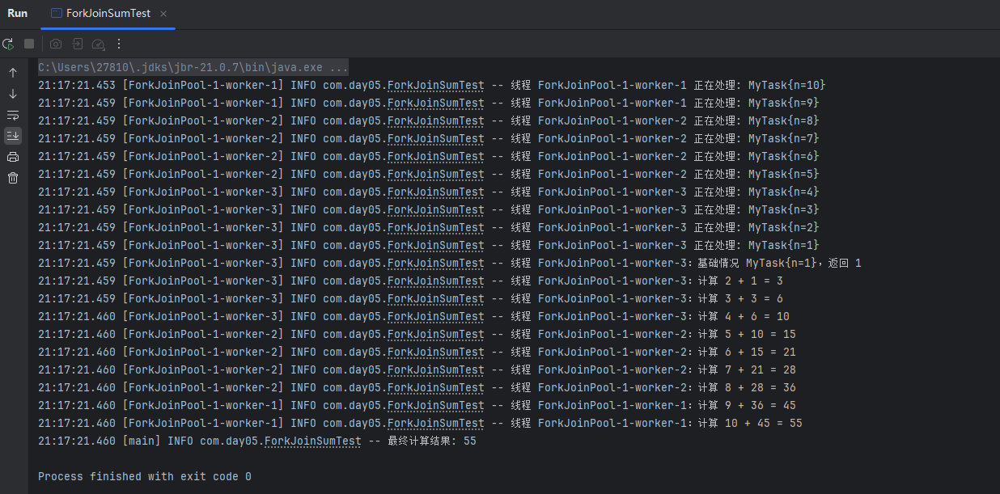
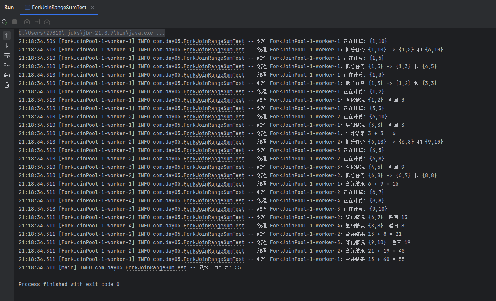

# JUC-11  线程池（二）

# 1、ThreadPoolExecutor

#### 1.1  线程池状态

- ThreadPoolExecutor 使用 int 的**高 3 位来表示线程池状态，低 29 位表示线程数量**。
- 这些信息存储在一个原子变量 ctl 中，目的是将线程池状态与线程个数合二为一，这样就可以用一次 CAS 原子操作进行赋值。

  - ```java
    // c 为旧值， ctlOf 返回结果为新值
    ctl.compareAndSet(c, ctlOf(targetState, workerCountOf(c))));

    // rs 为高 3 位代表线程池状态， wc 为低 29 位代表线程个数，ctl 是合并它们
    private static int ctlOf(int rs, int wc) { return rs | wc; }
    ```
  - |状态|高3位|接收新任务|处理阻塞任务队列|说明|
    | ------------| -------| ------------| ------------------| -------------------------------------------|
    |RUNNING|111|Y|Y||
    |SHUTDOWN|000|N|Y|不接收新任务，但处理阻塞队列剩余任务|
    |STOP|001|N|N|中断正在执行的任务，并抛弃阻塞队列任务|
    |TIDYING|010|-|-|任务全执行完毕，活动线程为 0 即将进入终结|
    |TERMINATED|011|-|-|终止状态|
  - 从数字上比较，TERMINATED > TIDYING > STOP > SHUTDOWN（调用了线程池的SHUTDOWN） > RUNNING（创建出来的初始状态）

#### 1.2  构造方法

1. 代码

    - ```java
      public ThreadPoolExecutor(int corePoolSize,
          int maximumPoolSize,
       	long keepAliveTime,
       	TimeUnit unit,
       	BlockingQueue<Runnable> workQueue,
       	ThreadFactory threadFactory,
      	RejectedExecutionHandler handler)
      ```
2. 参数说明

    - **corePoolSize：** 核心线程数，定义了最小可以同时运行的线程数量。
    - **maximumPoolSize：** 最大线程数，当队列中存放的任务达到队列容量时，当前可以同时运行的数量变为最大线程数，创建线程并立即执行最新的任务，与核心线程数之间的差值又叫救急线程数。
    - **keepAliveTime：** 救急线程最大存活时间，当线程池中的线程数量大于 `corePoolSize`​ 的时候，如果这时没有新的任务提交，核心线程外的线程不会立即销毁，而是会等到 `keepAliveTime`​ 时间超过销毁。
    - **unit：**​`keepAliveTime`​ 参数的时间单位。
    - **workQueue：** 阻塞队列，存放被提交但尚未被执行的任务。
    - **threadFactory：** 线程工厂，创建新线程时用到，可以为线程创建时起名字。
    - **handler：** 拒绝策略，线程到达最大线程数仍有新任务时会执行拒绝策略。
3. 注意事项

    - 线程池中刚开始没有线程，当一个任务提交给线程池后，线程池会创建一个新线程来执行任务。
    - 当线程数达到 corePoolSize 并没有线程空闲，这时再加入任务，新加的任务会被加入workQueue 队列排队，直到有空闲的线程。
    - 如果队列选择了**有界队列**，那么任务超过了队列大小时，**才会创建 maximumPoolSize - corePoolSize 数目的线程来救急**。（救急线程和核心线程的最大区别就是，它有生存时间，执行完了，过一段时间，没有新任务了，就销毁掉了，下次高峰期来了，才会再有）。
    - 如果线程到达 maximumPoolSize 仍然有新任务这时会执行拒绝策略。拒绝策略 jdk 提供了 4 种实现：

      - **AbortPolicy：** 让调用者抛出 RejectedExecutionException 异常，这是**默认策略**。
      - **CallerRunsPolicy：** 让调用者运行的调节机制，将某些任务回退到调用者，从而降低新任务的流量。
      - **DiscardPolicy：** 直接丢弃任务，不予任何处理也不抛出异常。
      - **DiscardOldestPolicy：** 放弃队列中最早的任务，把当前任务加入队列中尝试再次提交当前任务。

        
      - 其他框架拒绝策略：

        - **Dubbo：** 在抛出 RejectedExecutionException 异常前记录日志，并 dump 线程栈信息，方便定位问题。
        - **Netty：** 创建一个新线程来执行任务。
        - **ActiveMQ：** 带超时等待（60s）尝试放入队列。
        - **PinPoint：** 它使用了一个拒绝策略链，会逐一尝试策略链中每种拒绝策略。
    - 当高峰过去后，超过 corePoolSize 的救急线程如果一段时间没有任务做，需要结束节省资源，这个时间由 keepAliveTime 和 unit 来控制。
    - 根据这个构造方法，JDK Executors 类中提供了众多工厂方法来创建各种用途的线程池。
4. 工厂方法

    - newFixedThreadPool：创建一个拥有 n 个线程的线程池

      - 核心线程数 \=\= 最大线程数（没有救急线程被创建），因此也无需超时时间。
      - LinkedBlockingQueue 是一个单向链表实现的阻塞队列，默认大小为 `Integer.MAX_VALUE`​，也就是无界队列，可以放任意数量的任务，在任务比较多的时候会导致 OOM（内存溢出）
      - 适用于任务量已知，相对耗时的长期任务。
      - ```java
        public static ExecutorService newFixedThreadPool(int nThreads) {
            return new ThreadPoolExecutor(nThreads, nThreads, 0L, TimeUnit.MILLISECONDS,
                                          new LinkedBlockingQueue<Runnable>());
        }
        ```
    - newCachedThreadPool：创建一个可扩容的线程池

      - 核心线程数是 0， 最大线程数是 29 个 1，全部都是救急线程（60s 后可以回收），可能会创建大量线程，从而导致 **OOM。**
      - SynchronousQueue 作为阻塞队列，没有容量，对于每一个 take 的线程会阻塞直到有一个 put 的线程放入元素为止（类似一手交钱、一手交货）。
      - 适合任务数比较密集，但每个任务执行时间较短的情况。
      - ```java
        public static ExecutorService newCachedThreadPool() {
            return new ThreadPoolExecutor(0, Integer.MAX_VALUE, 60L, TimeUnit.SECONDS,
                                          new SynchronousQueue<Runnable>());
        }
        ```
    - newSingleThreadExecutor：创建一个只有 1 个线程的单线程池

      - 保证所有任务按照**指定顺序执行**，线程数固定为 1，任务数多于 1 时会放入无界队列排队，任务执行完毕，这唯一的线程也不会被释放。
      - ```java
        public static ExecutorService newSingleThreadExecutor() {
            return new FinalizableDelegatedExecutorService
                (new ThreadPoolExecutor(1, 1,0L, TimeUnit.MILLISECONDS,
                                        new LinkedBlockingQueue<Runnable>()));
        }
        ```
5. 提交任务

    - 常用方法

      - |方法|说明|
        | -----------------------------------------------------------------------------------------------------------| -----------------------------------------------------------------------------------------|
        |void execute(Runnable command)|执行任务（Executor 类 API）|
        |Future\<?\> submit(Runnable task)|提交任务 task()|
        |Future submit(Callable task)|提交任务 task，用返回值 Future 获得任务执行结果|
        |List\<Future\> invokeAll(Collection\<? extends Callable\> tasks)|提交 tasks 中所有任务|
        |List\<Future\> invokeAll(Collection\<? extends Callable\> tasks, long timeout, TimeUnit unit)|提交 tasks 中所有任务，超时时间针对所有task，超时会取消没有执行完的任务，并抛出超时异常|
        |T invokeAny(Collection\<? extends Callable\> tasks)|提交 tasks 中所有任务，哪个任务先成功执行完毕，返回此任务执行结果，其它任务取消|
      - execute 和 submit 都属于线程池的方法，对比：

        - execute 只能执行 Runnable 类型的任务，没有返回值； submit 既能提交 Runnable 类型任务也能提交 Callable 类型任务，底层是**封装成 FutureTask，然后调用 execute 执行**。
        - execute 会直接抛出任务执行时的异常，submit 会吞掉异常，可通过 Future 的 get 方法将任务执行时的异常重新抛出。
6. 关闭线程池

    - 常用方法

      - |方法|说明|
        | -------------------------------------------------------| -----------------------------------------------------------------------------------------------------------------------------|
        |void shutdown()|线程池状态变为 SHUTDOWN，等待任务执行完后关闭线程池，不会接收新任务，但已提交任务会执行完，而且也可以添加线程（不绑定任务）|
        |List shutdownNow()|线程池状态变为 STOP，用 interrupt 中断正在执行的任务，直接关闭线程池，不会接收新任务，会将队列中的任务返回|
        |boolean isShutdown()|不在 RUNNING 状态的线程池，此执行者已被关闭，方法返回 true|
        |boolean isTerminated()|线程池状态是否是 TERMINATED，如果所有任务在关闭后完成，返回 true|
        |boolean awaitTermination(long timeout, TimeUnit unit)|调用 shutdown 后，由于调用线程不会等待所有任务运行结束，如果它想在线程池 TERMINATED 后做些事情，可以利用此方法等待|
      - shutdown流程

        - 修改线程池状态为`SHUTDOWN`​。
        - 不再接收新提交的任务。
        - 中断线程池中**空闲**的线程。
        - 第③步只是中断了空闲的线程，但正在执行的任务以及线程池任务队列中的任务会继续执行完毕。
        - ```java
          public void shutdown() {
              final ReentrantLock mainLock = this.mainLock;
              mainLock.lock();
              try {
                  checkShutdownAccess();
                  // 修改线程池状态
                  advanceRunState(SHUTDOWN);
                  // 仅会打断空闲线程
                  interruptIdleWorkers();
                  onShutdown(); // 扩展点 ScheduledThreadPoolExecutor
              } finally {
                  mainLock.unlock();
              }
              // 尝试终结(没有运行的线程可以立刻终结，如果还有运行的线程也不会等)
              tryTerminate();
          }
          ```
      - shutdownNow流程

        - 修改线程池状态为`STOP`​。
        - 不再接收任务提交。
        - 尝试中断线程池中**所有**的线程（包括正在执行的线程）。
        - 返回正在等待执行的任务列表 `List<Runnable>`​。
        - ```java
          public List<Runnable> shutdownNow() {
              List<Runnable> tasks;
              final ReentrantLock mainLock = this.mainLock;
              mainLock.lock();
              try {
                  checkShutdownAccess();
                  // 修改线程池状态
                  advanceRunState(STOP);
                  // 打断所有线程
                  interruptWorkers();
                  // 获取队列中剩余任务
                  tasks = drainQueue();
              } finally {
                  mainLock.unlock();
              }
              // 尝试终结
              tryTerminate();
              return tasks;
          }	
          ```
      - 此时线程池中等待队列中的任务不会被执行，正在执行的任务**也可能**被终止（正常执行的任务如果不响应中断，那么就不会被终止，直到任务执行完毕）。

        - 线程是如何中断的

          - 中断线程池中的线程的方法是通过调用 `Thread.interrupt()`​ 方法来实现的，这种方法的作用有限，如果线程中没有`sleep()`​ 、`wait()`​、`Condition`​、定时锁等应用, `interrupt()`​ 方法是无法中断当前的线程的（因为`sleep()`​ 、`await()`​、`Condition`​这些是响应中断的）。所以，`shutdownNow()`​并不代表线程池就一定立即就能退出，它也可能必须要等待所有正在执行的任务都执行完成了才能退出。但是大多数时候是能立即退出的。
        - 为什么修改线程池状态为`shutdown`​以后线程池就不能接收新任务了

          - 在向线程池提交任务的时候，会先检查线程池状态， 线程池状态为非关闭（或停止）时才能提交任务，这里已经将线程池状态修改为`shutdown`​了，自然就不能接受新的任务提交了。
      - 通过比较shutdown源码和shutdownNow的源码我们可以发现，这两个方法最大的不同在于中断线程的地方：

        - 首先，需要再次明确的一点是，中断线程并不是立即把这个线程停止，而是把这个线程的【中断状态】设置为true，表示有其他线程来中断过这个线程。
        - ​`shutdown`​方法调用`interruptIdleWorkers()`​方法中断的只是线程池中空闲的线程，那么也就说明线程池中正在工作的线程没有被中断，所以说正在工作的线程会继续执行完毕，并且正在工作的线程也会去任务队列中将已经提交的任务取出来并执行。
        - ​`shutdownNow`​方法调用的是`interruptWorkers()`​方法，该方法会逐一遍历线程池中的每一个线程（包括空闲线程和正在工作的线程）并且去中断他，所以说当调用`shutdownNow`​方法的时候，所有线程都会被中断，等待队列中的任务不会被执行，正在执行的任务也可能会中断退出（为什么是可能而不是一定？因为如果正在执行的线程不响应中断，那么他就会继续运行）
7. 异步模式之工作线程

    - 定义

      - 让有限的工作线程（Worker Thread）来轮流异步处理无限多的任务。也可以将其归类为分工模式，它的典型实现就是**线程池**，也体现了经典设计模式中的**享元模式**。
      - 例如，海底捞的服务员（线程），轮流处理每位客人的点餐（任务），如果为每位客人都配一名专属的服务员，那么成本就太高了。
      - 注意，不同任务类型应该使用不同的线程池，这样能够避免饥饿，并能提升效率。

        - 例如，如果一个餐馆的工人既要招呼客人（任务类型A），又要到后厨做菜（任务类型B）显然效率不咋地，分成服务员（线程池A）与厨师（线程池B）更为合理，当然你能想到更细致的分工。
    - 饥饿，固定大小线程池会有饥饿现象

      - 两个工人是同一个线程池中的两个线程
      - 他们要做的事情是：为客人点餐和到后厨做菜，这是两个阶段的工作。

        - 客人点餐：必须先点完餐，等菜做好，上菜，在此期间处理点餐的工人必须等待。
        - 后厨做菜：没啥说的，做就是了。
      - 工人A 处理了点餐任务，接下来它要等着 工人B 把菜做好，然后上菜；
      - 但现在同时来了两个客人，这个时候工人A 和工人B 都去处理点餐了，这时没人做饭了，就导致**饥饿**。
    - 那么，创建多少线程合适呢？

      - 线程数过少，会导致程序不能充分地利用系统资源、容易导致饥饿。
      - 线程数过多，会导致更多的线程上下文切换，占用更多内存。
    - CPU 密集型运算

      - 通常采用 cpu 核数 + 1 能够实现最优的 CPU 利用率，+1 是保证当线程由于页缺失故障（操作系统）或其它原因导致暂停时，额外的这个线程就能顶上去，保证 CPU 时钟周期不被浪费。
    - I/O 密集型运算

      - CPU 不总是处于繁忙状态，例如，当你执行业务计算时，这时候会使用 CPU 资源，但当你执行 I/O 操作时、远程RPC 调用时，包括进行数据库操作时，这时候 CPU 就闲下来了，你可以利用多线程提高它的利用率。
      - 经验公式如下：

        线程数 \= 核数 \* 期望 CPU 利用率 \* 总时间(CPU计算时间+等待时间) / CPU 计算时间。

        - 例如 4 核 CPU 计算时间是 50% ，其它等待时间是 50%，期望 cpu 被 100% 利用，套用公式：

          线程数 = 4 \* 100% \* 100% / 50% \= 8
        - 例如 4 核 CPU 计算时间是 10% ，其它等待时间是 90%，期望 cpu 被 100% 利用，套用公式

          线程数 = 4 \* 100% \* 100% / 10% \= 40
8. 任务调度线程池

    - 在『任务调度线程池』功能加入之前，可以使用 `java.util.Timer`​ 来实现定时功能，`Timer`​ 的优点在于简单易用，**但由于所有任务都是由同一个线程来调度，因此所有任务都是串行执行的，同一时间只能有一个任务在执行**，前一个任务的**延迟或异常**都将会影响到之后的任务。

      - ```java
        public static void main(String[] args) {
            Timer timer = new Timer();
            TimerTask task1 = new TimerTask() {
                @Override
                public void run() {
                    log.debug("task 1");
                    sleep(2);
                }
            };
            TimerTask task2 = new TimerTask() {
                @Override
                public void run() {
                    log.debug("task 2");
                }
            };
            // 使用 timer 添加两个任务，希望它们都在 1s 后执行
            // 但由于 timer 内只有一个线程来顺序执行队列中的任务，因此『任务1』的延时，影响了『任务2』的执行
            timer.schedule(task1, 1000);
            timer.schedule(task2, 1000);
        }
        ```
    - 可以使用 ScheduledExecutorService 改写：

      - ​`Timer`​中如果一个线程出现了异常，那么剩下的任务就不执行了，而`ScheduledExecutorService`​出现了异常，那么后续任务还是会执行的。
      - 延迟任务，但是出现异常并不会在控制台打印，也不会影响其他线程的执行。

        - ```java
          ScheduledExecutorService executor = Executors.newScheduledThreadPool(2);
          // 添加两个任务，希望它们都在 1s 后执行
          executor.schedule(() -> {
           	System.out.println("任务1，执行时间：" + new Date());
           	try { Thread.sleep(2000); } catch (InterruptedException e) { }
          }, 1000, TimeUnit.MILLISECONDS);
          executor.schedule(() -> {
           	System.out.println("任务2，执行时间：" + new Date());
          }, 1000, TimeUnit.MILLISECONDS);
          ```
      - 定时任务 scheduleAtFixedRate：**一次任务的启动到下一次任务的启动**之间只要大于等于间隔时间，抢占到 CPU 就会立即执行。

        - ```java
          public static void main(String[] args) {
              ScheduledExecutorService pool = Executors.newScheduledThreadPool(1);
              System.out.println("start..." + new Date());
              
              pool.scheduleAtFixedRate(() -> {
                  System.out.println("running..." + new Date());
                  Thread.sleep(2000);
              }, 1, 1, TimeUnit.SECONDS);
          }

          /*start...Sat Apr 24 18:08:12 CST 2021
          running...Sat Apr 24 18:08:13 CST 2021
          running...Sat Apr 24 18:08:15 CST 2021
          running...Sat Apr 24 18:08:17 CST 2021
          ```
      - 定时任务 scheduleWithFixedDelay：**一次任务的结束到下一次任务的启动之间**等于间隔时间，抢占到 CPU 就会立即执行，这个方法才是真正的设置两个任务之间的间隔。

        - ```java
          public static void main(String[] args){
              ScheduledExecutorService pool = Executors.newScheduledThreadPool(3);
              System.out.println("start..." + new Date());
              
              pool.scheduleWithFixedDelay(() -> {
                  System.out.println("running..." + new Date());
                  Thread.sleep(2000);
              }, 1, 1, TimeUnit.SECONDS);
          }
          /*start...Sat Apr 24 18:11:41 CST 2021
          running...Sat Apr 24 18:11:42 CST 2021
          running...Sat Apr 24 18:11:45 CST 2021
          running...Sat Apr 24 18:11:48 CST 2021
          ```
      - 任务调度线程池模拟定时执行任务

        - ```java
          // 如何让每周四 18:00:00 定时执行任务？

          // 获得当前时间
          LocalDateTime now = LocalDateTime.now();
          // 获取本周四 18:00:00.000
          LocalDateTime thursday =
                  now.with(DayOfWeek.THURSDAY).withHour(18).withMinute(0).withSecond(0).withNano(0);
          // 如果当前时间已经超过 本周四 18:00:00.000， 那么找下周四 18:00:00.000
                  if(now.compareTo(thursday) >= 0) {
          thursday = thursday.plusWeeks(1);
                  }
          // 计算时间差，即延时执行时间
          long initialDelay = Duration.between(now, thursday).toMillis();
          // 计算间隔时间，即 1 周的毫秒值
          long oneWeek = 7 * 24 * 3600 * 1000;
          ScheduledExecutorService executor = Executors.newScheduledThreadPool(2);

          System.out.println("开始时间：" + new Date());
          executor.scheduleAtFixedRate(() -> {
          System.out.println("执行时间：" + new Date());
          }, initialDelay, oneWeek, TimeUnit.MILLISECONDS);
          ```
9. Tomcat线程池

    - Tomcat 在哪里用到了线程池？

      - 
      - LimitLatch 用来限流，可以控制最大连接个数，类似 JUC 中的 Semaphore。
      - Acceptor 只负责【接收新的 socket 连接】。
      - Poller 只负责监听 socket channel 是否有【可读的 I/O 事件】。
      - 一旦可读，封装一个任务对象（socketProcessor），提交给 Executor 线程池处理。
      - Executor 线程池中的工作线程最终负责【处理请求】，也是tomcat实现高并发的保障。
    - Tomcat 线程池扩展了 ThreadPoolExecutor，行为稍有不同

      - 如果总线程数达到 maximumPoolSize，这时不会立刻抛 RejectedExecutionException 异常，而是再次尝试将任务放入队列，如果还失败，才抛出 RejectedExecutionException 异常。
10. ForkJoin

     - Fork/Join：线程池的一种实现方式，体现了分治思想，适用于能够进行任务拆分的 CPU 密集型运算，用于**并行计算。**
     - 任务拆分：将一个大任务拆分为算法上相同的小任务，直至不能拆分可以直接求解。跟递归相关的一些计算，如归并排序、斐波那契数列都可以用分治思想进行求解。

       - Fork/Join 在​**分治的基础上加入了多线程**​，把每个任务的分解和合并交给不同的线程来完成，提升了运算效率
       - ForkJoin 使用 ForkJoinPool 来启动，是一个特殊的线程池，默认会创建与 CPU 核心数大小相同的线程池
       - 任务有返回值继承 RecursiveTask，没有返回值继承 RecursiveAction
     - 代码实现

       - 1

         - 代码

           - ```java
             @Slf4j
             public class ForkJoinSumTest {

                 public static void main(String[] args) {
                     ForkJoinPool pool = new ForkJoinPool(4);

                     MyTask task = new MyTask(10);

                     int result = pool.invoke(task);

                     log.info("最终计算结果: {}", result);
                 }

                 // 计算 1 ~ n 的和
                 static class MyTask extends RecursiveTask<Integer> {
                     private final int n;

                     public MyTask(int n) {
                         this.n = n;
                     }

                     @Override
                     protected Integer compute() {
                         String threadName = Thread.currentThread().getName();
                         log.info("线程 {} 正在处理: {}", threadName, this);

                         if (n == 1) {
                             log.info("线程 {}：基础情况 {}，返回 1", threadName, this);
                             return 1;
                         }

                         MyTask subTask = new MyTask(n - 1);
                         subTask.fork();

                         int subResult = subTask.join();
                         int result = n + subResult;

                         log.info("线程 {}：计算 {} + {} = {}", threadName, n, subResult, result);
                         return result;
                     }

                     @Override
                     public String toString() {
                         return "MyTask{" + "n=" + n + '}';
                     }
                 }
             }
             ```
         - 运行结果

           - 
       - 继续拆分优化

         - 代码

           - ```java
             @Slf4j
             public class ForkJoinRangeSumTest {

                 public static void main(String[] args) {
                     // 创建线程池，最多并行 4 个线程
                     ForkJoinPool pool = new ForkJoinPool(4);

                     // 创建计算任务：求 1 到 5 的和
                     AddTask task = new AddTask(1, 10);

                     // 执行任务并获取结果
                     int result = pool.invoke(task);

                     log.info("最终计算结果: {}", result); // 应该输出 15
                 }

                 static class AddTask extends RecursiveTask<Integer> {
                     int begin;
                     int end;

                     public AddTask(int begin, int end) {
                         this.begin = begin;
                         this.end = end;
                     }

                     @Override
                     public String toString() {
                         return "{" + begin + "," + end + '}';
                     }

                     @Override
                     protected Integer compute() {
                         String threadName = Thread.currentThread().getName();
                         log.info("线程 {} 正在计算: {}", threadName, this);

                         if (begin == end) {
                             log.info("线程 {}：基础情况 {}，返回 {}", threadName, this, begin);
                             return begin;
                         }

                         if (end - begin == 1) {
                             int sum = begin + end;
                             log.info("线程 {}：简化情况 {}，返回 {}", threadName, this, sum);
                             return sum;
                         }

                         int mid = (begin + end) / 2;

                         AddTask left = new AddTask(begin, mid);
                         AddTask right = new AddTask(mid + 1, end);

                         log.info("线程 {}：拆分任务 {} -> {} 和 {}", threadName, this, left, right);

                         left.fork();
                         right.fork();

                         int leftResult = left.join();
                         int rightResult = right.join();
                         int total = leftResult + rightResult;

                         log.info("线程 {}：合并结果 {} + {} = {}", threadName, leftResult, rightResult, total);
                         return total;
                     }
                 }
             }
             ```
         - 运行结果

           - 

‍
