# JUC-12  ReentrantLock

# 1、AQS 原理

#### 1.1  核心思想

AQS：AbstractQueuedSynchronizer，是阻塞式锁和相关的同步器工具的框架，许多同步类实现都依赖于该同步器。

**AQS特点：**

- AQS用 `state`​ 状态属性来表示资源的状态（分**独占模式和共享模式**），子类需要定义如何维护这个状态，控制如何获取锁和释放锁。

  - ​`getState`​ ：获取 state 状态。  
    ​`setState`​ ：设置 state 状态。  
    ​`compareAndSetState`​ ：cas机制设置 state 状态。
  - 独占模式是只有一个线程能够访问资源，如 ReentrantLock。
  - 共享模式允许多个线程访问资源，如 Semaphore，ReentrantReadWriteLock 是组合式。
- 提供了基于 FIFO 的等待队列，类似于 Monitor 的 EntryList。
- 条件变量来实现等待、唤醒机制，支持多个条件变量，类似于Monitor的 WaitSet.

**AQS 核心思想：**

- 如果被请求的共享资源空闲，则将当前请求资源的线程设置为有效的工作线程，并将共享资源设置锁定状态。
- 请求的共享资源被占用，AQS 用队列实现线程阻塞等待以及被唤醒时锁分配的机制，将暂时获取不到锁的线程加入到队列中。  
  CLH 是一种基于单向链表的**高性能、公平的自旋锁**，AQS 是将每条请求共享资源的线程封装成一个 CLH 锁队列的一个结点（Node）来实现锁的分配。

  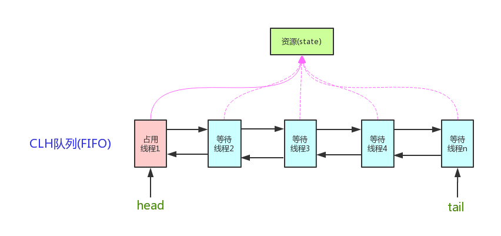
- 子类主要实现这样一些方法（默认抛出 UnsupportedOperationException）

  - tryAcquire
  - tryRelease
  - tryAcquireShared 方法是一个尝试获取共享资源的方法
  - tryReleaseShared 方法是一个尝试获取共享资源的方法
  - isHeldExclusively 方法用于判断当前线程是否独占地持有资源
  - 获取锁

    - ```java
      // 如果获取锁失败
      if (!tryAcquire(arg)) {
       	// 入队, 可以选择阻塞当前线程 park unpark（为什么是park 和 unpark在后面介绍源码的时候会展示）
      }
      ```
  - 释放锁

    - ```java
      // 如果释放锁成功
      if (tryRelease(arg)) {
       	// 让阻塞线程恢复运行
      }
      ```
  - 1

#### 1.2  设计原理模板对象

1. 设计原理：

    - 获取锁：

      ```java
      while(state 状态不允许获取) {	// tryAcquire(arg)
          if(队列中还没有此线程) {
              入队并阻塞 park
          }
      }
      当前线程出队
      ```
    - 释放锁：

      ```java
      if(state 状态允许了) {	// tryRelease(arg)
      	恢复阻塞的线程(s) unpark
      }
      ```
2. AbstractQueuedSynchronizer 中 state 设计：

    - state 使用了 32bit int 来维护同步状态，独占模式 0 表示未加锁状态，大于 0 表示已经加锁状态

      ```java
      private volatile int state;
      ```
    - state **使用 volatile 修饰配合 cas** 保证其修改时的原子性
    - state 表示**线程重入的次数（独占模式）或者剩余许可数（共享模式）**
    - state API：

      - ​`protected final int getState()`​：获取 state 状态
      - ​`protected final void setState(int newState)`​：设置 state 状态
      - ​`protected final boolean compareAndSetState(int expect,int update)`​：**CAS** 安全设置 state
3. 封装线程的 Node 节点中 waitstate 设计

    - 使用 **volatile 修饰配合 CAS** 保证其修改时的原子性
    - 表示 Node 节点的状态，有以下几种状态：

      ```java
      // 默认为 0
      volatile int waitStatus;
      // 由于超时或中断，此节点被取消，不会再改变状态
      static final int CANCELLED =  1;
      // 此节点后面的节点已（或即将）被阻止（通过park），【当前节点在释放或取消时必须唤醒后面的节点】
      static final int SIGNAL    = -1;
      // 此节点当前在条件队列中
      static final int CONDITION = -2;
      // 将releaseShared传播到其他节点
      static final int PROPAGATE = -3;
      ```
4. 阻塞恢复设计

    - 使用 park & unpark 来实现线程的暂停和恢复，因为命令的先后顺序不影响结果。
    - park & unpark 是针对线程的，而不是针对同步器的，因此控制粒度更为精细。
    - park 线程可以通过 interrupt 打断。
5. 队列设计

    - 使用了 FIFO 先入先出队列，并不支持优先级队列，**同步队列是双向链表，便于出队入队**

      ```java
      // 头结点，指向哑元节点
      private transient volatile Node head;
      // 阻塞队列的尾节点，阻塞队列不包含头结点，从 head.next → tail 认为是阻塞队列
      private transient volatile Node tail;

      static final class Node {
          // 枚举：共享模式
          static final Node SHARED = new Node();
          // 枚举：独占模式
          static final Node EXCLUSIVE = null;
          // node 需要构建成 FIFO 队列，prev 指向前继节点
          volatile Node prev;
          // next 指向后继节点
          volatile Node next;
          // 当前 node 封装的线程
          volatile Thread thread;
          // 条件队列是单向链表，只有后继指针，条件队列使用该属性
          Node nextWaiter;
      }
      ```

      
    - 条件变量来实现等待、唤醒机制，支持多个条件变量，类似于 Monitor 的 WaitSet，**条件队列是单向链表**

      ```java
       public class ConditionObject implements Condition, java.io.Serializable {
           // 指向条件队列的第一个 node 节点
           private transient Node firstWaiter;
           // 指向条件队列的最后一个 node 节点
           private transient Node lastWaiter;
       }
      ```

#### 1.3  模板对象

同步器的设计是基于模板方法模式，该模式是基于继承的，主要是为了在不改变模板结构的前提下在子类中重新定义模板中的内容以实现复用代码

- 使用者继承 `AbstractQueuedSynchronizer`​ 并重写指定的方法
- 将 AQS 组合在自定义同步组件的实现中，并调用其模板方法，这些模板方法会调用使用者重写的方法

AQS 使用了模板方法模式，自定义同步器时需要重写下面几个 AQS 提供的模板方法：

```java
isHeldExclusively()		//该线程是否正在独占资源。只有用到condition才需要去实现它
tryAcquire(int)			//独占方式。尝试获取资源，成功则返回true，失败则返回false
tryRelease(int)			//独占方式。尝试释放资源，成功则返回true，失败则返回false
tryAcquireShared(int)	//共享方式。尝试获取资源。负数表示失败；0表示成功但没有剩余可用资源；正数表示成功且有剩余资源
tryReleaseShared(int)	//共享方式。尝试释放资源，成功则返回true，失败则返回false
```

- 默认情况下，每个方法都抛出 `UnsupportedOperationException`​
- 这些方法的实现必须是内部线程安全的
- AQS 类中的其他方法都是 final ，所以无法被其他类使用，只有这几个方法可以被其他类使用

#### 1.4  自定义一个不可重入锁

```java
class MyLock implements Lock {
    //独占锁 不可重入
    class MySync extends AbstractQueuedSynchronizer {
        @Override
        protected boolean tryAcquire(int arg) {
            if (compareAndSetState(0, 1)) {
                // 加上锁 设置 owner 为当前线程
                setExclusiveOwnerThread(Thread.currentThread());
                return true;
            }
            return false;
        }
        @Override   //解锁
        protected boolean tryRelease(int arg) {
            setExclusiveOwnerThread(null);
            setState(0);//volatile 修饰的变量放在后面，防止指令重排
            return true;
        }
        @Override   //是否持有独占锁
        protected boolean isHeldExclusively() {
            return getState() == 1;
        }
        public Condition newCondition() {
            return new ConditionObject();
        }
    }

    private MySync sync = new MySync();

    @Override   //加锁（不成功进入等待队列等待）
    public void lock() {
        sync.acquire(1);
    }

    @Override   //加锁 可打断
    public void lockInterruptibly() throws InterruptedException {
        sync.acquireInterruptibly(1);
    }

    @Override   //尝试加锁，尝试一次
    public boolean tryLock() {
        return sync.tryAcquire(1);
    }

    @Override   //尝试加锁，带超时
    public boolean tryLock(long time, TimeUnit unit) throws InterruptedException {
        return sync.tryAcquireNanos(1, unit.toNanos(time));
    }
    
    @Override   //解锁
    public void unlock() {
        sync.release(1);
    }
    
    @Override   //条件变量
    public Condition newCondition() {
        return sync.newCondition();
    }
}
```

# 2、ReentrantLock原理

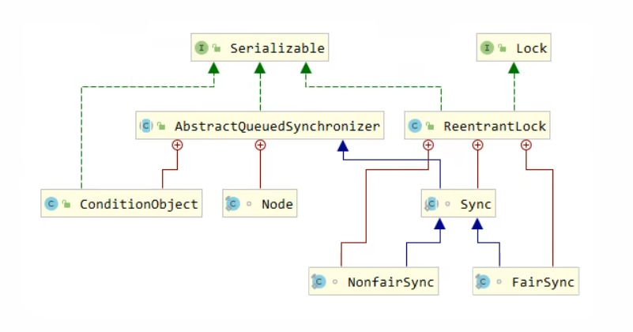

> 从ReentrantLock的构造器可以看出，默认为非公平锁实现。
>
> ```java
> public ReentrantLock() {
>  	sync = new NonfairSync();
> }
> ```

1. 加锁流程

    - 源码

      - ```java
        public void lock() {
            sync.lock();
        }

        static final class NonfairSync extends Sync {
            private static final long serialVersionUID = 7316153563782823691L;

            /**
             * Performs lock.  Try immediate barge, backing up to normal
             * acquire on failure.
             */
            final void lock() {
                // 下面两行代码其实在模拟自定义锁的时候都用过
                // 尝试修改锁，如果修改成功了，就会将owner线程修改
                if (compareAndSetState(0, 1))
                    setExclusiveOwnerThread(Thread.currentThread());
                else
                    acquire(1);
            }

            protected final boolean tryAcquire(int acquires) {
                return nonfairTryAcquire(acquires);
            }
        }
        ```
    - **加锁成功**  ——  在没有竞争时（ `Thread0`​ 尝试获取锁，**且当前锁是空闲状态，即 state**  **==**  **0**）

      - ​`compareAndSetState(0, 1)`​

        - 这是一个 CAS 操作（原子性地将 state 从 0 设置为 1）。
        - 如果成功，说明这个线程成功获取到了锁（没有竞争）。
      - ​`setExclusiveOwnerThread(Thread.currentThread())`​

        - **非公平同步器（NonfairSync）** 将当前线程设置为锁的“所有者”（owner），用于支持可重入机制，方便后续判断是不是同一个线程在释放锁或再次加锁。

        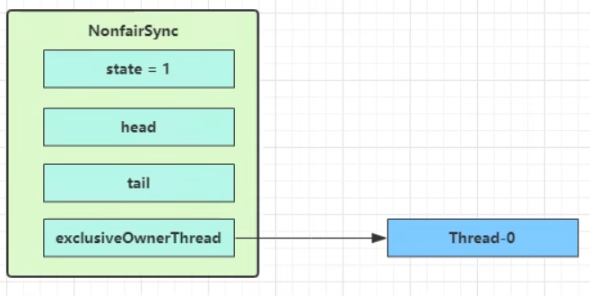
    - **加锁失败**  ——  当第一个竞争出现时（`Thread0`​已经获取到了锁，此时`Thread1`​尝试获取锁）

      - Thread-1 执行 `compareAndSetState(0, 1)`​ → 失败，进入 `acquire(1)`​。
      - 进入 `acquire()`​ 源码，发现进入的是 `tryAcquire()`​ 逻辑，`tryAcquire()`​ 返回的是 `nonfairTryAcquire()`​ 的结果。由于此时的 `state`​ 已经是1，因此 `int c = getState() = 1`​ ，所以不进入 `if`​ 的逻辑；而因为当前线程 `Thread1`​ 不是锁的持有者，所以也不进入 `else if`​ 的逻辑；最终，`nonfairTryAcquire()`​ 返回false，表明加锁失败。

        - ```java
          public final void acquire(int arg) {
              if (!tryAcquire(arg) &&
                  acquireQueued(addWaiter(Node.EXCLUSIVE), arg))
                  selfInterrupt();
          }
          ```
        - ```java
          protected final boolean tryAcquire(int acquires) {
              return nonfairTryAcquire(acquires);
          }

          final boolean nonfairTryAcquire(int acquires) {
              final Thread current = Thread.currentThread();
              int c = getState();
              if (c == 0) {
                  if (compareAndSetState(0, acquires)) {
                      setExclusiveOwnerThread(current);
                      return true;
                  }
              } else if (current == getExclusiveOwnerThread()) {
                  // 重入锁逻辑
                  int nextc = c + acquires;
                  setState(nextc);
                  return true;
              }
              return false;
          }
          ```

          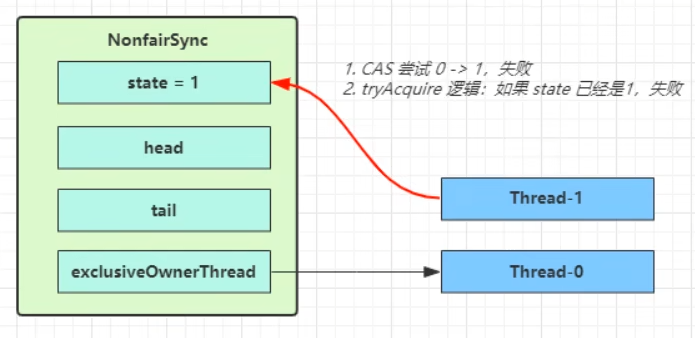
      - 由于 `tryAcquire(1)`​ 返回`false`​，因此 `!tryAcquire(1)`​为`true`​， 后续 `acquire()`​ 会继续执行`acquireQueued(addWaiter(Node.EXCLUSIVE), arg)`​。

        - 线程进入 `addWaiter`​ 逻辑用于构造 Node 队列。`addWaiter(Node.EXCLUSIVE)`​尝试将当前线程封装为一个节点 `Node`​，并加入 AQS 的 **同步队列。**

          图中黄色三角表示该 Node 的 waitStatus 状态，其中 0 为默认正常状态。

          Node 的创建是懒惰的。

          首次创建的时候会创建两个Node，其中第一个 Node 称为 Dummy（哑元）或哨兵，用来占位，并不关联线程。第二个 Node 才是 Thread1 。

          <span data-type="text" style="background-color: var(--b3-font-background6);">注意：图中的</span>`head`​​<span data-type="text" style="background-color: var(--b3-font-background6);">和</span>`tail`​​<span data-type="text" style="background-color: var(--b3-font-background6);">都是</span>**指针（引用）** <span data-type="text" style="background-color: var(--b3-font-background6);">，而不是真实的节点。</span>

          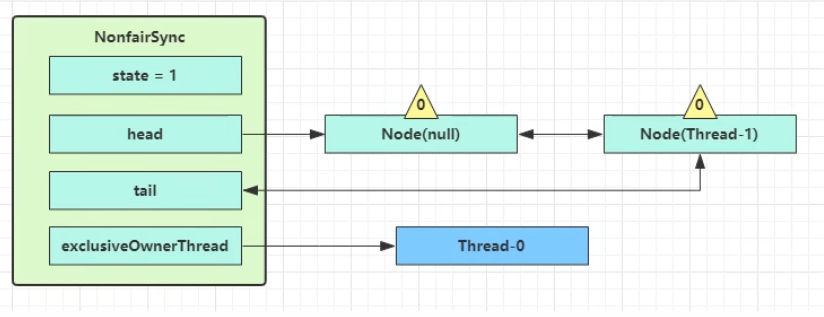
      - 当前线程进入 `acquireQueued`​ 逻辑。

        - ```java
          final boolean acquireQueued(final Node node, int arg) {
              boolean failed = true;
              try {
                  boolean interrupted = false;
                  for (;;) { // 死循环
                      // 获取前驱节点
                      final Node p = node.predecessor();
                      // 还会再试一次
                      if (p == head && tryAcquire(arg)) {
                          setHead(node);
                          p.next = null; // help GC
                          failed = false;
                          return interrupted;
                      }
                      // 如果获取不到锁，返回false，就会进入到这个if
                      if (shouldParkAfterFailedAcquire(p, node) &&
                              parkAndCheckInterrupt())
                          interrupted = true;
                  }
              } finally {
                  if (failed)
                      cancelAcquire(node);
              }
          }
          ```

          ​`acquireQueued()`​ 会在一个死循环中不断尝试获得锁，失败后进入 park 阻塞。

          如果 `node.predecessor()`​ 的结果是 `Node(null)`​，即如果`node`​是紧邻着 head节点（`Node(null)`​）的，那么再次 tryAcquire 尝试获取锁，当然这时 state 仍为 1，失败。

          此时进入 `shouldParkAfterFailedAcquire`​ 逻辑，将`node`​的前驱，即 `Node(null)`​ 的 `waitStatus`​ 改为 -1，这次返回 false。

          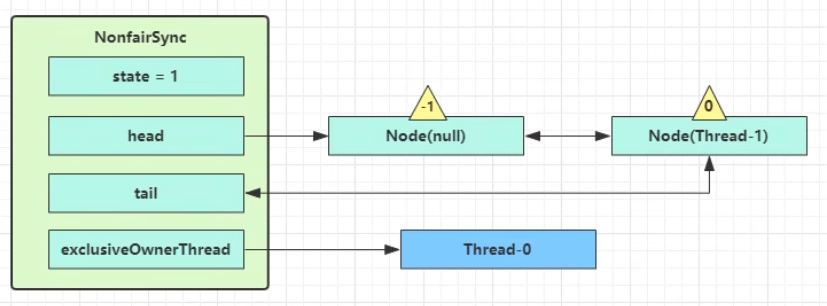

          由于这段代码是一个死循环，因此 `shouldParkAfterFailedAcquire()`​ 执行完毕会回到 `acquireQueued()`​ ，再次 `tryAcquire()`​ 尝试获取锁，当然这时state 仍为 1，失败。

          当再次进入 `shouldParkAfterFailedAcquire()`​ 时，这时因为 `Node(null)`​的 `waitStatus`​ 为 -1，这次返回true。

          进入 `parkAndCheckInterrupt()`​， 这段代码会将当前线程阻塞出，因此 `Thread-1`​ 被`park()`​阻塞住了（图中用灰色表示）。

          ```java
          private final boolean parkAndCheckInterrupt() {
              LockSupport.park(this);
              return Thread.interrupted();
          }
          ```

          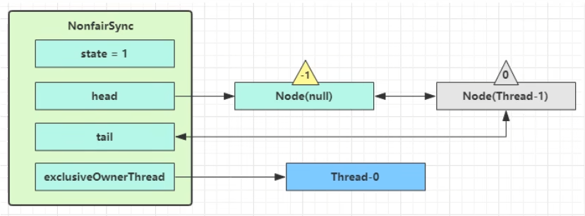

          若是有多个线程经历上述过程竞争失败，会变成下面这个样子。

          注意只有最后一个节点的 `waitStatus`​ 为0，其余的均为-1.意思是， `Thread3`​ 需要由 `Thread2`​唤醒， `Thread2`​ 需要由 `Thread1`​ 唤醒...... 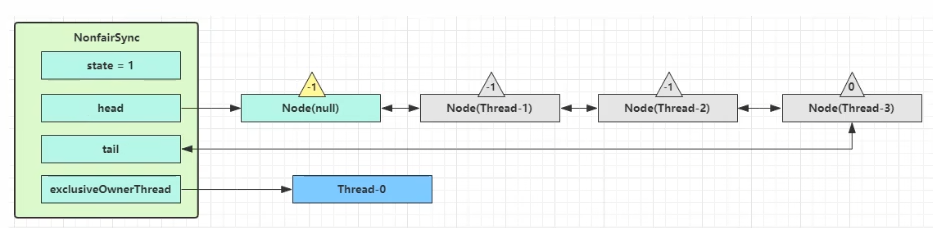
2. 解锁流程

    - 源码

      - ```java
        public void unlock() {
            sync.release(1);
        }


        public final boolean release(int arg) {
            if (tryRelease(arg)) {
                Node h = head;
                if (h != null && h.waitStatus != 0)
                    // 判断 head不为空 且不等于0
                    // 唤醒下一个节点
                    unparkSuccessor(h);
                return true;
            }
            return false;
        }


        protected final boolean tryRelease(int releases) {
            int c = getState() - releases;
            if (Thread.currentThread() != getExclusiveOwnerThread())
                throw new IllegalMonitorStateException();
            boolean free = false;
            if (c == 0) {
                free = true;
                // 设置为 null
                setExclusiveOwnerThread(null);
            }
            // 设置 为 0
            setState(c);
            return free;
        }
        ```
    - 解锁竞争成功

      - 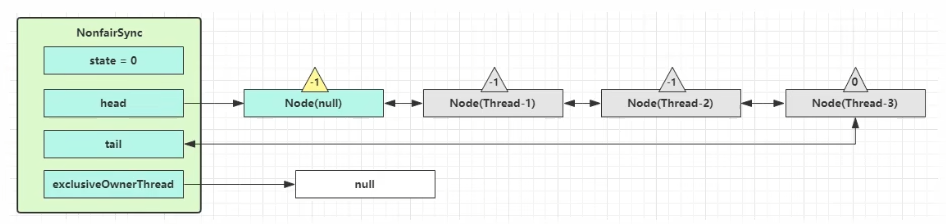
      - ​`Thread-0`​ 释放锁，进入 `tryRelease`​ 流程，如果成功：

        - ​`setExclusiveOwnerThread(null)`​：设置 `exclusiveOwnerThread`​ 为 null。
        - ​`setState(c)`​： 设置state为0。
        - ​`tryRelease`​ 返回 `true`​。
      - 进入 `release`​ 逻辑

        - ​`Node h = head`​ 表示的是 `Node(null)`​。
        - 由于前面提到过，Node的创建是懒惰的。如果锁从未发生过竞争，则`h = null`​。如果 `h != null`​ ，表示 AQS 内部的 **同步队列已经建立**，也就是说有线程尝试加锁失败并**进入了等待队列**。
      - 当前队列不为 null，并且 head 的 waitStatus = -1，进入 `unparkSuccessor`​ 流程。

        - ```java
          private void unparkSuccessor(Node node) {
              /*
               * If status is negative (i.e., possibly needing signal) try
               * to clear in anticipation of signalling.  It is OK if this
               * fails or if status is changed by waiting thread.
               */
              int ws = node.waitStatus;
              if (ws < 0)
                  compareAndSetWaitStatus(node, ws, 0);

              /*
               * Thread to unpark is held in successor, which is normally
               * just the next node.  But if cancelled or apparently null,
               * traverse backwards from tail to find the actual
               * non-cancelled successor.
               */
              Node s = node.next;
              if (s == null || s.waitStatus > 0) {
                  s = null;
                  for (Node t = tail; t != null && t != node; t = t.prev)
                      if (t.waitStatus <= 0)
                          s = t;
              }
              if (s != null)
                  // 底层调用 unpark 恢复运行了
                  LockSupport.unpark(s.thread);
          }
          ```
        - 找到队列中离 head 最近的一个 Node（没取消的，在本例中即为 `Thread-1`​），使用 `unpark`​ 恢复其运行。
        - 回到 `Thread-1`​ 的 `acquireQueued()`​ 流程

          - ```java
            final boolean acquireQueued(final Node node, int arg) {
                boolean failed = true;
                try {
                    boolean interrupted = false;
                    for (;;) {
                        final Node p = node.predecessor();
                        if (p == head && tryAcquire(arg)) {
                            setHead(node);
                            p.next = null; // help GC
                            failed = false;
                            return interrupted;
                        }
                        if (shouldParkAfterFailedAcquire(p, node) &&
                                parkAndCheckInterrupt())
                            interrupted = true;
                    }
                } finally {
                    if (failed)
                        cancelAcquire(node);
                }
            }

            private final boolean parkAndCheckInterrupt() {
                LockSupport.park(this);
                return Thread.interrupted();
            }
            ```
          - 之前一直在这里阻塞着，一被唤醒，就又进入循环了。
          - 进入循环后，执行 `p == head && tryAcquire(arg)`​。
          - 将原来的`Node(null)`​断开连接，可被垃圾回收。
          - 将`head`​指针指向`Thread-1`​的节点，设置为头节点。

            - exclusiveOwnerThread 为 Thread-1，state \= 1
          - 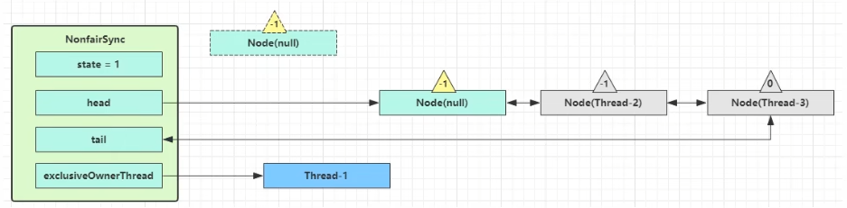
    - 解锁竞争失败

      - 如果这时候有其它线程来竞争（非公平的体现），例如这时有 `Thread-4`​ 来了。
      - 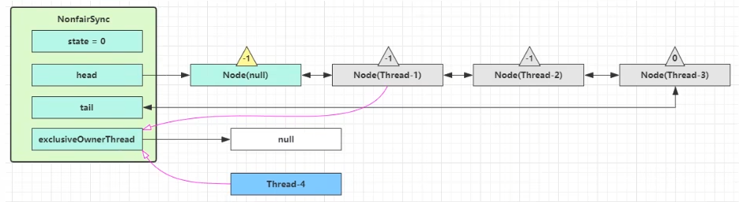
      - 如果锁被 `Thread-4`​ 获取到了

        -  `Thread-4`​ 被设置为 exclusiveOwnerThread，state \= 1。
        -  `Thread-1`​ 再次进入 `acquireQueued()`​ 流程，获取锁失败，重新进入 `park()`​ 阻塞。
3. 可重入原理

    - ```java
      static final class NonfairSync extends Sync {
          // ...

          // Sync 继承过来的方法, 方便阅读, 放在此处
          final boolean nonfairTryAcquire(int acquires) {
              final Thread current = Thread.currentThread();
              int c = getState();
              // 首先先获取锁的流程
              // 先查看状态是否为 0，如果还没有获得锁，从0试图将其改成1 。如果成功，将其改为真
              if (c == 0) {
                  if (compareAndSetState(0, acquires)) {
                      setExclusiveOwnerThread(current);
                      return true;
                  }
              }
              // 如果已经获得了锁, 线程还是当前线程, 表示发生了锁重入
              else if (current == getExclusiveOwnerThread()) {
                  // state++
                  // 锁重入时，实际上是对 state做了一个累加
                  int nextc = c + acquires;
                  if (nextc < 0) // overflow
                      throw new Error("Maximum lock count exceeded");
                  setState(nextc);
                  return true;
              }
              return false;
          }

          // Sync 继承过来的方法, 方便阅读, 放在此处
          protected final boolean tryRelease(int releases) {
              // state--
              int c = getState() - releases;
              if (Thread.currentThread() != getExclusiveOwnerThread())
                  throw new IllegalMonitorStateException();
              boolean free = false;
              // 支持锁重入, 只有 state 减为 0, 才释放成功
              if (c == 0) {
                  free = true;
                  setExclusiveOwnerThread(null);
              }
              setState(c);
              // 返回true，才会去唤醒其他的线程
              return free;
          }
      }
      ```
    - 可重入锁的原理是，通过 `state`​ 来记录加锁的“层数”，并用 `exclusiveOwnerThread`​ 来标识谁持有锁。只有当 `state == 0`​，才真正释放锁。

      - 加锁的时候，

        - 如果当前线程​**就是锁的持有者**​，说明是**重入**了锁。
        - 那么就简单地把 `state`​ 值 +1，表示加深了一层锁（嵌套调用）。
      - 解锁的时候，

        - 减少 `state`​ 的值。
        - 只有**锁的持有者线程才能释放锁**。
        - 如果 `state`​ 被减为 0，说明**彻底释放锁。**
4. 可打断原理

    - 不可打断模式

      - ```java
        // Sync 继承自 AQS
        static final class NonfairSync extends Sync {
            // ...

            private final boolean parkAndCheckInterrupt() {
                // 如果打断标记已经是 true, 则 park 会失效
                LockSupport.park(this);
                // interrupted 会清除打断标记 // 清除了打断标记，以后线程还是能park住
                // 下次再park的时候，不受影响
                return Thread.interrupted();
            }

            final boolean acquireQueued(final Node node, int arg) {
                boolean failed = true;
                try {
                    boolean interrupted = false;
                    for (;;) {
                        final Node p = node.predecessor();
                        if (p == head && tryAcquire(arg)) {
                            setHead(node);
                            p.next = null;
                            failed = false;
                            // 还是需要获得锁后, 才能返回打断状态
                            return interrupted;
                        }
                        if (
                                shouldParkAfterFailedAcquire(p, node) &&
                                        parkAndCheckInterrupt()
                        ) {
                            // 如果是因为 interrupt 被唤醒, 返回打断状态为 true
                            interrupted = true;
                            // 只是设置为 true，并没有做任何的处理，所以还是会再次进入循环，如果获得不了锁，还是会进入这个阻塞，再次设置上park。
                            // 而这个打断标记与 Thread.interrupted(); 所控制的打断标记并不是一个东西，由于之前 返回true，并清除了打断标记，所以是可以park的。
                        }
                    }
                } finally {
                    if (failed)
                        cancelAcquire(node);
                }
            }

            public final void acquire(int arg) {
                if (
                        !tryAcquire(arg) &&
                                acquireQueued(addWaiter(Node.EXCLUSIVE), arg)
                ) {
                    // 如果打断状态为 true
                    selfInterrupt();
                }
            }

            static void selfInterrupt() {
                // 重新产生一次中断
                Thread.currentThread().interrupt();
            }
        }
        ```
    - 可打断模式

      - ```java
        static final class NonfairSync extends Sync {
            public final void acquireInterruptibly(int arg) throws InterruptedException {
                if (Thread.interrupted())
                    throw new InterruptedException();
                // 如果没有获得到锁, 进入 ㈠
                if (!tryAcquire(arg))
                    doAcquireInterruptibly(arg);
            }

            // ㈠ 可打断的获取锁流程
            private void doAcquireInterruptibly(int arg) throws InterruptedException {
                final Node node = addWaiter(Node.EXCLUSIVE);
                boolean failed = true;
                try {
                    for (;;) {
                        final Node p = node.predecessor();
                        if (p == head && tryAcquire(arg)) {
                            setHead(node);
                            p.next = null; // help GC
                            failed = false;
                            return;
                        }
                        if (shouldParkAfterFailedAcquire(p, node) &&
                                parkAndCheckInterrupt()) {
                            // 在 park 过程中如果被 interrupt 会进入此
                            // 这时候抛出异常, 而不会再次进入 for (;;)
                            throw new InterruptedException();
                        }
                    }
                } finally {
                    if (failed)
                        cancelAcquire(node);
                }
            }
        }
        ```
5. 公平锁原理

    - ```java
      static final class FairSync extends Sync {
          private static final long serialVersionUID = -3000897897090466540L;
          final void lock() {
              acquire(1);
          }

          // AQS 继承过来的方法, 方便阅读, 放在此处
          public final void acquire(int arg) {
              if (
                      !tryAcquire(arg) &&
                              acquireQueued(addWaiter(Node.EXCLUSIVE), arg)
              ) {
                  selfInterrupt();
              }
          }
          // 与非公平锁主要区别在于 tryAcquire 方法的实现
          protected final boolean tryAcquire(int acquires) {
              final Thread current = Thread.currentThread();
              int c = getState();
              if (c == 0) {
                  // 先检查 AQS 队列中是否有前驱节点, 没有才去竞争
                  if (!hasQueuedPredecessors() &&
                          compareAndSetState(0, acquires)) {
                      setExclusiveOwnerThread(current);
                      return true;
                  }
              }
              else if (current == getExclusiveOwnerThread()) {
                  int nextc = c + acquires;
                  if (nextc < 0)
                      throw new Error("Maximum lock count exceeded");
                  setState(nextc);
                  return true;
              }
              return false;
          }

          // ㈠ AQS 继承过来的方法, 方便阅读, 放在此处
          public final boolean hasQueuedPredecessors() {
              Node t = tail;
              Node h = head;
              Node s;
              // h != t 时表示队列中有 Node
              return h != t &&
                      (
                              // (s = h.next) == null 表示队列中还有没有老二
                              (s = h.next) == null ||
                                      // 或者队列中老二线程不是此线程
                                      s.thread != Thread.currentThread()
                      );
          }
      }
      ```
6. 条件变量

    - 基本使用

      - ​`synchronized`​ 的条件变量是当条件不满足时进入 `WaitSet`​ 等待。

        ​`ReentrantLock`​ 的条件变量比 `synchronized`​ 的强大之处在于：支持多个条件变量。

        ​`ReentrantLock`​ 类获取 `Condition`​ 对象：`public Condition newCondition()`​。
      - Condition 类 API：

        - ​`void await()`​：当前线程从运行状态进入等待状态，释放锁。
        - ​`void signal()`​：唤醒一个等待在 Condition 上的线程，但是必须获得与该 Condition 相关的锁。
      - 使用流程：

        - **await / signal 前需要获得锁。**
        - await 执行后，会释放锁进入 ConditionObject 等待。
        - await 的线程被唤醒去重新竞争 lock 锁。
        - **线程在条件队列被打断会抛出中断异常。**
        - 竞争 lock 锁成功后，从 await 后继续执行。
      - 代码

        - ```java
          public static void main(String[] args) throws InterruptedException {    
              ReentrantLock lock = new ReentrantLock();
              //创建一个新的条件变量
              Condition condition1 = lock.newCondition();
              Condition condition2 = lock.newCondition();
              new Thread(() -> {
                  try {
                      lock.lock();
                      System.out.println("进入等待");
                      //进入休息室等待
                      condition1.await();
                      System.out.println("被唤醒了");
                  } catch (InterruptedException e) {
                      e.printStackTrace();
                  } finally {
                      lock.unlock();
                  }    
              }).start();
              Thread.sleep(1000);
              //叫醒
              new Thread(() -> {
                  try {            
                      lock.lock();
                      //唤醒
                      condition2.signal();
                  } finally {
                      lock.unlock();
                  }
              }).start();
          }
          ```
    - ​`await()`​实现原理

      - 总体流程是将 await 线程包装成 node 节点放入 ConditionObject 的条件队列，如果被唤醒就将 node 转移到 AQS 的执行阻塞队列，等待获取锁，**每个 Condition 对象都包含一个等待队列。**
      - 开始 Thread-0 持有锁，调用 await，进入 ConditionObject 的 addConditionWaiter 流程进行等待，直到被唤醒或打断，调用 await 方法的线程都是持锁状态的，所以说逻辑里**不存在并发。**

        ```java
        public final void await() throws InterruptedException {
             // 判断当前线程是否是中断状态，是就直接给个中断异常
            if (Thread.interrupted())
                throw new InterruptedException();
            // 将调用 await 的线程包装成 Node，添加到条件队列并返回
            Node node = addConditionWaiter();
            // 完全释放节点持有的锁，因为其他线程唤醒当前线程的前提是【持有锁】
            int savedState = fullyRelease(node);
            
            // 设置打断模式为没有被打断，状态码为 0
            int interruptMode = 0;
            
            // 如果该节点还没有转移至 AQS 阻塞队列, park 阻塞，等待进入阻塞队列
            while (!isOnSyncQueue(node)) {
                LockSupport.park(this);
                // 如果被打断，退出等待队列，对应的 node 【也会被迁移到阻塞队列】尾部，状态设置为 0
                if ((interruptMode = checkInterruptWhileWaiting(node)) != 0)
                    break;
            }
            // 逻辑到这说明当前线程退出等待队列，进入【阻塞队列】
            
            // 尝试枪锁，释放了多少锁就【重新获取多少锁】，获取锁成功判断打断模式
            if (acquireQueued(node, savedState) && interruptMode != THROW_IE)
                interruptMode = REINTERRUPT;
            
            // node 在条件队列时 如果被外部线程中断唤醒，会加入到阻塞队列，但是并未设 nextWaiter = null
            if (node.nextWaiter != null)
                // 清理条件队列内所有已取消的 Node
                unlinkCancelledWaiters();
            // 条件成立说明挂起期间发生过中断
            if (interruptMode != 0)
                // 应用打断模式
                reportInterruptAfterWait(interruptMode);
        }
        ```
      - **创建新的 Node 状态为 -2（Node.CONDITION）** ，关联 Thread-0，加入等待队列尾部

        - 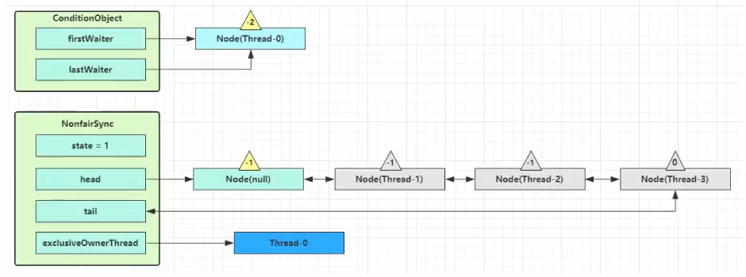
        - ```java
          private Node addConditionWaiter() {
              // 获取当前条件队列的尾节点的引用，保存到局部变量 t 中
              Node t = lastWaiter;
              // 当前队列中不是空，并且节点的状态不是 CONDITION（-2），说明当前节点发生了中断
              if (t != null && t.waitStatus != Node.CONDITION) {
                  // 清理条件队列内所有已取消的 Node
                  unlinkCancelledWaiters();
                  // 清理完成重新获取 尾节点 的引用
                  t = lastWaiter;
              }
              // 创建一个关联当前线程的新 node, 设置状态为 CONDITION(-2)，添加至队列尾部
              Node node = new Node(Thread.currentThread(), Node.CONDITION);
              if (t == null)
                  firstWaiter = node;		// 空队列直接放在队首【不用CAS因为执行线程是持锁线程，并发安全】
              else
                  t.nextWaiter = node;	// 非空队列队尾追加
              lastWaiter = node;			// 更新队尾的引用
              return node;
          }
          ```
        - ```java
          // 清理条件队列内所有已取消（不是CONDITION）的 node，【链表删除的逻辑】
          private void unlinkCancelledWaiters() {
              // 从头节点开始遍历【FIFO】
              Node t = firstWaiter;
              // 指向正常的 CONDITION 节点
              Node trail = null;
              // 等待队列不空
              while (t != null) {
                  // 获取当前节点的后继节点
                  Node next = t.nextWaiter;
                  // 判断 t 节点是不是 CONDITION 节点，条件队列内不是 CONDITION 就不是正常的
                  if (t.waitStatus != Node.CONDITION) { 
                      // 不是正常节点，需要 t 与下一个节点断开
                      t.nextWaiter = null;
                      // 条件成立说明遍历到的节点还未碰到过正常节点
                      if (trail == null)
                          // 更新 firstWaiter 指针为下个节点
                          firstWaiter = next;
                      else
                          // 让上一个正常节点指向 当前取消节点的 下一个节点，【删除非正常的节点】
                          trail.nextWaiter = next;
                      // t 是尾节点了，更新 lastWaiter 指向最后一个正常节点
                      if (next == null)
                          lastWaiter = trail;
                  } else {
                      // trail 指向的是正常节点 
                      trail = t;
                  }
                  // 把 t.next 赋值给 t，循环遍历
                  t = next; 
              }
          }
          ```
      - 接下来 Thread-0 进入 AQS 的 fullyRelease 流程，释放同步器上的锁。

        - 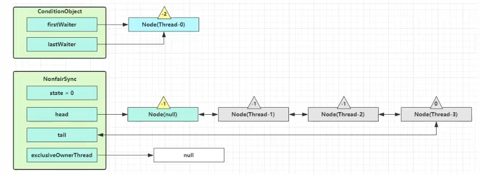
        - ```java
          // 线程可能重入，需要将 state 全部释放
          final int fullyRelease(Node node) {
              // 完全释放锁是否成功，false 代表成功
              boolean failed = true;
              try {
                  // 获取当前线程所持有的 state 值总数
                  int savedState = getState();
                  // release -> tryRelease 解锁重入锁
                  if (release(savedState)) {
                      // 释放成功
                      failed = false;
                      // 返回解锁的深度
                      return savedState;
                  } else {
                      // 解锁失败抛出异常
                      throw new IllegalMonitorStateException();
                  }
              } finally {
                  // 没有释放成功，将当前 node 设置为取消状态
                  if (failed)
                      node.waitStatus = Node.CANCELLED;
              }
          }
          ```
      - fullyRelease 中会 unpark AQS 队列中的下一个节点竞争锁，假设 Thread-1 竞争成功。

        - 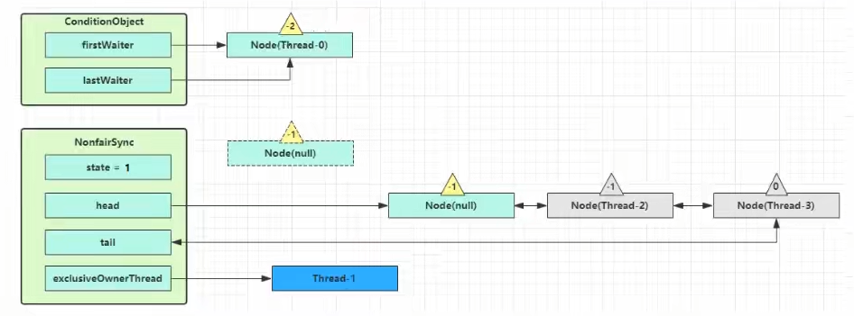
        - ```java
          public final boolean release(int arg) {
              if (tryRelease(arg)) {
                  Node h = head;
                  if (h != null && h.waitStatus != 0)
                      unparkSuccessor(h);
                  return true;
              }
              return false;
          }
          ```
      - Thread-0 进入 isOnSyncQueue 逻辑判断节点**是否移动到阻塞队列**，没有就 park 阻塞 Thread-0。

        - 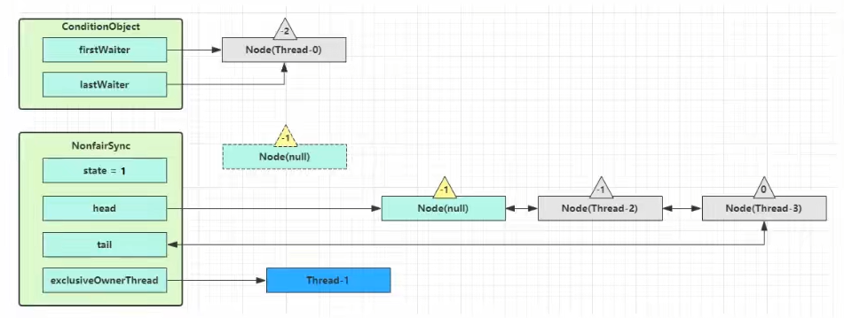
        - ```java
          final boolean isOnSyncQueue(Node node) {
              // node 的状态是 CONDITION，signal 方法是先修改状态再迁移，所以前驱节点为空证明还【没有完成迁移】
              if (node.waitStatus == Node.CONDITION || node.prev == null)
                  return false;
              // 说明当前节点已经成功入队到阻塞队列，且当前节点后面已经有其它 node，因为条件队列的 next 指针为 null
              if (node.next != null)
                  return true;
          	// 说明【可能在阻塞队列，但是是尾节点】
              // 从阻塞队列的尾节点开始向前【遍历查找 node】，如果查找到返回 true，查找不到返回 false
              return findNodeFromTail(node);
          }
          ```
      - await 线程 park 后如果被 unpark 或者被打断，都会进入 checkInterruptWhileWaiting 判断线程是否被打断：**在条件队列被打断的线程需要抛出异常。**

        - ```java
          private int checkInterruptWhileWaiting(Node node) {
              // Thread.interrupted() 返回当前线程中断标记位，并且重置当前标记位 为 false
              // 如果被中断了，根据是否在条件队列被中断的，设置中断状态码
              return Thread.interrupted() ?(transferAfterCancelledWait(node) ? THROW_IE : REINTERRUPT) : 0;
          }
          ```
        - ```java
          // 这个方法只有在线程是被打断唤醒时才会调用
          final boolean transferAfterCancelledWait(Node node) {
              // 条件成立说明当前node一定是在条件队列内，因为 signal 迁移节点到阻塞队列时，会将节点的状态修改为 0
              if (compareAndSetWaitStatus(node, Node.CONDITION, 0)) {
                  // 把【中断唤醒的 node 加入到阻塞队列中】
                  enq(node);
                  // 表示是在条件队列内被中断了，设置为 THROW_IE 为 -1
                  return true;
              }

              //执行到这里的情况：
              //1.当前node已经被外部线程调用 signal 方法将其迁移到 阻塞队列 内了
              //2.当前node正在被外部线程调用 signal 方法将其迁移至 阻塞队列 进行中状态
              
              // 如果当前线程还没到阻塞队列，一直释放 CPU
              while (!isOnSyncQueue(node))
                  Thread.yield();

              // 表示当前节点被中断唤醒时不在条件队列了，设置为 REINTERRUPT 为 1
              return false;
          }
          ```
      - 最后开始处理中断状态

        - ```java
          private void reportInterruptAfterWait(int interruptMode) throws InterruptedException {
              // 条件成立说明【在条件队列内发生过中断，此时 await 方法抛出中断异常】
              if (interruptMode == THROW_IE)
                  throw new InterruptedException();

              // 条件成立说明【在条件队列外发生的中断，此时设置当前线程的中断标记位为 true】
              else if (interruptMode == REINTERRUPT)
                  // 进行一次自己打断，产生中断的效果
                  selfInterrupt();
          }
          ```
    - ​`signal()`​实现原理

      - 假设 Thread-1 要来唤醒 Thread-0，进入 ConditionObject 的 doSignal 流程，**取得等待队列中第一个 Node**，即 Thread-0 所在 Node，必须持有锁才能唤醒, 因此 doSignal 内线程安全。

        - 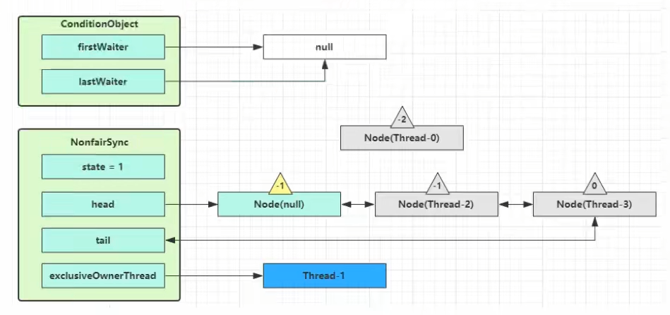
        - ```java
          public final void signal() {
              // 判断调用 signal 方法的线程是否是独占锁持有线程
              if (!isHeldExclusively())
                  throw new IllegalMonitorStateException();
              // 获取条件队列中第一个 Node
              Node first = firstWaiter;
              // 不为空就将第该节点【迁移到阻塞队列】
              if (first != null)
                  doSignal(first);
          }
          ```
        - ```java
          // 唤醒 - 【将没取消的第一个节点转移至 AQS 队列尾部】
          private void doSignal(Node first) {
              do {
                  // 成立说明当前节点的下一个节点是 null，当前节点是尾节点了，队列中只有当前一个节点了
                  if ((firstWaiter = first.nextWaiter) == null)
                      lastWaiter = null;
                  first.nextWaiter = null;
              // 将等待队列中的 Node 转移至 AQS 队列，不成功且还有节点则继续循环
              } while (!transferForSignal(first) && (first = firstWaiter) != null);
          }

          // signalAll() 会调用这个函数，唤醒所有的节点
          private void doSignalAll(Node first) {
              lastWaiter = firstWaiter = null;
              do {
                  Node next = first.nextWaiter;
                  first.nextWaiter = null;
                  transferForSignal(first);
                  first = next;
              // 唤醒所有的节点，都放到阻塞队列中
              } while (first != null);
          }
          ```
      - 执行 transferForSignal，**先将节点的 waitStatus 改为 0，然后加入 AQS 阻塞队列尾部**，将 Thread-3 的 waitStatus 改为 -1。

        - 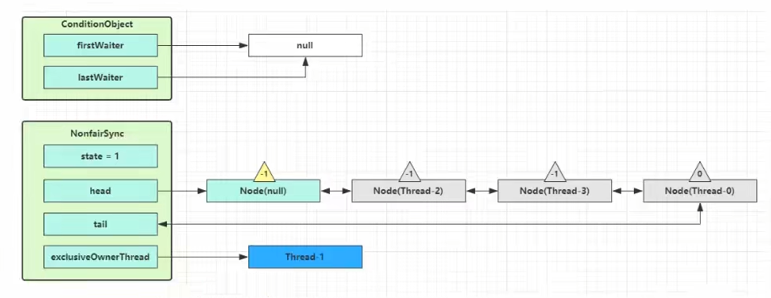
        - ```java
          // 如果节点状态是取消, 返回 false 表示转移失败, 否则转移成功
          final boolean transferForSignal(Node node) {
              // CAS 修改当前节点的状态，修改为 0，因为当前节点马上要迁移到阻塞队列了
              // 如果状态已经不是 CONDITION, 说明线程被取消（await 释放全部锁失败）或者被中断（可打断 cancelAcquire）
              if (!compareAndSetWaitStatus(node, Node.CONDITION, 0))
                  // 返回函数调用处继续寻找下一个节点
                  return false;
              
              // 【先改状态，再进行迁移】
              // 将当前 node 入阻塞队列，p 是当前节点在阻塞队列的【前驱节点】
              Node p = enq(node);
              int ws = p.waitStatus;
              
              // 如果前驱节点被取消或者不能设置状态为 Node.SIGNAL，就 unpark 取消当前节点线程的阻塞状态, 
              // 让 thread-0 线程竞争锁，重新同步状态
              if (ws > 0 || !compareAndSetWaitStatus(p, ws, Node.SIGNAL))
                  LockSupport.unpark(node.thread);
              return true;
          }
          ```
      - Thread-1 释放锁，进入 unlock 流程。

‍
