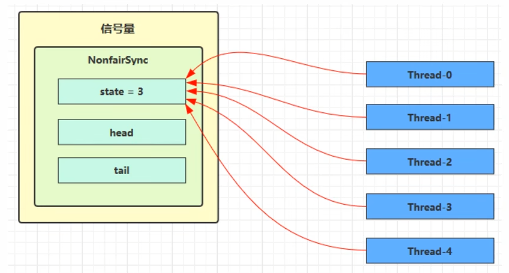
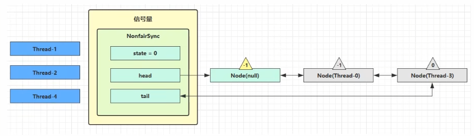
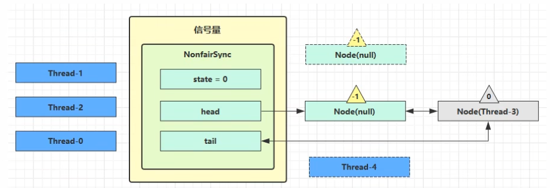

# JUC-14  同步协作

# 1、Semaphore

#### 1.1  基本使用

synchronized 可以起到锁的作用，但某个时间段内，只能有一个线程允许执行

Semaphore（信号量）用来限制能同时访问共享资源的线程上限，非重入锁

构造方法：

- ​`public Semaphore(int permits)`​：permits 表示许可线程的数量（state）
- ​`public Semaphore(int permits, boolean fair)`​：fair 表示公平性，如果设为 true，下次执行的线程会是等待最久的线程

常用API：

- ​`public void acquire()`​：表示获取许可
- ​`public void release()`​：表示释放许可，acquire() 和 release() 方法之间的代码为同步代码

```java
public static void main(String[] args) {
    // 1.创建Semaphore对象
    Semaphore semaphore = new Semaphore(3);

    // 2. 10个线程同时运行
    for (int i = 0; i < 10; i++) {
        new Thread(() -> {
            try {
                // 3. 获取许可
                semaphore.acquire();
                sout(Thread.currentThread().getName() + " running...");
                Thread.sleep(1000);
                sout(Thread.currentThread().getName() + " end...");
            } catch (InterruptedException e) {
                e.printStackTrace();
            } finally {
                // 4. 释放许可
                semaphore.release();
            }
        }).start();
    }
}
```

#### 1.2  实现原理 --  加锁解锁流程

Semaphore 有点像一个停车场，permits 就好像停车位数量，当线程获得了 permits 就像是获得了停车位，然后停车场显示空余车位减一

- 刚开始，permits（state）为 3，这时 5 个线程来获取资源

  

  ```java
  public Semaphore(int permits) {
      sync = new NonfairSync(permits);
  }

  static final class NonfairSync extends Sync {
      private static final long serialVersionUID = -2694183684443567898L;

      NonfairSync(int permits) {
          super(permits);
      }

      protected int tryAcquireShared(int acquires) {
          return nonfairTryAcquireShared(acquires);
      }
  }

  abstract static class Sync extends AbstractQueuedSynchronizer {
      private static final long serialVersionUID = 1192457210091910933L;

      // 核心在这里将state设置进来
      Sync(int permits) {
          setState(permits);
      }

      final int getPermits() {
          return getState();
      }

      final int nonfairTryAcquireShared(int acquires) {
          for (; ; ) {
              int available = getState();
              int remaining = available - acquires;
              if (remaining < 0 ||
                      compareAndSetState(available, remaining))
                  return remaining;
          }
      }
  }
  ```

  ‍
- 假设其中 Thread-1，Thread-2，Thread-4 cas 竞争成功，而 Thread-0 和 Thread-3 竞争失败，进入 AQS 队列 park 阻塞

  

  ```java
  // acquire() -> sync.acquireSharedInterruptibly(1)，可中断
  public final void acquireSharedInterruptibly(int arg) {
      if (Thread.interrupted())
          throw new InterruptedException();
      // 尝试获取通行证，获取成功返回 >= 0的值
      if (tryAcquireShared(arg) < 0)
          // 获取许可证失败，进入阻塞
          doAcquireSharedInterruptibly(arg);
  }

  // tryAcquireShared() -> nonfairTryAcquireShared()
  // 非公平，公平锁会在循环内 hasQueuedPredecessors()方法判断阻塞队列是否有临头节点(第二个节点)
  final int nonfairTryAcquireShared(int acquires) {
      for (;;) {
          // 获取 state ，state 这里【表示通行证】
          int available = getState();
          // 计算当前线程获取通行证完成之后，通行证还剩余数量
          int remaining = available - acquires;
          // 如果许可已经用完, 返回负数, 表示获取失败,
          if (remaining < 0 ||
              // 许可证足够分配的，如果 cas 重试成功, 返回正数, 表示获取成功
              compareAndSetState(available, remaining))
              return remaining;
      }
  }
  ```

  ```java
  private void doAcquireSharedInterruptibly(int arg) {
      // 将调用 Semaphore.aquire 方法的线程，包装成 node 加入到 AQS 的阻塞队列中
      final Node node = addWaiter(Node.SHARED);
      // 获取标记
      boolean failed = true;
      try {
          for (;;) {
              final Node p = node.predecessor();
              // 前驱节点是头节点可以再次获取许可
              if (p == head) {
                  // 再次尝试获取许可，【返回剩余的许可证数量】
                  int r = tryAcquireShared(arg);
                  if (r >= 0) {
                      // 成功后本线程出队（AQS）, 所在 Node设置为 head
                      // r 表示【可用资源数】, 为 0 则不会继续传播
                      setHeadAndPropagate(node, r); 
                      p.next = null; // help GC
                      failed = false;
                      return;
                  }
              }
              // 不成功, 设置上一个节点 waitStatus = Node.SIGNAL, 下轮进入 park 阻塞
              if (shouldParkAfterFailedAcquire(p, node) && parkAndCheckInterrupt())
                  throw new InterruptedException();
          }
      } finally {
          // 被打断后进入该逻辑
          if (failed)
              cancelAcquire(node);
      }
  }
  ```

  ```java
  private void setHeadAndPropagate(Node node, int propagate) {    
      Node h = head;
      // 设置自己为 head 节点
      setHead(node);
      // propagate 表示有【共享资源】（例如共享读锁或信号量）
      // head waitStatus == Node.SIGNAL 或 Node.PROPAGATE，doReleaseShared 函数中设置的
      if (propagate > 0 || h == null || h.waitStatus < 0 ||
          (h = head) == null || h.waitStatus < 0) {
          Node s = node.next;
          // 如果是最后一个节点或者是等待共享读锁的节点，做一次唤醒
          if (s == null || s.isShared())
              doReleaseShared();
      }
  }
  ```

  ‍
- 这时 Thread-4 释放了 permits，状态如下

  

  ```java
  // release() -> releaseShared()
  public final boolean releaseShared(int arg) {
      // 尝试释放锁
      if (tryReleaseShared(arg)) {
          doReleaseShared();
          return true;
      }    
      return false;
  }
  protected final boolean tryReleaseShared(int releases) {    
      for (;;) {
          // 获取当前锁资源的可用许可证数量
          int current = getState();
          int next = current + releases;
          // 索引越界判断
          if (next < current)            
              throw new Error("Maximum permit count exceeded");        
          // 释放锁
          if (compareAndSetState(current, next))            
              return true;    
      }
  }
  private void doReleaseShared() {    
      // PROPAGATE 详解    
      // 如果 head.waitStatus == Node.SIGNAL ==> 0 成功, 下一个节点 unpark	
      // 如果 head.waitStatus == 0 ==> Node.PROPAGATE
  }
  ```

  ‍
- 接下来 Thread-0 竞争成功，permits 再次设置为 0，设置自己为 head 节点，并且 unpark 接下来的共享状态的 Thread-3 节点，但由于 permits 是 0，因此 Thread-3 在尝试不成功后再次进入 park 状态

  

# 2、CountdownLatch

#### 2.1  基本使用

CountDownLatch：计数器，用来进行线程同步协作，**等待所有线程完成。**

- 构造器：

  - ​`public CountDownLatch(int count)`​：初始化唤醒需要的 down 几步
- 常用API：

  - ​`public void await() `​：让当前线程等待，必须 down 完初始化的数字才可以被唤醒，否则进入无限等待
  - ​`public void countDown()`​：计数器进行减 1（down 1）
- 应用：同步等待多个 Rest 远程调用结束

  ```java
  // LOL 10人进入游戏倒计时
  public static void main(String[] args) throws InterruptedException {
      CountDownLatch latch = new CountDownLatch(10);
      ExecutorService service = Executors.newFixedThreadPool(10);
      String[] all = new String[10];
      Random random = new Random();

      for (int j = 0; j < 10; j++) {
          int finalJ = j;//常量
          service.submit(() -> {
              for (int i = 0; i <= 100; i++) {
                  Thread.sleep(random.nextInt(100));	//随机休眠
                  all[finalJ] = i + "%";
                  System.out.print("\r" + Arrays.toString(all));	// \r代表覆盖
              }
              latch.countDown();
          });
      }
      latch.await();
      System.out.println("\n游戏开始");
      service.shutdown();
  }

  /*
  [100%, 100%, 100%, 100%, 100%, 100%, 100%, 100%, 100%, 100%]
  游戏开始
  ```

#### 2.2  实现原理 

1. 阻塞等待

    - 线程调用 await() 等待其他线程完成任务：支持打断

      ```java
      public void await() throws InterruptedException {
          sync.acquireSharedInterruptibly(1);
      }
      // AbstractQueuedSynchronizer#acquireSharedInterruptibly
      public final void acquireSharedInterruptibly(int arg) throws InterruptedException {
          // 判断线程是否被打断，抛出打断异常
          if (Thread.interrupted())
              throw new InterruptedException();
          // 尝试获取共享锁，条件成立说明 state > 0，此时线程入队阻塞等待，等待其他线程获取共享资源
          // 条件不成立说明 state = 0，此时不需要阻塞线程，直接结束函数调用
          if (tryAcquireShared(arg) < 0)
              doAcquireSharedInterruptibly(arg);
      }
      // CountDownLatch.Sync#tryAcquireShared
      protected int tryAcquireShared(int acquires) {
          return (getState() == 0) ? 1 : -1;
      }
      ```
    - 线程进入 AbstractQueuedSynchronizer#doAcquireSharedInterruptibly 函数阻塞挂起，等待 latch 变为 0：

      ```java
      private void doAcquireSharedInterruptibly(int arg) throws InterruptedException {
          // 将调用latch.await()方法的线程 包装成 SHARED 类型的 node 加入到 AQS 的阻塞队列中
          final Node node = addWaiter(Node.SHARED);
          boolean failed = true;
          try {
              for (;;) {
                  // 获取当前节点的前驱节点
                  final Node p = node.predecessor();
                  // 前驱节点时头节点就可以尝试获取锁
                  if (p == head) {
                      // 再次尝试获取锁，获取成功返回 1
                      int r = tryAcquireShared(arg);
                      if (r >= 0) {
                          // 获取锁成功，设置当前节点为 head 节点，并且向后传播
                          setHeadAndPropagate(node, r);
                          p.next = null; // help GC
                          failed = false;
                          return;
                      }
                  }
                  // 阻塞在这里
                  if (shouldParkAfterFailedAcquire(p, node) && parkAndCheckInterrupt())
                      throw new InterruptedException();
              }
          } finally {
              // 阻塞线程被中断后抛出异常，进入取消节点的逻辑
              if (failed)
                  cancelAcquire(node);
          }
      }
      ```
    - 获取共享锁成功，进入唤醒阻塞队列中与头节点相连的 SHARED 模式的节点：

      ```java
      private void setHeadAndPropagate(Node node, int propagate) {
          Node h = head;
          // 将当前节点设置为新的 head 节点，前驱节点和持有线程置为 null
          setHead(node);
      	// propagate = 1，条件一成立
          if (propagate > 0 || h == null || h.waitStatus < 0 || (h = head) == null || h.waitStatus < 0) {
              // 获取当前节点的后继节点
              Node s = node.next;
              // 当前节点是尾节点时 next 为 null，或者后继节点是 SHARED 共享模式
              if (s == null || s.isShared())
                  // 唤醒所有的等待共享锁的节点
                  doReleaseShared();
          }
      }
      ```
2. 计数减一

    - 线程进入 countDown() 完成计数器减一（释放锁）的操作

      ```java
      public void countDown() {
          sync.releaseShared(1);
      }
      public final boolean releaseShared(int arg) {
          // 尝试释放共享锁
          if (tryReleaseShared(arg)) {
              // 释放锁成功开始唤醒阻塞节点
              doReleaseShared();
              return true;
          }
          return false;
      }
      ```
    - 更新 state 值，每调用一次，state 值减一，当 state -1 正好为 0 时，返回 true

      ```java
      protected boolean tryReleaseShared(int releases) {
          for (;;) {
              int c = getState();
              // 条件成立说明前面【已经有线程触发唤醒操作】了，这里返回 false
              if (c == 0)
                  return false;
              // 计数器减一
              int nextc = c-1;
              if (compareAndSetState(c, nextc))
                  // 计数器为 0 时返回 true
                  return nextc == 0;
          }
      }
      ```
    - state \= 0 时，当前线程需要执行**唤醒阻塞节点的任务**

      ```java
      private void doReleaseShared() {
          for (;;) {
              Node h = head;
              // 判断队列是否是空队列
              if (h != null && h != tail) {
                  int ws = h.waitStatus;
                  // 头节点的状态为 signal，说明后继节点没有被唤醒过
                  if (ws == Node.SIGNAL) {
                      // cas 设置头节点的状态为 0，设置失败继续自旋
                      if (!compareAndSetWaitStatus(h, Node.SIGNAL, 0))
                          continue;
                      // 唤醒后继节点
                      unparkSuccessor(h);
                  }
                  // 如果有其他线程已经设置了头节点的状态，重新设置为 PROPAGATE 传播属性
                  else if (ws == 0 && !compareAndSetWaitStatus(h, 0, Node.PROPAGATE))
                      continue;
              }
              // 条件不成立说明被唤醒的节点非常积极，直接将自己设置为了新的head，
              // 此时唤醒它的节点（前驱）执行 h == head 不成立，所以不会跳出循环，会继续唤醒新的 head 节点的后继节点
              if (h == head)
                  break;
          }
      }
      ```

# 3、CyclicBarrier

#### 3.1  基本使用

CyclicBarrier：循环屏障，用来进行线程协作，等待线程满足某个计数，才能触发自己执行。

- 常用方法：

  - ​`public CyclicBarrier(int parties, Runnable barrierAction)`​：用于在线程到达屏障 parties 时，执行 barrierAction

    - parties：代表多少个线程到达屏障开始触发线程任务
    - barrierAction：线程任务
  - ​`public int await()`​：线程调用 await 方法通知 CyclicBarrier 本线程已经到达屏障
  - 与 CountDownLatch 的区别：CyclicBarrier 是可以重用的
- 应用：可以实现多线程中，某个任务在等待其他线程执行完毕以后触发

  ```java
  public static void main(String[] args) {
      ExecutorService service = Executors.newFixedThreadPool(2);
      CyclicBarrier barrier = new CyclicBarrier(2, () -> {
          System.out.println("task1 task2 finish...");
      });

      for (int i = 0; i < 3; i++) { // 循环重用
          service.submit(() -> {
              System.out.println("task1 begin...");
              try {
                  Thread.sleep(1000);
                  barrier.await();    // 2 - 1 = 1
              } catch (InterruptedException | BrokenBarrierException e) {
                  e.printStackTrace();
              }
          });

          service.submit(() -> {
              System.out.println("task2 begin...");
              try {
                  Thread.sleep(2000);
                  barrier.await();    // 1 - 1 = 0
              } catch (InterruptedException | BrokenBarrierException e) {
                  e.printStackTrace();
              }
          });
      }
      service.shutdown();
  }
  ```

#### 3.2  实现原理

1. 成员属性

    - 全局锁：利用可重入锁实现的工具类

      ```java
      // barrier 实现是依赖于Condition条件队列，condition 条件队列必须依赖lock才能使用
      private final ReentrantLock lock = new ReentrantLock();
      // 线程挂起实现使用的 condition 队列，当前代所有线程到位，这个条件队列内的线程才会被唤醒
      private final Condition trip = lock.newCondition();
      ```
    - 线程数量：

      ```java
      private final int parties;	// 代表多少个线程到达屏障开始触发线程任务
      private int count;			// 表示当前“代”还有多少个线程未到位，初始值为 parties
      ```
    - 当前代中最后一个线程到位后要执行的事件：

      ```java
      private final Runnable barrierCommand;
      ```
    - 代：

      ```java
      // 表示 barrier 对象当前 代
      private Generation generation = new Generation();
      private static class Generation {
          // 表示当前“代”是否被打破，如果被打破再来到这一代的线程 就会直接抛出 BrokenException 异常
          // 且在这一代挂起的线程都会被唤醒，然后抛出 BrokerException 异常。
          boolean broken = false;
      }
      ```
    - 构造方法：

      ```java
      public CyclicBarrie(int parties, Runnable barrierAction) {
          // 因为小于等于 0 的 barrier 没有任何意义
          if (parties <= 0) throw new IllegalArgumentException();

          this.parties = parties;
          this.count = parties;
          // 可以为 null
          this.barrierCommand = barrierAction;
      }
      ```
2. 成员方法

    - await()：阻塞等待所有线程到位

      ```java
      public int await() throws InterruptedException, BrokenBarrierException {
          try {
              return dowait(false, 0L);
          } catch (TimeoutException toe) {
              throw new Error(toe); // cannot happen
          }
      }
      ```
      ```java
      // timed：表示当前调用await方法的线程是否指定了超时时长，如果 true 表示线程是响应超时的
      // nanos：线程等待超时时长，单位是纳秒
      private int dowait(boolean timed, long nanos) {
          final ReentrantLock lock = this.lock;
          // 加锁
          lock.lock();
          try {
              // 获取当前代
              final Generation g = generation;

              // 【如果当前代是已经被打破状态，则当前调用await方法的线程，直接抛出Broken异常】
              if (g.broken)
                  throw new BrokenBarrierException();
      		// 如果当前线程被中断了，则打破当前代，然后当前线程抛出中断异常
              if (Thread.interrupted()) {
                  // 设置当前代的状态为 broken 状态，唤醒在 trip 条件队列内的线程
                  breakBarrier();
                  throw new InterruptedException();
              }

              // 逻辑到这说明，当前线程中断状态是 false， 当前代的 broken 为 false（未打破状态）

              // 假设 parties 给的是 5，那么index对应的值为 4,3,2,1,0
              int index = --count;
              // 条件成立说明当前线程是最后一个到达 barrier 的线程，【需要开启新代，唤醒阻塞线程】
              if (index == 0) {
                  // 栅栏任务启动标记
                  boolean ranAction = false;
                  try {
                      final Runnable command = barrierCommand;
                      if (command != null)
                          // 启动触发的任务
                          command.run();
                      // run()未抛出异常的话，启动标记设置为 true
                      ranAction = true;
                      // 开启新的一代，这里会【唤醒所有的阻塞队列】
                      nextGeneration();
                      // 返回 0 因为当前线程是此代最后一个到达的线程，index == 0
                      return 0;
                  } finally {
                      // 如果 command.run() 执行抛出异常的话，会进入到这里
                      if (!ranAction)
                          breakBarrier();
                  }
              }

              // 自旋，一直到条件满足、当前代被打破、线程被中断，等待超时
              for (;;) {
                  try {
                      // 根据是否需要超时等待选择阻塞方法
                      if (!timed)
                          // 当前线程释放掉 lock，【进入到 trip 条件队列的尾部挂起自己】，等待被唤醒
                          trip.await();
                      else if (nanos > 0L)
                          nanos = trip.awaitNanos(nanos);
                  } catch (InterruptedException ie) {
                      // 被中断后来到这里的逻辑

                      // 当前代没有变化并且没有被打破
                      if (g == generation && !g.broken) {
                          // 打破屏障
                          breakBarrier();
                          // node 节点在【条件队列】内收到中断信号时 会抛出中断异常
                          throw ie;
                      } else {
                          // 等待过程中代变化了，完成一次自我打断
                          Thread.currentThread().interrupt();
                      }
                  }
      			// 唤醒后的线程，【判断当前代已经被打破，线程唤醒后依次抛出 BrokenBarrier 异常】
                  if (g.broken)
                      throw new BrokenBarrierException();

                  // 当前线程挂起期间，最后一个线程到位了，然后触发了开启新的一代的逻辑
                  if (g != generation)
                      return index;
      			// 当前线程 trip 中等待超时，然后主动转移到阻塞队列
                  if (timed && nanos <= 0L) {
                      breakBarrier();
                      // 抛出超时异常
                      throw new TimeoutException();
                  }
              }
          } finally {
              // 解锁
              lock.unlock();
          }
      }
      ```
    - breakBarrier()：打破 Barrier 屏障

      ```java
      private void breakBarrier() {
          // 将代中的 broken 设置为 true，表示这一代是被打破了，再来到这一代的线程，直接抛出异常
          generation.broken = true;
          // 重置 count 为 parties
          count = parties;
          // 将在trip条件队列内挂起的线程全部唤醒，唤醒后的线程会检查当前是否是打破的，然后抛出异常
          trip.signalAll();
      }
      ```
    - nextGeneration()：开启新的下一代

      ```java
      private void nextGeneration() {
          // 将在 trip 条件队列内挂起的线程全部唤醒
          trip.signalAll();
          // 重置 count 为 parties
          count = parties;

          // 开启新的一代，使用一个新的generation对象，表示新的一代，新的一代和上一代【没有任何关系】
          generation = new Generation();
      }
      ```
